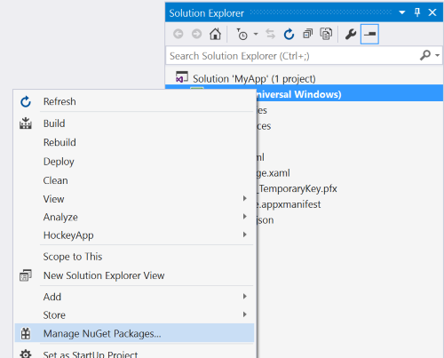

# Getting Started with the Windows Community Toolkit

The toolkit is available as NuGet packages that can be added to any existing or new project using Visual Studio.

1. Download [Visual Studio 2017](https://developer.microsoft.com/en-us/windows/downloads) and ensure you choose the **Universal Windows Platform development** Workload in the Visual Studio installer.

    > [!NOTE]
    Visual Studio 2015 is not supported with the Windows Community Toolkit 2.0 or higher

2. Open an existing project, or create a new project using the Blank App template under Visual C# -> Windows -> Universal.  **Important**:  Build 14393 or higher is supported by current version of the Toolkit.   

3. In Solution Explorer panel, right click on your project name and select **Manage NuGet Packages**. Search for **Microsoft.Toolkit.UWP**, and choose your desired [NuGet Packages](Nuget-Packages.md) from the list.

    

4. Add a reference to the toolkit in your XAML pages or C#

    * In your XAML page, add a reference at the top of your page

        ```xaml
        xmlns:controls="using:Microsoft.Toolkit.Uwp.UI.Controls"
        ```

    * In your C# page, add the namespaces to the toolkit

        ```c#
        using Microsoft.Toolkit.Uwp;
        ```


5. You can copy and paste code snippets for each feature from the [Windows Community Toolkit Sample App](http://aka.ms/uwptoolkitapp). 

## Other Resources 

Download the [Windows Community Toolkit Sample App](http://aka.ms/uwptoolkitapp) from the Windows store to see the controls in an actual app.

We recommend developers new to UWP visit the [Getting Started with UWP Development](https://developer.microsoft.com/en-us/windows/getstarted) pages on the Developer portal. 

Visit the [Windows Community Toolkit Github Repository](http://aka.ms/uwptoolkit) to see the current source code, what is coming next, and to clone the repository.  Community contributions are welcome!

