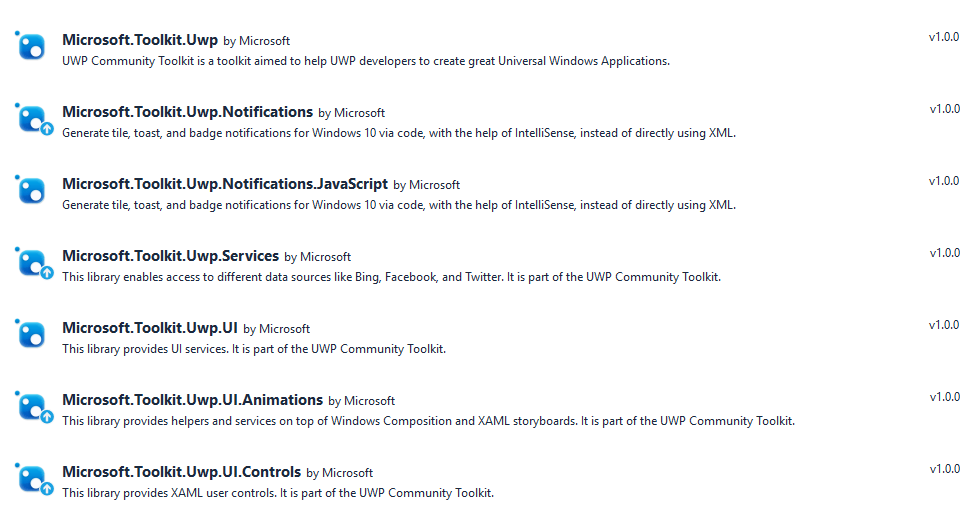

# UWP Community Toolkit Nuget Packages

NuGet is a standard package manager for .Net applications that is built into Visual Studio. From your open solution choose the *Tools* menu, *NuGet Package Manager*, *Manage NuGet packages for solution...* to open the UI.  Enter one of the package names below to search for it online.

| Link | Description |
| --- | --- |
| Microsoft.Toolkit.Uwp | Main NuGet package includes code only helpers such as Colors conversion tool, Internet Connection detection, Storage file handling, a Stream helper class, etc. |
| Microsoft.Toolkit.Uwp.Notifications | Notifications Package - Generate tile, toast, and badge notifications for Windows 10 via code.  Includes intellisense support to avoid having to use the XML syntax. |
| Microsoft.Toolkit.Uwp.Notifications.Javascript | Notification Packages for JavaScript |
| Microsoft.Toolkit.Uwp.Services | Services Package - This NuGet package includes the service helpers for Bing, Facebook, LinkedIn, Microsoft Graph and Twitter. |
| Microsoft.Toolkit.Uwp.UI | UI Packages - XAML converters, Visual tree extensions and helpers for your XAML UI. |
| Microsoft.Toolkit.Uwp.UI.Animations | Animations and Composition behaviors such as Blur, Fade, Rotate, etc. |
| Microsoft.Toolkit.Uwp.UI.Controls | XAML Controls such as RadialGauge, RangeSelector, etc. | 

## Search in Visual Studio

Searching in Visual Studio package manager you should see a list similar to the one below (version numbers may be different, but names should be the same).

### Getting Started

Read the [getting Started with the UWP Community Toolkit](getting-started.md) for more instructions on using these NuGet Packages in your own projects. 

### Windows 10 Store App

Want to see the controls and animations in action before jumping into the code?  We have published the [UWP Community Toolkit Sample App](http://aka.ms/uwptoolkitapp) to the Windows 10 store.  Download the app and play with the controls live to see what they do before ever writing a line of code.

### GitHub Repository

Visit the [UWP Community Toolkit Github Repository](http://aka.ms/uwptoolkit) to see the current source code, what is coming next, and to clone the repository.  Community contributions are welcome!
