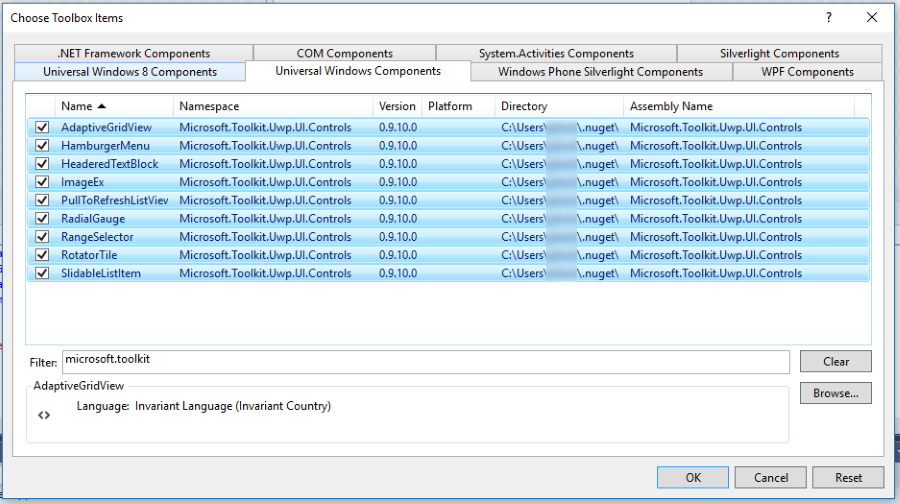
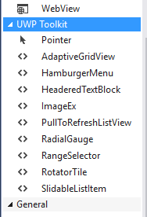

# Adding the UWP Community Toolkit to your Visual Studio Toolbox

Add the UWP Community Toolkit controls into the Visual Studio toolbox by following these steps:

1) Add the *Microsoft.Toolkit.Uwp.UI.Controls* NuGet package to your application. 

2) Open any XAML page and select the Toolbox on the left side of Visual Studio.

3) Right click in a blank area and select *Add Tab*.  Name the tab *UWP Community Toolkit Controls*.

4) Right click in the tab you just created and select *Choose Items...*.  Then select *Browse* from the *Choose Toolbox Items* dialog and navigate to the folder on your machine:

    ```
    c:\Users\%USERNAME%\.nuget\packages\Microsoft.Toolkit.Uwp.UI.Controls\
    ```

a.  Choose the folder name matching the version you have installed, then continue to the *lib\uap10.0* folder and select the *Microsoft.Toolkit.Uwp.UI.Controls.dll* file.  You should end up with a dialog similar to the one shown below.



5) Your toolbox should now have a list of UI Controls from the toolkit that you can drag and drop onto your XAML surfaces.



