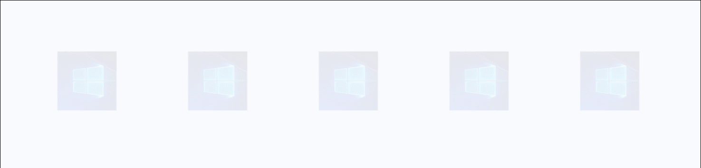

# AnimationSet

The AnimationSet class defines an object for storing and managing Storyboard and CompositionAnimations for an element. AnimationSet includes [Blur](Blur.md), [Fade](Fade.md), [Light](Light.md), [Offset](Offset.md), [Rotate](Rotate.md), [Saturation](Saturation.md) and [Scale](Scale.md) animations. AnimationSet animations is applied to all the XAML elements in its parent control/panel. AnimationSet animations doesn't affect the functionality of the control.

## Syntax

```xaml
<Page ...
     xmlns:interactivity="using:Microsoft.Xaml.Interactivity"  
     xmlns:behaviors="using:Microsoft.Toolkit.Uwp.UI.Animations.Behaviors"/>

<interactivity:Interaction.Behaviors>
    <interactivity:BehaviorCollection>
        <behaviors:Blur Value="10" Duration="2500" AutomaticallyStart="True"/>
        <behaviors:Scale ScaleX="2" ScaleY="2" Duration="2500" AutomaticallyStart="True"/>
        <!-- Others -->
    </interactivity:BehaviorCollection>
</interactivity:Interaction.Behaviors> 
```

```csharp
var anim = MyUIElement.Light(5).Offset(offsetX: 100, offsetY: 100).Saturation(0.5).Scale(scaleX: 2, scaleY: 2);
anim.SetDurationForAll(2500);
anim.SetDelay(250);
anim.Start();
```
```vb
Dim anim = MyUIElement.Light(5).Offset(offsetX:=100, offsetY:=100).Saturation(0.5).Scale(scaleX:=2, scaleY:=2)
anim.SetDurationForAll(2500)
anim.SetDelay(250)
anim.Start()
```

## Sample Output


## Properties

| Property | Type | Description |
| -- | -- | -- |
| Element | UIElement | Gets the UIElement |
| State | [AnimationSetState](https://docs.microsoft.com/dotnet/api/microsoft.toolkit.uwp.ui.animations.animationsetstate) | Gets the current state of the AnimationSet |
| UseComposition | Boolean | Gets or sets a value indicating whether composition must be use even on SDK > 10586 |
| Visual | Visual | Gets the Visual object that backs the XAML element |

### EasingType

You can change the way how the animation interpolates between keyframes by defining the EasingType.

| EasingType | Explanation                                                                                                | Graphical Explanation                      |
| ---------- | ---------------------------------------------------------------------------------------------------------- | ------------------------------------------ |
| Default    | Creates an animation that accelerates with the default EasingType which is specified in AnimationExtensions.DefaultEasingType which is by default Cubic |                                                                                                                           |
| Linear     | Creates an animation that accelerates or decelerates linear                                                                                             |                                                                                                                           |
| Back       | Retracts the motion of an animation slightly before it begins to animate in the path indicated                                                          |            |
| Bounce     | Creates a bouncing effect                                                                                                                               |        |
| Circle     | Creates an animation that accelerates or decelerates using a circular function                                                                          |        |
| Cubic      | Creates an animation that accelerates or decelerates using the formula f(t) = t3                                                                        |          |
| Elastic    | Creates an animation that resembles a spring oscillating back and forth until it comes to rest                                                          |      |
| Quadratic  | Creates an animation that accelerates or decelerates using the formula f(t) = t2                                                                        |  |
| Quartic    | Creates an animation that accelerates or decelerates using the formula f(t) = t4                                                                        |      |
| Quintic    | Create an animation that accelerates or decelerates using the formula f(t) = t5                                                                         |      |
| Sine       | Creates an animation that accelerates or decelerates using a sine formula                                                                               |            |

## Methods

| Methods | Description |
| -- | -- |
| AddCompositionAnimation(String, CompositionAnimation) | Adds a composition animation to be run on StartAsync() |
| AddCompositionDirectPropertyChange(String, Object) | Adds a composition property that will change instantaneously |
| AddCompositionEffectAnimation(CompositionObject, CompositionAnimation, String) | Adds a composition effect animation to be run on backing Visual |
| AddStoryboardAnimation(String, Timeline) | Adds a storyboard animation to be run |
| Dispose() | Dispose resources |
| RemoveCompositionAnimation(String) | Removes a composition animation from being run on Visual property |
| RemoveCompositionDirectPropertyChange(String) | Removes a composition property change |
| SetDelay(Double) | Ovewrites the delay time on all animations after last Then() to the specified value |
| SetDelay(TimeSpan) | Ovewrites the delay time on all animations after last Then() to the specified value |
| SetDelayForAll(Double)| Ovewrites the delay time on all animations to the specified value |
| SetDelayForAll(TimeSpan) | Ovewrites the delay time on all animations to the specified value |
| SetDuration(Double) | Ovewrites the duration on all animations after last Then() to the specified value |
| SetDuration(TimeSpan) | Ovewrites the duration on all animations after last Then() to the specified value |
| SetDurationForAll(Double) | Ovewrites the duration on all animations to the specified value |
| SetDurationForAll(TimeSpan) | Ovewrites the duration on all animations to the specified value |
| Start() | Stats all animations. This method is not awaitable. |
| StartAsync() | Starts all animations and returns an awaitable task |
| Stop() | Stops all animations |
| Then() | Wait for existing animations to complete before running new animations |

## Events

| Events | Description |
| -- | -- |
| Completed | Occurs when all animations have completed |

## Examples

- AnimationSet has endless possibility. Here is an example of creating popup effect

    **Sample Code**

    ```csharp
    FrameworkElement preElement = null;
    private void MyUIElement_PointerEntered(object sender, PointerRoutedEventArgs e)
    {
        preElement = sender as FrameworkElement;
        preElement.Blur(value: 0).Fade(value: 1).Scale(centerX: 100, centerY: 100, easingType: EasingType.Sine)
                .SetDurationForAll(500)
                .Start();
    }

    private void MyUIElement_PointerExited(object sender, PointerRoutedEventArgs e)
    {
        if (preElement != null)
        {
            preElement.Blur(value: 0).Fade(value: 0.1f).Scale(scaleX: 0.5f, scaleY: 0.5f, centerX: 100, centerY: 100, easingType: EasingType.Sine)
                    .SetDurationForAll(500)
                    .Start();
        }
    }
    ```
    ```vb
    Private Sub MyUIElement_PointerEntered(ByVal sender As Object, ByVal e As PointerRoutedEventArgs)
        preElement = TryCast(sender, FrameworkElement)
        preElement.Blur(value:=0).Fade(value:=1).Scale(centerX:=100, centerY:=100, easingType:=EasingType.Sine).SetDurationForAll(500).Start()
    End Sub

    Private Sub MyUIElement_PointerExited(ByVal sender As Object, ByVal e As PointerRoutedEventArgs)
        If preElement IsNot Nothing Then
            preElement.Blur(value:=0).Fade(value:=0.1F).Scale(scaleX:=0.5F, scaleY:=0.5F, centerX:=100, centerY:=100, easingType:=EasingType.Sine).SetDurationForAll(500).Start()
        End If
    End Sub
    ```

    **Sample Output**

    
- Use `Then()` to create a successive animation

    **Sample Code**

    ```csharp
    MyUIElement.Blur(value: 10).Fade(value: 0.5f)
               .Then()
               .Fade(value: 1).Scale(scaleX: 2, scaleY: 2, centerX: 100, centerY: 100, easingType: EasingType.Sine)
               .SetDurationForAll(2500)
               .Start();
    ```
    ```vb
    MyUIElement.Blur(value:=10) _
               .Fade(value:=0.5F) _
               .[Then]() _
               .Fade(value:=1) _
               .Scale(scaleX:=2, scaleY:=2, centerX:=100, centerY:=100, easingType:=EasingType.Sine) _
               .SetDurationForAll(2500) _
               .Start()
    ```

    **Sample Output**

    

## Requirements

| Device family | Universal, 10.0.14393.0 or higher   |
| ---------------------------------------------------------------- | ----------------------------------- |
| Namespace                                                        | Microsoft.Toolkit.Uwp.UI.Animations |
| NuGet package | [Microsoft.Toolkit.Uwp.UI.Animations](https://www.nuget.org/packages/Microsoft.Toolkit.Uwp.UI.Animations/) |

## API

* [AnimationSet source code](https://github.com/Microsoft/UWPCommunityToolkit/tree/master/Microsoft.Toolkit.Uwp.UI.Animations)

## Related

- [ ClAnimationSetCompletedEventArgsass](hTopicsttps://docs.microsoft.com/dotnet/api/microsoft.toolkit.uwp.ui.animations.animationsetcompletedeventargs)

- [ Class](https://docs.microsoft.com/dotnet/api/microsoft.toolkit.uwp.ui.animations.animationextensions)
AnimationExtensions