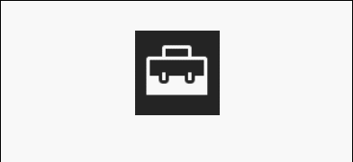
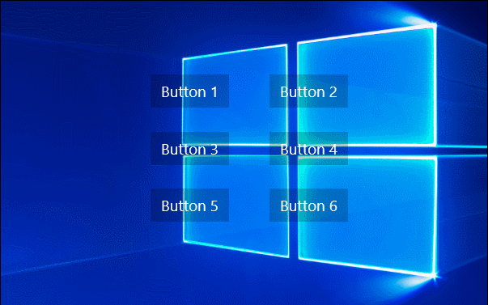

# Blur

The [Blur animation](https://docs.microsoft.com/dotnet/api/microsoft.toolkit.uwp.ui.animations.animationextensions.blur) blurs a XAML element by increasing or decreasing pixel size. Blur animation is applied to all the XAML elements in its parent control/panel. Blur animation doesn't affect the functionality of the control.

## Syntax

```xaml
<Page ...
    xmlns:interactivity="using:Microsoft.Xaml.Interactivity"  
    xmlns:behaviors="using:Microsoft.Toolkit.Uwp.UI.Animations.Behaviors"/>

<interactivity:Interaction.Behaviors>
    <behaviors:Blur x:Name="BlurBehavior" 
            Value="10" 
            Duration="2500" 
            Delay="250"
            EasingType="Linear"
            AutomaticallyStart="True"/>
</interactivity:Interaction.Behaviors>
```

```csharp
MyUIElement.Blur(value: 5, duration: 2500, delay: 250).Start();
await MyUIElement.Blur(value: 5, duration: 2500, delay: 250).StartAsync();  // Blur animation can be awaited
```
```vb
MyUIElement.Blur(value:=5, duration:=2500, delay:=250).Start()
Await MyUIElement.Blur(value:=5, duration:=2500, delay:=250).StartAsync()    ' Blur animation can be awaited
```

## Sample Output



## Properties

| Property | Type | Description |
| -- | -- | -- |
| Value | double | The blur amount |
| Duration | double | The duration in milliseconds |
| Delay | double | The delay for the animation to begin |

## Methods

| Methods | Return Type | Description |
| -- | -- | -- |
| Blur(AnimationSet, Double, Double, Double) | AnimationSet | Animates the gaussian blur of the the UIElement |
| Blur(FrameworkElement, Double, Double, Double) | AnimationSet | Animates the gaussian blur of the the UIElement |

## Examples

- Use this to shift the focus to foreground controls.

    **Sample Code**
    
    ```xaml
    <Grid>
        <Grid>
            <interactivity:Interaction.Behaviors>
                <behaviors:Blur x:Name="BlurBehavior" Value="5" Duration="2500" Delay="0" AutomaticallyStart="True"/>
            </interactivity:Interaction.Behaviors>
            <!-- XAML Element to be Blurred -->
            <!-- Background(even for Transparent background) of this Grid will also be Blurred -->
        </Grid>
        <!-- Foreground XAML Element -->
    </Grid>
    ```

    **Sample Output**

    

- Use this to create chaining animations with other animations. Visit the [AnimationSet](AnimationSet.md) documentation for more information.

    **Sample Code**

    ```csharp
    var anim = MyUIElement.Blur(5).Fade(0.5f).Rotate(30);
    anim.SetDurationForAll(2500);
    anim.SetDelay(250);
    anim.Completed += animation_completed;
    anim.Start();
    ```
    ```vb
    Dim anim = MyUIElement.Blur(5).Fade(0.5F).Rotate(30)
    anim.SetDurationForAll(2500)
    anim.SetDelay(250)
    AddHandler anim.Completed, AddressOf animation_completed
    anim.Start()
    ```

    **Sample Output**

    

## Sample Project

[Blur Behavior Sample Page Source](https://github.com/Microsoft/UWPCommunityToolkit/tree/master/Microsoft.Toolkit.Uwp.SampleApp/SamplePages/Blur). You can see this in action in [Windows Community Toolkit Sample App](https://www.microsoft.com/store/apps/9NBLGGH4TLCQ)

## Requirements

| Device family | Universal, 10.0.14393.0 or higher   |
| ---------------------------------------------------------------- | ----------------------------------- |
| Namespace                                                        | Microsoft.Toolkit.Uwp.UI.Animations |
| NuGet package | [Microsoft.Toolkit.Uwp.UI.Animations](https://www.nuget.org/packages/Microsoft.Toolkit.Uwp.UI.Animations/) |

## API

* [Blur source code](https://github.com/Microsoft/UWPCommunityToolkit/blob/master/Microsoft.Toolkit.Uwp.UI.Animations/Behaviors/Blur.cs)

## Related Topics

- [AnimationSet Class](https://docs.microsoft.com/windows/uwpcommunitytoolkit/animations/animationset)
- [CompositionEffectBrush Class](https://docs.microsoft.com/uwp/api/Windows.UI.Composition.CompositionEffectBrush)
