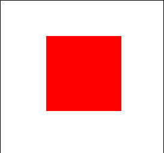

# Composition Animations in XAML

[Composition animations](https://docs.microsoft.com/windows/uwp/composition/composition-animation) in the universal windows platform provide a powerful and efficient way to run animations in your application UI and have been designed to ensure that your animations run at 60 FPS independent of the UI thread.

These XAML elements enable developer to specify composition animations directly in their XAML code to enable scenarios such as Implicit animations

## Syntax

```xaml
<Page ...
     xmlns:animations="using:Microsoft.Toolkit.Uwp.UI.Animations"/>

<animations:ScalarAnimation Target="Translation.Y" Duration="0:0:1" From="0" To="-200">
    <animations:ScalarKeyFrame Key="0.1" Value="30"></animations:ScalarKeyFrame>
    <animations:ScalarKeyFrame Key="0.5" Value="0.0"></animations:ScalarKeyFrame>
</animations:ScalarAnimation>
```

## Animations

### Animation Types

| Animation Type | Accepted KeyFrame type | Description |
| -- | -- | -- |
| ScalarAnimation | ScalarKeyFrame and ExpressionKeyFrame | Animation that animates a scalar (double) value |
| Vector2Animation | Vector2KeyFrame and ExpressionKeyFrame | Animation that animates a value of type [Vector2](https://docs.microsoft.com/uwp/api/Windows.Foundation.Numerics.Vector2) ("0" or "0, 0") |
| Vector3Animation | Vector3KeyFrame and ExpressionKeyFrame | Animation that animates a value of type [Vector3](https://docs.microsoft.com/uwp/api/Windows.Foundation.Numerics.Vector3) ("0" or "0, 0, 0") |
| Vector4Animation | Vector4KeyFrame and ExpressionKeyFrame | Animation that animates a value of type [Vector4](https://docs.microsoft.com/uwp/api/Windows.Foundation.Numerics.Vector4) ("0" or "0, 0, 0, 0") |
| OpacityAnimation | ScalarKeyFrame and ExpressionKeyFrame | ScalarAnimation where `Target = "Opacity". Animates the Visual.Opacity property |
| RotationAnimation | ScalarKeyFrame and ExpressionKeyFrame | ScalarAnimation where `Target = "RotationAngle". Animates the Visual.RotationAngle property |
| RotationInDegreesAnimation | ScalarKeyFrame and ExpressionKeyFrame | ScalarAnimation where `Target = "RotationAngleInDegrees". Animates the Visual.RotationAngleInDegrees property |
| ScaleAnimation | Vector3KeyFrame and ExpressionKeyFrame | Vector3Animation where `Target = "Scale". Animates the Visual.Scale property |
| TranslationAnimation | Vector3KeyFrame and ExpressionKeyFrame | Vector3Animation where `Target = "Translation". Animates the Visual.Translation property |
| OffsetAnimations | Vector3KeyFrame and ExpressionKeyFrame | Vector3Animation where `Target = "Offset". Animates the Visual.Offset property |

### Animation Properties

| Property | Type | Description |
| -- | -- | -- |
| Duration | TimeSpan | The duration of the animation. Default is 400ms |
| Delay | TimeSpan | The delay before starting the animation. Default is 0ms |
| KeyFrames | KeyFrameCollection | Key frames for the animation. Each animation will only use the appropriate type KeyFrame and ExpressionKeyFrame |
| Target | string | The property to animate |
| ImplicitTarget | string | The property that, if changed, will invoke this animation. This property is only used when specifying Implicit Animations. If this value is not set, it will default to the **Target** property |
| From | T | Setting this value will insert a new key frame at Key 0 |
| To | T | Setting this value will insert a new key frame at Key 1 |

## KeyFrames

KeyFrames permit more than one target value that is reached at a point along the animation timeline. In other words each key frame can specify a different intermediate value.

### KeyFrame Types

| KeyFrame Type | Description |
| -- | -- |
| ExpressionKeyFrame | A KeyFrame of type string |
| ScalarKeyFrame | A KeyFrame of type double |
| Vector2KeyFrame | A KeyFrame of type string representing a Vector2 ("0" or "0, 0") |
| Vector3KeyFrame | A KeyFrame of type string representing a Vector3 ("0" or "0, 0, 0") |
| Vector4KeyFrame | A KeyFrame of type string representing a Vector4 ("0" or "0, 0, 0, 0") |

### KeyFrame Properties

| Property | Type | Description |
| -- | -- | -- |
| Key | double | A value between 0.0 and 1.0 |
| Value | T | The value that should be reached at specified Key |

## AnimationCollection

A collection of animations. 

### AnimationCollection Properties

| Property | Type | Description |
| -- | -- | -- |
| ContainsTranslationAnimation | bool | True if any of the animations in the collection target the **Visual.Translation** property |

### AnimationCollection Events

| Events | Description |
| -- | -- |
| AnimationCollectionChanged | Raised when an animation has been added, removed, or a value of an animation has changed |

## Examples

> [!NOTE]
Use [Implicit Composition Animations in XAML](https://docs.microsoft.com/windows/uwpcommunitytoolkit/animations/implicitanimations) to run these animations.

Let's create some plain animation first. Theses animation will run when the `Target` property is changed.

- Creating a `ScalarAnimation`. ScalarAnimation can target Opacity, RotationAngle, RotationAngleInDegrees, Translation.X, Translation.Y, Translation.Z.
    ```xaml
    <animations:ScalarAnimation Target="Opacity" Duration="0:0:1" From="0" To="1"/>
    ```
- Creating a `Vector2Animation`. Vector2Animation can target AnchorPoint, RelativeSizeAdjustment, Size.
    ```xaml
    <animations:Vector2Animation Target="AnchorPoint" Duration="0:0:1" From="0, 0" To="50, 50"/>
    ```
- Creating a `Vector3Animation`. Vector3Animation can target CenterPoint, Offset, RelativeOffsetAdjustment, RotationAxis, Scale, Translation.
    ```xaml
    <animations:Vector3Animation Target="CenterPoint" Duration="0:0:1" From="0, 0, 0" To="50, 50, 50"/>
    ```
- Creating a animation that takes final value as `To` value. If you didn't set From/To value or any KeyFrames then in this case, an ExpressionKeyFrame will be added of `Value="this.FinalValue"`.
    ```xaml
    <animations:OffsetAnimations Duration="0:0:1"/>
    ```
    > [!NOTE]
    OffsetAnimations is equivalent to setting `Target = "Offset"` in Vector3Animation. So there is no Target property.
- Creating an animation which runs when another property changes. You can use `ImplicitTarget`. Whenever ImplicitTarget property changes the animation will run. In this example, if Offset changes then the ScaleAnimation will run.
    ```xaml
    <animations:ScaleAnimation Duration="0:0:1" To="50, 50, 50" ImplicitTarget="Offset"/>
    ```
    > [!NOTE]
    If `ImplicitTarget` is set then the animation will no longer run when `Target` property is changed.

Now we can add KeyFrames

- Creating a blink and disappear animation with OpacityAnimation. To create a blink animation, we need to reduce and increase the opacity.
    ```xaml
    <animations:OpacityAnimation Duration="0:0:1" From="1" To="0">
        <animations:ScalarKeyFrame Key="0.2" Value="0.5"/>
        <animations:ScalarKeyFrame Key="0.4" Value="0.8"/>
        <animations:ScalarKeyFrame Key="0.6" Value="0.3"/>
        <animations:ScalarKeyFrame Key="0.8" Value="0.6"/>
    </animations:OpacityAnimation>
    ```
    **Sample Output**
    
- You can use ExpressionKeyFrame to specify expression to create [ExpressionAnimation](https://docs.microsoft.com/uwp/api/Windows.UI.Composition.ExpressionAnimation).
    ```xaml
    <animations:OffsetAnimation Duration="0:0:1">
        <animations:ExpressionKeyFrame Key="0.2" Value="This.FinalValue / 2"/>
    </animations:OffsetAnimation>
    ```

## Sample Code

[Implicit Composition Animations in XAML sample page source](https://github.com/Microsoft/UWPCommunityToolkit/blob/master/Microsoft.Toolkit.Uwp.SampleApp/SamplePages/Implicit%20Animations/ImplicitAnimationsPage.xaml). You can see this in action in [Windows Community Toolkit Sample App](https://www.microsoft.com/store/apps/9NBLGGH4TLCQ).

## Requirements

| Device family | Universal, 10.0.15063.0 or higher   |
| ---------------------------------------------------------------- | ----------------------------------- |
| Namespace                                                        | Microsoft.Toolkit.Uwp.UI.Animations |
| NuGet package | [Microsoft.Toolkit.Uwp.UI.Animations](https://www.nuget.org/packages/Microsoft.Toolkit.Uwp.UI.Animations/) |

## API

* [Composition animations source code](https://github.com/Microsoft/UWPCommunityToolkit/tree/master/Microsoft.Toolkit.Uwp.UI.Animations/CompositionAnimations)

## Related Topics

- [Visual layer](https://docs.microsoft.com/windows/uwp/composition/visual-layer)
- [Composition animations](https://docs.microsoft.com/windows/uwp/composition/composition-animation)
- [ExpressionAnimation](https://docs.microsoft.com/uwp/api/Windows.UI.Composition.ExpressionAnimation)
