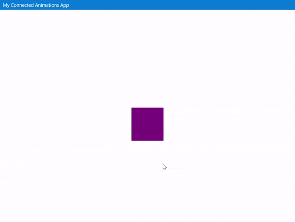

# Connected Animations XAML Attached Properties

[Connected animations](https://docs.microsoft.com/windows/uwp/style/connected-animation) let you create a dynamic and compelling navigation experience by animating the transition of an element between two different views.

The Connected Animations XAML Attached Properties enable connected animations to be defined directly in your XAML code by simply adding a Key to the element that should animate. There are also attached properties to enable coordinated animations and animations in lists and grids.

## Syntax

```xaml
<Page ...
    xmlns:animations="using:Microsoft.Toolkit.Uwp.UI.Animations"/>

<Border x:Name="Element" animations:Connected.Key="item"></Border>

<TextBlock animations:Connected.AnchorElement="{x:Bind Element}" Text="Hello World"/>

<GridView animations:Connected.ListItemElementName="ItemThumbnail"
          animations:Connected.ListItemKey="listItem">
    <GridView.ItemTemplate>
        <DataTemplate>
            <Image x:Name="ItemThumbnail" Height="200" Width="200"></Image>
        </DataTemplate>
    </GridView.ItemTemplate>
</GridView>
```

## Sample Output



## Properties

### Connected.Key
Registers element with the [ConnectedAnimationsService](https://msdn.microsoft.com/library/windows/apps/windows.ui.xaml.media.animation.connectedanimation.aspx). For the animation to work, the same key must be registered on two different pages when navigating

### Connected.AnchorElement
To enable [coordinated animations](https://docs.microsoft.com/windows/uwp/style/connected-animation#coordinated-animation), use the AnchorElement attached property on the element that should appear alongside the connected animation element by specifying the connected animation element

### Connected.ListItemKey
Registers a ListView/GridView for connected animations. When navigating from/to a page that is using this property, the connected animation will use the item passed as a **parameter** in the page navigation to select the item in the list that should animate. The Connected.ListItemElementName attached property must also be set for the animation to be registered

### Connected.ListItemElementName
Specifies what named element in the DataTemplate of an item should animate. The Connected.ListItemKey attached property must also be set for the animation to be registered.

## Examples

We can create the above connected animations.

**In first page**

We need a set a key for the element to be connected with another element in a different page.

```xaml
<Grid>
    <Border Height="100" Width="100" Background="Purple" 
        VerticalAlignment="Center" HorizontalAlignment="Center" 
        animations:Connected.Key="item"/>
</Grid>
```

**In second page**
 
We need to set the same key for the element to be connected with. Also, You can anchor another element to move along the connected animation path.

```xaml
<StackPanel Orientation="Horizontal">
    <Border x:Name="HeroElement" Height="300"  Width="300" Background="Purple"
    animations:Connected.Key="item"/>

    <StackPanel x:Name="HeroDetailsElement" Margin="20,0" 
        VerticalAlignment="Bottom" MaxWidth="500" 
        animations:Connected.AnchorElement="{x:Bind HeroElement}">
        <TextBlock Text="Header" FontSize="50">Header</TextBlock>
        <TextBlock TextWrapping="WrapWholeWords">Lorem ipsum ...</TextBlock>
    </StackPanel>
</StackPanel>
```

In this page, we can also create a GridView which implements connected animation for its items. You need to set ListItemKey and ListItemElementName for specifying the UIElement to animate.

```xaml
<GridView x:Name="listView" Margin="0, 40, 0, 0" SelectionMode="None" 
Grid.Row="1" ItemClick="ListView_ItemClick" IsItemClickEnabled="True"
animations:Connected.ListItemElementName="ItemThumbnail"
animations:Connected.ListItemKey="listItem">
    <GridView.ItemTemplate>
        <DataTemplate x:DataType="data:Item">
            <StackPanel>
                <Border x:Name="ItemThumbnail" Background="Purple" Height="200" Width="200"></Border>
                <TextBlock Text="{x:Bind Title}"></TextBlock>
            </StackPanel>
        </DataTemplate>
    </GridView.ItemTemplate>
</GridView>
```

**In third page**

In this page, you just need to give the same key.

```xaml
<StackPanel>
    <StackPanel Orientation="Horizontal" HorizontalAlignment="Right">
        <StackPanel x:Name="HeroDetailsElement" Margin="20,0" VerticalAlignment="Bottom" MaxWidth="500" 
        animations:Connected.AnchorElement="{x:Bind ItemHeroElement}">
            <TextBlock Text="{x:Bind item.Title}" 
            FontSize="50"/>
            <TextBlock TextWrapping="WrapWholeWords">Lorem ipsum ...</TextBlock>
        </StackPanel>

        <Border x:Name="ItemHeroElement" Height="300" Width="300" Background="Purple" 
        animations:Connected.Key="listItem"/>
    </StackPanel>

    <TextBlock Margin="0,40" TextWrapping="WrapWholeWords">Lorem Ipsum ...</TextBlock>
</StackPanel>
```

## Sample Code

[Connected Animations sample page source](https://github.com/Microsoft/WindowsCommunityToolkit//tree/master/Microsoft.Toolkit.Uwp.SampleApp/SamplePages/Connected%20Animations). You can see this in action in [Windows Community Toolkit Sample App](https://www.microsoft.com/store/apps/9NBLGGH4TLCQ).

## Requirements

| Device family | Universal, 10.0.15063.0 or higher   |
| ---------------------------------------------------------------- | ----------------------------------- |
| Namespace                                                        | Microsoft.Toolkit.Uwp.UI.Animations |
| NuGet package | [Microsoft.Toolkit.Uwp.UI.Animations](https://www.nuget.org/packages/Microsoft.Toolkit.Uwp.UI.Animations/) |

## API

* [Connected animations source code](https://github.com/Microsoft/WindowsCommunityToolkit//tree/master/Microsoft.Toolkit.Uwp.UI.Animations/ConnectedAnimations)

## Related Topics

- [ConnectedAnimationService Class](https://docs.microsoft.com/uwp/api/Windows.UI.Xaml.Media.Animation.ConnectedAnimationService)
