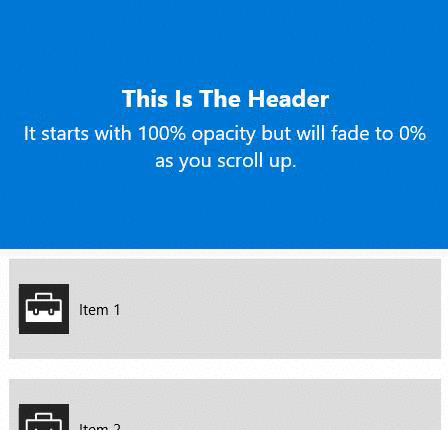

# FadeHeader

The [FadeHeader](https://docs.microsoft.com/dotnet/api/microsoft.toolkit.uwp.ui.animations.behaviors.fadeheaderbehavior) fades a ListView or GridView Header UIElement when the user scrolls. The UIElement fades out to 0 opacity when the edge of the Header reaches the edge of the visible bounds of the ListElement.

## Syntax

***Implicit usage***: Automatically detects the Header element by finding the ListViewBase (note: GridView uses ListViewBase)

```xaml
<Page ...
    xmlns:interactivity="using:Microsoft.Xaml.Interactivity"  
    xmlns:behaviors="using:Microsoft.Toolkit.Uwp.UI.Animations.Behaviors"/>

<ListView>
    <interactivity:Interaction.Behaviors>
        <behaviors:FadeHeaderBehavior />
    </interactivity:Interaction.Behaviors>
    <ListView.Header>
        <!-- Header Content -->
    </ListView.Header>
</ListView>
```

***Explicit usage***: Set the ElementName property using the UIElement of the Header manually

```xaml
<Page ...
    xmlns:interactivity="using:Microsoft.Xaml.Interactivity"  
    xmlns:behaviors="using:Microsoft.Toolkit.Uwp.UI.Animations.Behaviors"/>

<ListView>
    <interactivity:Interaction.Behaviors>
        <behaviors:FadeHeaderBehavior HeaderElement="{Binding ElementName=MyHeaderGrid}" />
    </interactivity:Interaction.Behaviors>
    <ListView.Header>
        <Grid Name="MyHeaderGrid">
            <!-- Header Content -->
        </Grid>
    </ListView.Header>
</ListView>
```

***Implicit usage***:

```csharp
Microsoft.Xaml.Interactivity.Interaction.GetBehaviors(MyListView).Add(new FadeHeaderBehavior());
```
```vb
Microsoft.Xaml.Interactivity.Interaction.GetBehaviors(MyListView).Add(New FadeHeaderBehavior())
```

***Explicit usage***:

```csharp
Microsoft.Xaml.Interactivity.Interaction.GetBehaviors(MyListView).Add(new FadeHeaderBehavior { HeaderElement = MyHeaderGrid });
```
```vb
Microsoft.Xaml.Interactivity.Interaction.GetBehaviors(MyListView).Add(New FadeHeaderBehavior With {.HeaderElement = MyHeaderGrid})
```

## Sample Output



## Properties

| Property | Type | Description |
| -- | -- | -- |
| HeaderElement | UIElement | Gets or sets the target element for the Fading behavior |

## Sample Project

[FadeHeader Behavior Sample Page Source](https://github.com/Microsoft/WindowsCommunityToolkit//tree/master/Microsoft.Toolkit.Uwp.SampleApp/SamplePages/FadeHeader). You can see this in action in [Windows Community Toolkit Sample App](https://www.microsoft.com/store/apps/9NBLGGH4TLCQ).

## Requirements

| Device family | Universal, 10.0.15063.0 or higher   |
| ---------------------------------------------------------------- | ----------------------------------- |
| Namespace                                                        | Microsoft.Toolkit.Uwp.UI.Animations |
| NuGet package | [Microsoft.Toolkit.Uwp.UI.Animations](https://www.nuget.org/packages/Microsoft.Toolkit.Uwp.UI.Animations/) |

## API

* [FadeHeader source code](https://github.com/Microsoft/WindowsCommunityToolkit//blob/master/Microsoft.Toolkit.Uwp.UI.Animations/Behaviors/FadeHeaderBehavior.cs)

## Related Topics

- [ListViewBase Header](https://docs.microsoft.com/uwp/api/windows.ui.xaml.controls.listviewbase#Windows_UI_Xaml_Controls_ListViewBase_Header)
