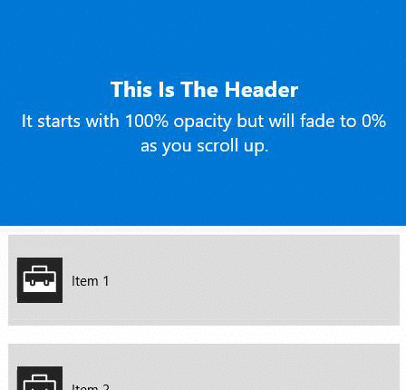

# FadeHeader

The **FadeHeader Behavior** fades a ListView or GridView Header UIElement when the user scrolls. The UIElement fades out to 0 opacity when the edge of the Header reaches the edge of the visible bounds of the ListElement.

## Syntax

### XAML Implementation ###

**Implicit usage**: 

Automatically detects the Header element by finding the ListViewBase (note: GridView uses ListViewBase)

```xml

    <interactivity:Interaction.Behaviors>
        <behaviors:FadeHeaderBehavior />
    </interactivity:Interaction.Behaviors>

```


**Explicit usage**: 

Set the ElementName property using the UIElement of the Header manually

```xml

    <interactivity:Interaction.Behaviors>
        <behaviors:FadeHeaderBehavior HeaderElement="{Binding ElementName=MyHeaderGrid}" />
    </interactivity:Interaction.Behaviors>

```

### C# Implementation ###

Implicit usage:

```csharp

    Microsoft.Xaml.Interactivity.Interaction.GetBehaviors(MyListView).Add(new FadeHeaderBehavior());

```

Explicit usage:

```csharp

    Microsoft.Xaml.Interactivity.Interaction.GetBehaviors(MyListView).Add(new FadeHeaderBehavior { HeaderElement = MyHeaderGrid });

```


## Example ##

```xml

    <ListView x:Name="MyListView">
    <interactivity:Interaction.Behaviors>
        <behaviors:FadeHeaderBehavior />
    </interactivity:Interaction.Behaviors>
    <ListView.Header>
        <Grid x:Name="MyHeaderGrid"
                      MinHeight="250"
                      Background="{StaticResource Brush-Blue-01}">
            <StackPanel VerticalAlignment="Center"
                        HorizontalAlignment="Center"
                        Margin="20,0">
                <TextBlock Text="This Is The Header"
                           TextAlignment="Center"
                           FontWeight="Bold"
                           Style="{ThemeResource TitleTextBlockStyle}"
                           Foreground="{StaticResource Brush-White}"
                           Margin="0,5" />
                <TextBlock Text="It starts with 100% opacity but will fade to 0% as you scroll up."
                           Style="{ThemeResource SubtitleTextBlockStyle}"
                           Foreground="{StaticResource Brush-White}"
                           VerticalAlignment="Center"
                           TextAlignment="Center" />
            </StackPanel>
        </Grid>
    </ListView.Header>
</ListView>

```


[FadeHeader Behavior Sample Page Source](https://github.com/Microsoft/UWPCommunityToolkit/tree/master/Microsoft.Toolkit.Uwp.SampleApp/SamplePages/FadeHeader)

## Example Image



## Requirements (Windows 10 Device Family)

| [Device family](http://go.microsoft.com/fwlink/p/?LinkID=526370) | Universal, 10.0.14393.0 or higher |
| --- | --- |
| Namespace | Microsoft.Toolkit.Uwp.UI.Animations |

## API

* [FadeHeader source code](https://github.com/Microsoft/UWPCommunityToolkit/blob/master/Microsoft.Toolkit.Uwp.UI.Animations/Behaviors/FadeHeaderBehavior.cs)

