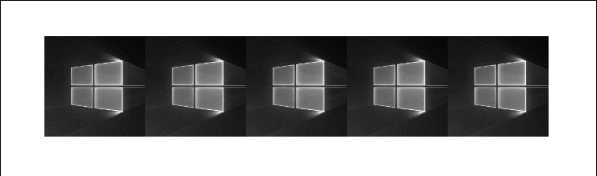

# Saturation

The Saturation animation selectively saturates a XAML element. Saturation animation is applied to all the XAML elements in its parent control/panel. Saturation animation doesn't affect the functionality of the control.

## Syntax

**XAML**

```xaml
<Page ...
    xmlns:interactivity="using:Microsoft.Xaml.Interactivity"  
    xmlns:behaviors="using:Microsoft.Toolkit.Uwp.UI.Animations.Behaviors"/>

<interactivity:Interaction.Behaviors>
    <behaviors:Saturation x:Name="SaturationBehavior" 
           Value="0" 
           Duration="2500" 
           Delay="250" 
           AutomaticallyStart="True"/>
</interactivity:Interaction.Behaviors>
```

**C#**

```csharp
ToolkitLogo.Saturation(value: 0, duration: 500, delay: 250);       
```

## Sample Output


## Properties


## Examples

- Sometimes you want an element to desaturate, a common example of this could be when you mouse over a UI Element, now you can apply a SaturationBehavior to the original element at run time.

    **Sample Code**
    ```csharp
    private void MyUIElement_PointerEntered(object sender, PointerRoutedEventArgs e)
    {
        MyUIElement.Saturation(value: 1).Start();
    }

    private void MyUIElement_PointerExited(object sender, PointerRoutedEventArgs e)
    {
        MyUIElement.Saturation(value: 0).Start();
    }
    ```
    **Sample Output**

    

- Use this to create chaining animations with other animations. Visit the [AnimationSet](\AnimationSet.md) documentation for more information.

    **Sample Code**
    ```csharp
    var anim = MyUIElement.Light(5).Offset(offsetX: 100, offsetY: 100).Saturation(0.5).Scale(scaleX: 2, scaleY: 2);
    anim.SetDurationForAll(2500);
    anim.SetDelay(250);
    anim.Completed += animation_completed;
    anim.Start();
    ```
    **Sample Output**

    

## Sample Project

[Saturation Behavior Sample Page Source](https://github.com/Microsoft/UWPCommunityToolkit/tree/master/Microsoft.Toolkit.Uwp.SampleApp/SamplePages/Saturation). You can see this in action in [UWP Community Toolkit Sample App](https://www.microsoft.com/store/apps/9NBLGGH4TLCQ).

## Requirements

| [Device family](http://go.microsoft.com/fwlink/p/?LinkID=526370) | Universal, 10.0.14393.0 or higher   |
| ---------------------------------------------------------------- | ----------------------------------- |
| Namespace                                                        | Microsoft.Toolkit.Uwp.UI.Animations |
| NuGet package | [Microsoft.Toolkit.Uwp.UI.Animations](https://www.nuget.org/packages/Microsoft.Toolkit.Uwp.UI.Animations/) |

## API

* [Saturation source code](https://github.com/Microsoft/UWPCommunityToolkit/blob/master/Microsoft.Toolkit.Uwp.UI.Animations/Behaviors/Saturation.cs)

