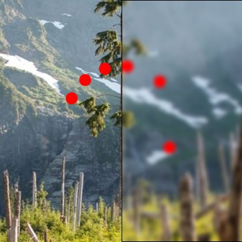

# BackdropBlurBrush

The [BackdropBlurBrush](https://docs.microsoft.com/dotnet/api/microsoft.toolkit.uwp.ui.media.backdropblurbrush) is a [Brush](https://docs.microsoft.com/uwp/api/windows.ui.xaml.media.brush) that blurs whatever is behind it in the application.

## Syntax

```xaml
<Border BorderBrush="Black" BorderThickness="1" VerticalAlignment="Center" HorizontalAlignment="Center" Width="400" Height="400">
  <Border.Background>
    <media:BackdropBlurBrush Amount="3.0" />
  </Border.Background>
</Border>
```

## Example Image



## Properties

| Property | Type | Description |
| -- | -- | -- |
| Amount | double | The `Amount` property specifies a double value for the amount of Gaussian blur to apply. |

## Sample Code

[BackdropBlurBrush sample page Source](https://github.com/Microsoft/UWPCommunityToolkit/tree/master/Microsoft.Toolkit.Uwp.SampleApp/SamplePages/BackdropBlurBrush). You can see this in action in [Windows Community Toolkit Sample App](https://www.microsoft.com/store/apps/9NBLGGH4TLCQ).

## Requirements

| Device family | Universal, 10.0.15063.0 or higher |
| --- | --- |
| Namespace | Microsoft.Toolkit.Uwp.UI.Media |
| NuGet package | [Microsoft.Toolkit.Uwp.UI](https://www.nuget.org/packages/Microsoft.Toolkit.Uwp.UI/) |

## API Source Code

- [BackdropBlurBrush source code](https://github.com/Microsoft/UWPCommunityToolkit/blob/master/Microsoft.Toolkit.Uwp/Media/BackdropBlurBrush.cs)

## Related Topics

- [Win2D GaussianBlurEffect reference](http://microsoft.github.io/Win2D/html/T_Microsoft_Graphics_Canvas_Effects_GaussianBlurEffect.htm)
- [XamlCompositionBrushBase Examples](https://docs.microsoft.com/uwp/api/windows.ui.xaml.media.xamlcompositionbrushbase#examples)
