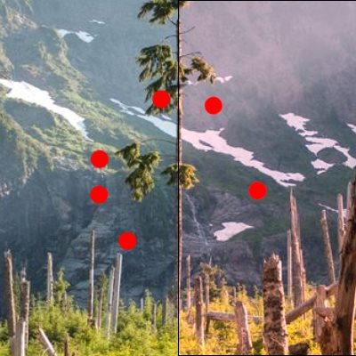

# BackdropGammaTransferBrush

The [BackdropGammaTransferBrush](https://docs.microsoft.com/dotnet/api/microsoft.toolkit.uwp.ui.media.backdropgammatransferbrush) is a [Brush](https://docs.microsoft.com/uwp/api/windows.ui.xaml.media.brush) which modifies the color values of whatever is behind it in the application.

## Syntax

To apply a red hue:

```xaml
<Border BorderBrush="Black" BorderThickness="1" VerticalAlignment="Center" HorizontalAlignment="Center" Width="400" Height="400">
  <Border.Background>
    <media:BackdropGammaTransferBrush RedAmplitude="1.25" />
  </Border.Background>
</Border>
```

## Example Image



## Properties

See the property reference for the [GammaTransferEffect](http://microsoft.github.io/Win2D/html/T_Microsoft_Graphics_Canvas_Effects_GammaTransferEffect.htm).  

All Amplitude, Disable, Exponent, and Offset properties are available for the Alpha, Red, Green, and Blue channels.

## Sample Code

[BackdropGammaTransferBrush sample page Source](https://github.com/Microsoft/WindowsCommunityToolkit//tree/master/Microsoft.Toolkit.Uwp.SampleApp/SamplePages/BackdropGammaTransferBrush). You can see this in action in [Windows Community Toolkit Sample App](https://www.microsoft.com/store/apps/9NBLGGH4TLCQ).

## Requirements

| Device family | Universal, 10.0.15063.0 or higher |
| --- | --- |
| Namespace | Microsoft.Toolkit.Uwp.UI.Media |
| NuGet package | [Microsoft.Toolkit.Uwp.UI](https://www.nuget.org/packages/Microsoft.Toolkit.Uwp.UI/) |

## API Source Code

- [BackdropGammaTransferBrush source code](https://github.com/Microsoft/WindowsCommunityToolkit//blob/master/Microsoft.Toolkit.Uwp/Media/BackdropGammaTransferBrush.cs)

## Related Topics

- [Win2D GammaTransferEffect reference](http://microsoft.github.io/Win2D/html/T_Microsoft_Graphics_Canvas_Effects_GammaTransferEffect.htm)
