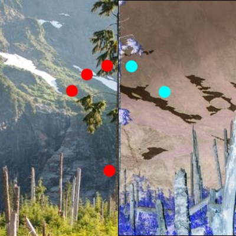

# BackdropInvertBrush

The [BackdropInvertBrush](https://docs.microsoft.com/dotnet/api/microsoft.toolkit.uwp.ui.media.backdropinvertbrush) is a [Brush](https://docs.microsoft.com/uwp/api/windows.ui.xaml.media.brush) that inverts whatever is behind it in the application.

## Syntax

```xaml
<Border BorderBrush="Black" BorderThickness="1" VerticalAlignment="Center" HorizontalAlignment="Center" Width="400" Height="400">
  <Border.Background>
    <media:BackdropInvertBrush />
  </Border.Background>
</Border>
```

## Example Image



## Sample Code

[BackdropInvertBrush sample page Source](https://github.com/Microsoft/WindowsCommunityToolkit//tree/master/Microsoft.Toolkit.Uwp.SampleApp/SamplePages/BackdropInvertBrush). You can see this in action in [Windows Community Toolkit Sample App](https://www.microsoft.com/store/apps/9NBLGGH4TLCQ).

## Requirements

| Device family | Universal, 10.0.15063.0 or higher |
| --- | --- |
| Namespace | Microsoft.Toolkit.Uwp.UI.Media |
| NuGet package | [Microsoft.Toolkit.Uwp.UI](https://www.nuget.org/packages/Microsoft.Toolkit.Uwp.UI/) |

## API Source Code

- [BackdropInvertBrush source code](https://github.com/Microsoft/WindowsCommunityToolkit//blob/master/Microsoft.Toolkit.Uwp/Media/BackdropInvertBrush.cs)

## Related Topics

- [Win2D InvertEffect reference](http://microsoft.github.io/Win2D/html/T_Microsoft_Graphics_Canvas_Effects_InvertEffect.htm)
- [Working with Brushes and Content – XAML and Visual Layer Interop, Part One](https://blogs.windows.com/buildingapps/2017/07/18/working-brushes-content-xaml-visual-layer-interop-part-one/#c57zf3bW4ylLlSvJ.97)
