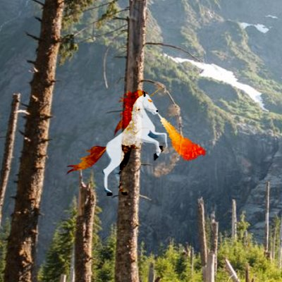

# ImageBlendBrush

The [ImageBlendBrush](https://docs.microsoft.com/dotnet/api/microsoft.toolkit.uwp.ui.media.imageblendbrush) is a [Brush](https://docs.microsoft.com/uwp/api/windows.ui.xaml.media.brush) that blends the provided image with whatever is behind it in the application with the provided blend mode.

## Syntax

```xaml
<Border Grid.Column="0">
  <Border.Background>
    <media:ImageBlendBrush 
      Source="/SamplePages/DropShadowPanel/Unicorn.png"
      Stretch="None"
      Mode="ColorBurn"/>
  </Border.Background>
</Border>
```

## Example Image



## Properties

| Property | Type | Description |
| -- | -- | -- |
| Source | Windows.UI.Xaml.Media.ImageSource | The `ImageSource` property specifies which image to use for the effect.  It is assumed it will resolve to a [BitmapImage](https://docs.microsoft.com/uwp/api/windows.ui.xaml.media.imaging.bitmapimage). |
| Stretch | Windows.UI.Xaml.Media.Stretch | The `Stretch` property specifies how the image should stretch to its container.  Requires 10.0.16299 or higher for modes other than None (default). |
| Mode | [ImageBlendMode](https://docs.microsoft.com/dotnet/api/microsoft.toolkit.uwp.ui.media.imageblendmode) | The `ImageBlendMode` property specifies how the image should be blended with the backdrop.  See the [BlendEffectMode](http://microsoft.github.io/Win2D/html/T_Microsoft_Graphics_Canvas_Effects_BlendEffectMode.htm) reference.  The `Hue`, `Saturation`, `Color`, and `Luminosity` modes require a Windows version 10.0.16299 or higher. |

> [!NOTE]
The `Stretch` property for values other than `None` requires a Windows version 10.0.16299 or higher.
In addition, the `Hue`, `Saturation`, `Color`, and `Luminosity` modes require a Windows version 10.0.16299 or higher.

## Sample Code

[ImageBlendBrush sample page Source](https://github.com/Microsoft/UWPCommunityToolkit/tree/master/Microsoft.Toolkit.Uwp.SampleApp/SamplePages/ImageBlendBrush). You can see this in action in [Windows Community Toolkit Sample App](https://www.microsoft.com/store/apps/9NBLGGH4TLCQ).

## Requirements

| Device family | Universal, 10.0.15063.0 or higher |
| --- | --- |
| Namespace | Microsoft.Toolkit.Uwp.UI.Media |
| NuGet package | [Microsoft.Toolkit.Uwp.UI](https://www.nuget.org/packages/Microsoft.Toolkit.Uwp.UI/) |

## API Source Code

- [BackdropInvertBrush source code](https://github.com/Microsoft/UWPCommunityToolkit/blob/master/Microsoft.Toolkit.Uwp/Media/ImageBlendBrush.cs)

## Related Topics

- [BitmapImage](https://docs.microsoft.com/uwp/api/windows.ui.xaml.media.imaging.bitmapimage)
- [Win2D BlendEffect reference](http://microsoft.github.io/Win2D/html/T_Microsoft_Graphics_Canvas_Effects_BlendEffect.htm)
- [BlendEffectMode reference](http://microsoft.github.io/Win2D/html/T_Microsoft_Graphics_Canvas_Effects_BlendEffectMode.htm)
- [Working with Brushes and Content – XAML and Visual Layer Interop, Part One](https://blogs.windows.com/buildingapps/2017/07/18/working-brushes-content-xaml-visual-layer-interop-part-one/#c57zf3bW4ylLlSvJ.97)
