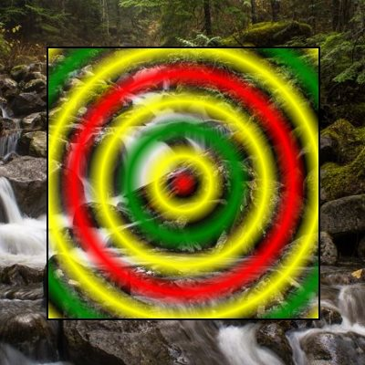

# RadialGradientBrush

The [RadialGradientBrush](https://docs.microsoft.com/dotnet/api/microsoft.toolkit.uwp.ui.media.radialgradientbrush) is a [Brush](https://docs.microsoft.com/uwp/api/windows.ui.xaml.media.brush) that fills an area with a radial gradient. A focal point defines the beginning of the gradient, and a circle defines the end point of the gradient.  It is a drop-in replacement for the [System.Windows.Media.RadialGradientBrush](https://msdn.microsoft.com/library/system.windows.media.radialgradientbrush(v=vs.110).aspx).  However, the `Transform`, `RenderTransform`, and `MappingMode` properties aren't supported.

## WPF Conversion Notes

When porting your brush XAML from WPF, just add the `media:` namespace prefix to your `RadialGradientBrush` and add the `xmlns:media="using:Microsoft.Toolkit.Uwp.UI.Media"` to your XAML namespace list.

If you used the `Absolute` *MappingMode* you'll need to convert to the `RelativeToBoundingBox` mode first and recalculate your `RadiusX`, `RadiusY`, `Center`, and `GradientOrigin` property values.

The Animation or Binding of *GradientStop* `Offset` and `Color` properties is not supported.

## Syntax

```xaml
<Rectangle Width="300" Height="300" Stroke="Black" StrokeThickness="2">
  <Rectangle.Fill>
    <media:RadialGradientBrush 
            AlphaMode="Premultiplied"
            RadiusX="0.2" RadiusY="0.2"
            SpreadMethod="Reflect">
        <GradientStop Color="Red" Offset="0" />
        <GradientStop Color="Transparent" Offset="0.25" />
        <GradientStop Color="Yellow" Offset="0.50" />
        <GradientStop Color="Transparent" Offset="0.75" />
        <GradientStop Color="Green" Offset="1.0" />
    </media:RadialGradientBrush>
  </Rectangle.Fill>
</Rectangle>
```

## Example Image



## Properties

| Property | Type | Description |
| -- | -- | -- |
| AlphaMode | [AlphaMode](https://docs.microsoft.com/dotnet/api/microsoft.toolkit.uwp.ui.media.alphamode) | Specifies how the alpha channel affects color channels.  The default is `Straight` for compatibility with WPF; however, the `Premultiplied` value may provide a more natural transition to transparent values.
| Center | Windows.Foundation.Point | The center of the outermost circle of the radial gradient.  The default is `0.5,0.5`. |
| ColorInterpolationMode | [ColorInteropolationMode](https://docs.microsoft.com/uwp/api/Windows.UI.Xaml.Media.ColorInterpolationMode) | Specifies how the gradient's colors are interpolated.  The default is `SRgbLinearInterpolation`. |
| FallbackColor | Windows.UI.Color | The color to use for rendering in case the CompositionBrush can't be rendered. |
| GradientOrigin | Windows.Foundation.Point | The location of the two-dimensional focal point that defines the beginning of the gradient.  The default is `0.5,0.5`. |
| GradientStops | Windows.UI.Xaml.Media.GradientStopCollection | The brush's gradient stops.  *Indiviual GradientStop's `Offset` and `Color` properties can't be bound or animated.* |
| Opacity | double | Gets or sets the degree of opacity of a Brush. |
| RadiusX | double | The horizontal radius of the outermost circle of the radial gradient. The default is `0.5`. |
| RadiusY | double | The vertical radius of the outermost circle of the radial gradient.  The default is `0.5`. |
| SpreadMethod | [GradientSpreadMethod](https://docs.microsoft.com/uwp/api/Windows.UI.Xaml.Media.GradientSpreadMethod) | The type of spread method that specifies how to draw a gradient that starts or ends inside the bounds of the object to be painted.  The default is `Pad`.

> [!NOTE]
The `Transform`, `RenderTransform`, and `MappingMode` properties aren't supported.  
The Animation or Binding of *GradientStop* `Offset` and `Color` properties is not supported.

## Sample Code

[RadialGradientBrush sample page Source](https://github.com/Microsoft/UWPCommunityToolkit/tree/master/Microsoft.Toolkit.Uwp.SampleApp/SamplePages/RadialGradientBrush). You can see this in action in [Windows Community Toolkit Sample App](https://www.microsoft.com/store/apps/9NBLGGH4TLCQ).

## Requirements

| Device family | Universal, 10.0.15063.0 or higher |
| --- | --- |
| Namespace | Microsoft.Toolkit.Uwp.UI.Media |
| NuGet package | [Microsoft.Toolkit.Uwp.UI](https://www.nuget.org/packages/Microsoft.Toolkit.Uwp.UI/) |

## API Source Code

- [RadialGradientBrush source code](https://github.com/Microsoft/UWPCommunityToolkit/blob/master/Microsoft.Toolkit.Uwp/Media/RadialGradientBrush.cs)

## Related Topics

- [Brush](https://docs.microsoft.com/uwp/api/windows.ui.xaml.media.brush)
- [System.Windows.Media.RadialGradientBrush](https://msdn.microsoft.com/library/system.windows.media.radialgradientbrush(v=vs.110).aspx)
- [Win2D CanvasRadialGradientBrush reference](http://microsoft.github.io/Win2D/html/T_Microsoft_Graphics_Canvas_Brushes_CanvasRadialGradientBrush.htm)
