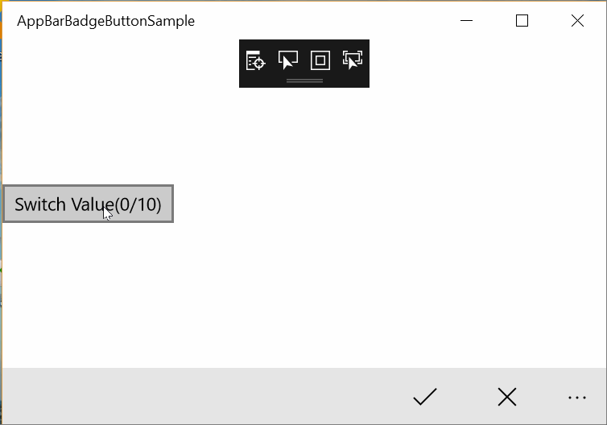

# AppBarBadgeButton XAML Control 

The AppBarBadgeButton is a custom AppBarButton with a number badge, inherited from the `AppBarButton`. It has a badge to indicate a number, such as the new messages count. 
You can customize the badge's background and foreground by setting the `BadgeBackground` and the `BadgeForeground` property.
The badge will auto hide when the count is 0.

## Syntax

```xml

<controls:AppBarBadgeButton Count="{Binding CommentsCount}" Icon="Comment" Label="Comments" 
    BadgeBackground="{Binding BadgeBackground}" BadgeForeground="{Binding BadgeForeground}">
</controls:AppBarBadgeButton>
                                  

```


## Example Image



## Example Code

[AppBarBadgeButton Sample Page](https://github.com/Microsoft/UWPCommunityToolkit/tree/master/Microsoft.Toolkit.Uwp.SampleApp/SamplePages/AppBarBadgeButton)

## Default Template 

[AppBarBadgeButtonView XAML File](https://github.com/Microsoft/UWPCommunityToolkit/blob/master/Microsoft.Toolkit.Uwp.UI.Controls/AppBarBadgeButton/AppBarBadgeButton.xaml) is the XAML template used in the toolkit for the default styling.

## Requirements (Windows 10 Device Family)

| [Device family]("http://go.microsoft.com/fwlink/p/?LinkID=526370) | Universal, 10.0.10586.0 or higher |
| --- | --- |
| Namespace | Microsoft.Toolkit.Uwp.UI.Controls |

## API

* [AppBarBadgeButtonView source code](https://github.com/Microsoft/UWPCommunityToolkit/tree/master/Microsoft.Toolkit.Uwp.UI.Controls/AppBarBadgeButton)

