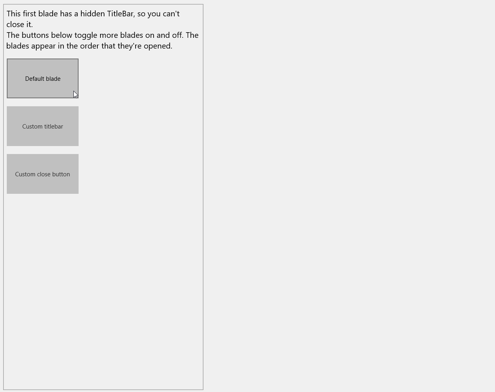

# Blade XAML Control 

The BladeControl provides a container to host blades as extra detail pages in, for example, a master-detail scenario. The control is based on how the Azure Portal works. 

## Syntax

```xaml

<controls:BladeControl>
    <controls:BladeItem IsOpen="True"
                        TitleBarVisibility="Collapsed">
        <StackPanel Margin="8">
            <ToggleButton Width="180"
                          Height="100"
                          Margin="0, 20, 0, 0"
                          IsChecked="{Binding IsOpen, Mode=TwoWay, ElementName=DefaultBlade}"
                          Content="Default blade" />
        </StackPanel>
    </controls:BladeItem>

    <controls:BladeItem x:Name="DefaultBlade" 
	                    Title="A blade"
                        IsOpen="False">
        <TextBlock HorizontalAlignment="Center"
                   VerticalAlignment="Center"
                   Style="{StaticResource SubtitleTextBlockStyle}"
                   Text="This is a blade with all settings set to default." />
    </controls:BladeItem>
</controls:BladeControl>

```

## Example Image



## Example Code

[BladeControl Sample Page](https://github.com/Microsoft/UWPCommunityToolkit/tree/master/Microsoft.Toolkit.Uwp.SampleApp/SamplePages/BladeControl)

## Default Template 

[BladeControl XAML File](https://github.com/Microsoft/UWPCommunityToolkit/blob/master/Microsoft.Toolkit.Uwp.UI.Controls/BladeControl/BladeControl.xaml) is the XAML template used in the toolkit for the default styling.

## Requirements (Windows 10 Device Family)

| [Device family]("http://go.microsoft.com/fwlink/p/?LinkID=526370) | Universal, 10.0.10586.0 or higher |
| --- | --- |
| Namespace | Microsoft.Toolkit.Uwp.UI.Controls |

## API

* [BladeControl source code](https://github.com/Microsoft/UWPCommunityToolkit/tree/master/Microsoft.Toolkit.Uwp.UI.Controls/BladeControl)

