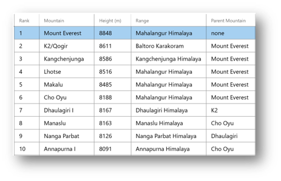
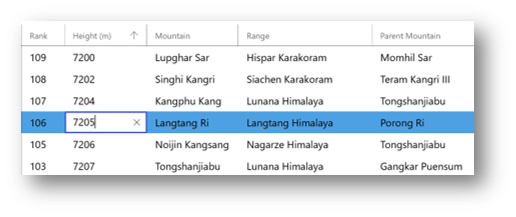
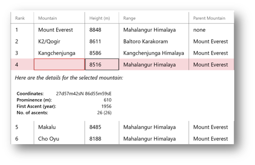
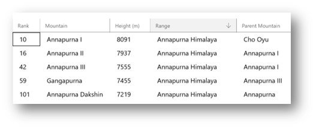
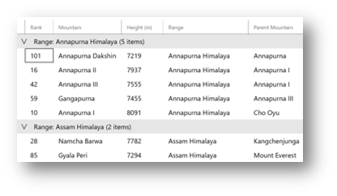

# DataGrid XAML control

> [!NOTE] 
This control is in preview and can be found as a prerelease package. The control could change between now and the final release

The DataGrid control you know and love from Silverlight and WPF is now available for Windows10. This control presents data in a customizable table of rows and columns.


## High level feature list
The DataGrid control supports most of all features supported by the [Silverlight DataGrid](https://docs.microsoft.com/en-us/previous-versions/windows/silverlight/dotnet-windows-silverlight/cc189753(v=vs.95)). This includes:

### 1. GridLines
```xml
<controls:DataGrid GridLinesVisibility="All"/>
```


### 2. AlternatingRowBackground
```xml
<controls:DataGrid AlternatingRowBackground="LightGray"/>
```


### 3. Customizable Cells
```xml
<controls:DataGrid CellStyle="{StaticResource cellStyle}" />

<controls:DataGridTemplateColumn Header="Range" CellTemplate="{StaticResource cellTemplate}" />
```

### 4. Row details with customization

```xml
<controls:DataGrid RowDetailsTemplate="{StaticResource rt}" RowDetailsVisibilityMode="VisibleWhenSelected"/>
```


### 5. Autogenerate columns

```xml
<controls:DataGrid AutoGenerateColumns="True"/>
<!-- Autogenerates column headers and columns based on the Data model provided -->
```

### 6. Frozen columns

```xml
<controls:DataGrid FrozenColumnCount="2"/>
```


### 7. Reorder and resize columns

```xml
<controls:DataGrid CanUserReorderColumns="True" CanUserResizeColumns="True"/>
```


### 8. Cell and Row editing

```xml
<controls:DataGrid BeginningEdit="dg_Editing" CellEditEnding="dg_CellEditEnding" RowEditEnding="dg_RowEditEnding" />
```



### 9. Built-in validation UI

* Use INotifyDataErrorInfo in your DataModel or ViewModel
* Implement data validation using DataErrorsChangedEventArgs, HasErrors and GetErrors
* The DataGrid control automatically shows the error UI when the error conditions are met



### 10. Single and extended selection modes
```xml
<controls:DataGrid SelectionMode="Extended"/>
```


### 11. Sorting, Grouping, Filtering
* In V1 DataGrid control has built-in UI for sorting on column headers and supports one-level grouping on row headers. Filtering UI is not built into the control. 
* The Sample app shows how to implement sorting, grouping and filtering using this DataGrid control.

```xml
<controls:DataGrid CanUserSortColumns="True" Sorting="dg_Sorting"/>
<controls:DataGrid LoadingRowGroup="dg_loadingrowgroup" RowGroupHeaderPropertyNameAlternative="Range"/>
```
```C#
//implement sort, group and filter using LINQ in the view model
dataGrid.ItemsSource = ViewModel.SortData(...);

//Use DataGridSortDirection enum for showing the buil-in sort icon in column header
e.Column.SortDirection = DataGridSortDirection.Ascending;
```




### 13. Accessibility
* DataGrid supports Narrator and Touch Narrator for navigation and interaction for blind users
* DataGrid has built in keyboard navigation support through headers and cells. Supports arrow key navigation as well as Home/End/PageDown/PageUp/Ctrl+ combinations etc., Use Enter key to sort on Column headers and collpase/open group headers etc.,  
* UIAutomation is also supported 

## Sample Code

[DataGrid Sample Page Source](https://github.com/Microsoft/WindowsCommunityToolkit//tree/harinikmsft/datagrid/Microsoft.Toolkit.Uwp.SampleApp/SamplePages/DataGrid). 

## Requirements

| Device family | Universal, 10.0.15063.0 or higher |
| -- | -- |
| Namespace | Microsoft.Toolkit.Uwp.UI.Controls |
| NuGet package | [Microsoft.Toolkit.Uwp.UI.Controls.DataGrid](https://www.nuget.org/packages/Microsoft.Toolkit.Uwp.UI.Controls.DataGrid/) |

## API

* [DataGrid source code](https://github.com/Microsoft/WindowsCommunityToolkit//tree/harinikmsft/datagrid/Microsoft.Toolkit.Uwp.UI.Controls.DataGrid/DataGrid)
* [Silverlight DataGrid API](https://docs.microsoft.com/en-us/previous-versions/windows/silverlight/dotnet-windows-silverlight/cc189753(v=vs.95))
