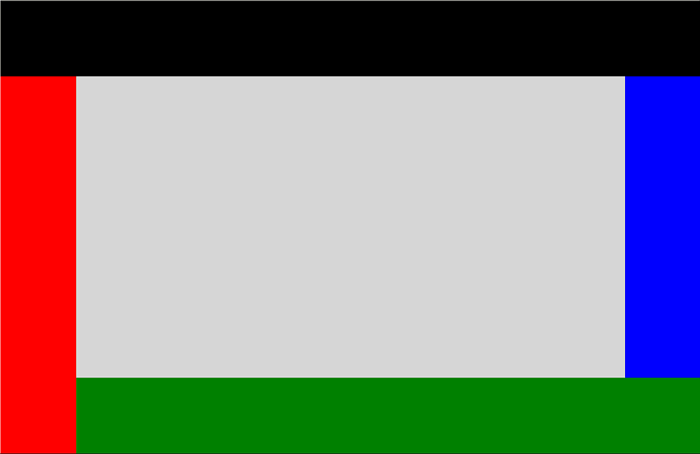

# DockPanel XAML Control

The **DockPanel Control** defines an area where you can arrange child elements either horizontally or vertically, relative to each other.

### How it works

The DockPanel position child controls based on the child Dock property, you have 4 options to Dock, left (Default), right, top, bottom.
You can set DockPanel LastChildFill property to true if you want the last item added to the DockPanel to fill the rest empty space.

## Syntax

```xml

<controls:DockPanel 
                Name="SampleDockPanel" 
                Margin="2" 
                Background="LightGray" 
                LastChildFill="False" />

```

## Example Image



## Properties

<!-- Explain all properties in a table format -->

| Property | Type | Description |
| -- | -- | -- |
| Padding | Thickness | The dimensions of the space between the edge and its child as a Thickness value. Thickness is a structure that stores dimension values using pixel measures. |

## Example Code

[DockPanel Sample Page](https://github.com/Microsoft/UWPCommunityToolkit/tree/master/Microsoft.Toolkit.Uwp.SampleApp/SamplePages/DockPanel)

The following sample demonstrates how to add DockPanel Control.

```xml

<Page
      xmlns="http://schemas.microsoft.com/winfx/2006/xaml/presentation"
      xmlns:x="http://schemas.microsoft.com/winfx/2006/xaml"
      xmlns:controls="using:Microsoft.Toolkit.Uwp.UI.Controls"
      xmlns:d="http://schemas.microsoft.com/expression/blend/2008"
      xmlns:local="using:Microsoft.Toolkit.Uwp.SampleApp.SamplePages"
      xmlns:mc="http://schemas.openxmlformats.org/markup-compatibility/2006"
      mc:Ignorable="d" >

  <Grid>
      <controls:DockPanel Name="SampleDockPanel" Margin="2" Background="LightGray" LastChildFill="False" >
        <StackPanel Height="100" controls:DockPanel.Dock="Top" Background="Black"></StackPanel>
        <StackPanel Width="100" controls:DockPanel.Dock="Left" Background="Red"></StackPanel>
        <StackPanel Height="100" controls:DockPanel.Dock="Bottom" Background="Green"></StackPanel>
        <StackPanel Width="100" controls:DockPanel.Dock="Right" Background="Blue"></StackPanel>
      </controls:DockPanel>
  </Grid>
</Page>


```

## Requirements (Windows 10 Device Family)

| [Device family](http://go.microsoft.com/fwlink/p/?LinkID=526370) | Universal, 10.0.14393.0 or higher |
| --- | --- |
| Namespace | Microsoft.Toolkit.Uwp.UI.Controls |

## API

* [DockPanel source code](https://github.com/Microsoft/UWPCommunityToolkit/tree/master/Microsoft.Toolkit.Uwp.UI.Controls/DockPanel)
