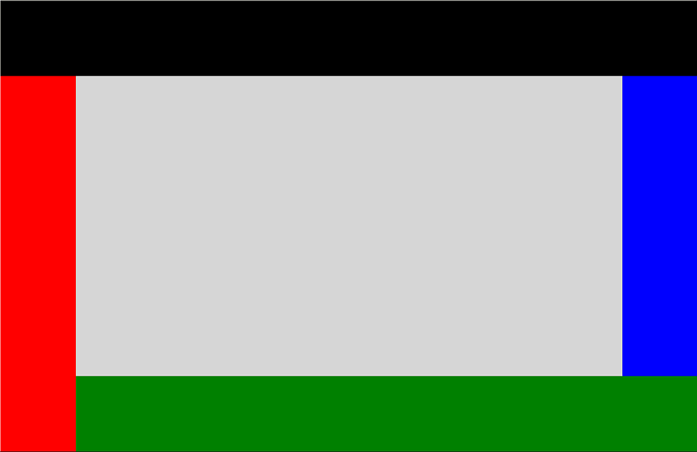

# DockPanel XAML Control

The [DockPanel Control](https://docs.microsoft.com/dotnet/api/microsoft.toolkit.uwp.ui.controls.dockpanel) defines an area where you can arrange child elements either horizontally or vertically, relative to each other.

The DockPanel position child controls based on the child Dock property, you have 4 options to Dock, left (Default), right, top, bottom.
You can set DockPanel LastChildFill property to true if you want the last item added to the DockPanel to fill the rest empty space.

## Syntax

```xaml
<Page ...
     xmlns:controls="using:Microsoft.Toolkit.Uwp.UI.Controls"/>

<controls:DockPanel Name="SampleDockPanel" Margin="2" Background="LightGray" LastChildFill="False" >
  <StackPanel Height="100" controls:DockPanel.Dock="Top" Background="Black"></StackPanel>
  <StackPanel Width="100" controls:DockPanel.Dock="Left" Background="Red"></StackPanel>
  <StackPanel Height="100" controls:DockPanel.Dock="Bottom" Background="Green"></StackPanel>
  <StackPanel Width="100" controls:DockPanel.Dock="Right" Background="Blue"></StackPanel>
</controls:DockPanel>
```

## Sample Output



## Properties

| Property | Type | Description |
| -- | -- | -- |
| LastChildFill | bool | Gets or sets a value indicating whether the last child element within a DockPanel stretches to fill the remaining available space |
| Padding | Thickness | The dimensions of the space between the edge and its child as a Thickness value. Thickness is a structure that stores dimension values using pixel measures. |

## Sample Code

[DockPanel Sample Page Source](https://github.com/Microsoft/UWPCommunityToolkit/tree/master/Microsoft.Toolkit.Uwp.SampleApp/SamplePages/DockPanel). You can see this in action in [Windows Community Toolkit Sample App](https://www.microsoft.com/store/apps/9NBLGGH4TLCQ).

## Requirements

| Device family | Universal, 10.0.14393.0 or higher |
| -- | -- |
| Namespace | Microsoft.Toolkit.Uwp.UI.Controls |
| NuGet package | [Microsoft.Toolkit.Uwp.UI.Controls](https://www.nuget.org/packages/Microsoft.Toolkit.Uwp.UI.Controls/) |

## API Source Code

* [DockPanel source code](https://github.com/Microsoft/UWPCommunityToolkit/tree/master/Microsoft.Toolkit.Uwp.UI.Controls/DockPanel)
