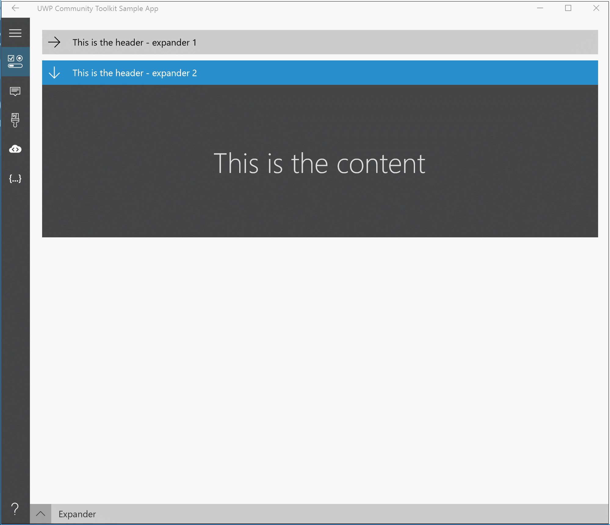

# Expander Control

The [Expander Control](https://docs.microsoft.com/dotnet/api/microsoft.toolkit.uwp.ui.controls.expander) provides an expandable container to host any content.  It is a specialized form of a [HeaderedContentControl](HeaderedContentControl.md)
You can show or hide this content by interacting with the Header.

## Syntax

```xaml
<Page ...
     xmlns:controls="using:Microsoft.Toolkit.Uwp.UI.Controls"/>

<controls:Expander Header="Header of the expander" Foreground="White"
                   Background="Gray" IsExpanded="True">
	<!-- Expander content -->
</controls:Expander>       
```

## Sample Output



## Properties

| Property | Type | Description |
| -- | -- | -- |
| ContentOverlay | UIElement | Specifies alternate content to show when the Expander is collapsed. |
| ExpandDirection | [ExpandDirection](https://docs.microsoft.com/dotnet/api/microsoft.toolkit.uwp.ui.controls.expanddirection) | Specifies the direction of where expanded content should be displayed in relation to the header. |
| HeaderStyle | Style | Specifies an alternate style template for the `ToggleButton` header control. |
| IsExpanded | bool | Indicates if the Expander is currently open or closed.  The default is `False`. |

## Events

| Events | Description |
| -- | -- |
| Collapsed | Fires when the expander is closed |
| Expanded | Fires when the expander is opened |

## Examples

### ContentOverlay

The `ContentOverlay` property can be used to define the content to be shown when the Expander is collapsed

```xaml
<controls:Expander Header="Header">
  <Grid>
    <TextBlock Text="Expanded content" />
  </Grid>

  <controls:Expander.ContentOverlay>
    <Grid MinHeight="250">
      <TextBlock Text="Collapsed content" />
    </Grid>
  </controls:Expander.ContentOverlay>
</controls:Expander>
```

### ExpandDirection

The `ExpandDirection` property can take 4 values that will expand the content based on the selected direction:

* `Down` - from top to bottom (default)
* `Up` - from bottom to top
* `Right` - from left to right
* `Left` - from right to left

### HeaderStyle

Allows creating an alternate style for the entire Expander header including the arrow symbol, in contrast to the `HeaderTemplate` which can control the content next to the arrow.

For instance to remove the header entirely from the Expander:

```xaml
  <Page.Resources>
    <Style x:Key="NoExpanderHeaderStyle" TargetType="ToggleButton">
      <Setter Property="Height" Value="0"/>
      <Setter Property="Template">
        <Setter.Value>
          <ControlTemplate TargetType="ToggleButton">
            <Grid/>
          </ControlTemplate>
        </Setter.Value>
      </Setter>
    </Style>
  </Page.Resources>

  <controls:Expander HeaderStyle="{StaticResource NoExpanderHeaderStyle}" IsExpanded="True">
    <TextBlock Text="My Content"/>
  </controls:Expander>
```

## Sample Code

[Expander Sample Page Source](https://github.com/Microsoft/WindowsCommunityToolkit//tree/master/Microsoft.Toolkit.Uwp.SampleApp/SamplePages/Expander). You can see this in action in [Windows Community Toolkit Sample App](https://www.microsoft.com/store/apps/9NBLGGH4TLCQ).

## Default Template 

[Expander XAML File](https://github.com/Microsoft/WindowsCommunityToolkit//blob/master/Microsoft.Toolkit.Uwp.UI.Controls/Expander/Expander.xaml) is the XAML template used in the toolkit for the default styling.

## Requirements

| Device family | Universal, 10.0.15063.0 or higher |
| -- | -- |
| Namespace | Microsoft.Toolkit.Uwp.UI.Controls |
| NuGet package | [Microsoft.Toolkit.Uwp.UI.Controls](https://www.nuget.org/packages/Microsoft.Toolkit.Uwp.UI.Controls/) |

## API

- [Expander source code](https://github.com/Microsoft/WindowsCommunityToolkit//tree/master/Microsoft.Toolkit.Uwp.UI.Controls/Expander)

## Related Topics

- [HeaderedControlControl](HeaderedContentControl.md)
- [ToggleButton](https://docs.microsoft.com/en-us/uwp/api/Windows.UI.Xaml.Controls.Primitives.ToggleButton)
