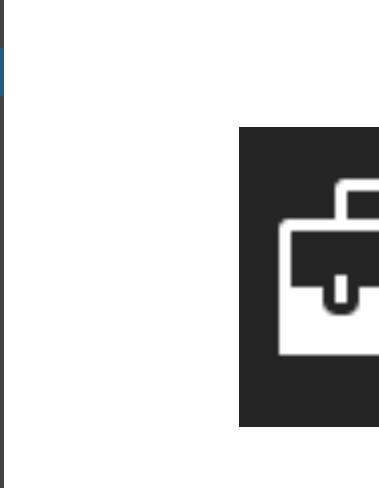

# FlyoutView XAML Control 

The **FlyoutView Control** displays a floating container. It appears for the left, right, top or bottom of his parent content.

## Syntax

```xml

<controls:FlyoutView ContentWidth="300"
                     ContentHeight="150"
                     IsOpen="{Binding Path=IsOpen.Value, Mode=TwoWay}"
                     Placement="Left"
                     UseDismissOvelay="True"
                     BackgroundOverlay="#BBF0F0F0">
    <controls:FlyoutView.HeaderTemplate>
        <DataTemplate>
            <Grid Background="Blue">
                <TextBlock Text="HEADER"
                            Margin="20" />
            </Grid>
        </DataTemplate>
    </controls:FlyoutView.HeaderTemplate>

    <TextBlock Text="This is the content" />
</controls:FlyoutView>

```

## Example Image



## Example Code

[FlyoutView Sample Page](https://github.com/Microsoft/UWPCommunityToolkit/tree/master/Microsoft.Toolkit.Uwp.SampleApp/SamplePages/FlyoutView)

## Default Template 

[FlyoutView XAML File](https://github.com/Microsoft/UWPCommunityToolkit/blob/master/Microsoft.Toolkit.Uwp.UI.Controls/FlyoutView/FlyoutView.xaml) is the XAML template used in the toolkit for the default styling.

## Requirements (Windows 10 Device Family)

| [Device family](http://go.microsoft.com/fwlink/p/?LinkID=526370) | Universal, 10.0.10586.0 or higher |
| --- | --- |
| Namespace | Microsoft.Toolkit.Uwp.UI.Controls |

## API

* [FlyoutView source code](https://github.com/Microsoft/UWPCommunityToolkit/tree/master/Microsoft.Toolkit.Uwp.UI.Controls/FlyoutView)

