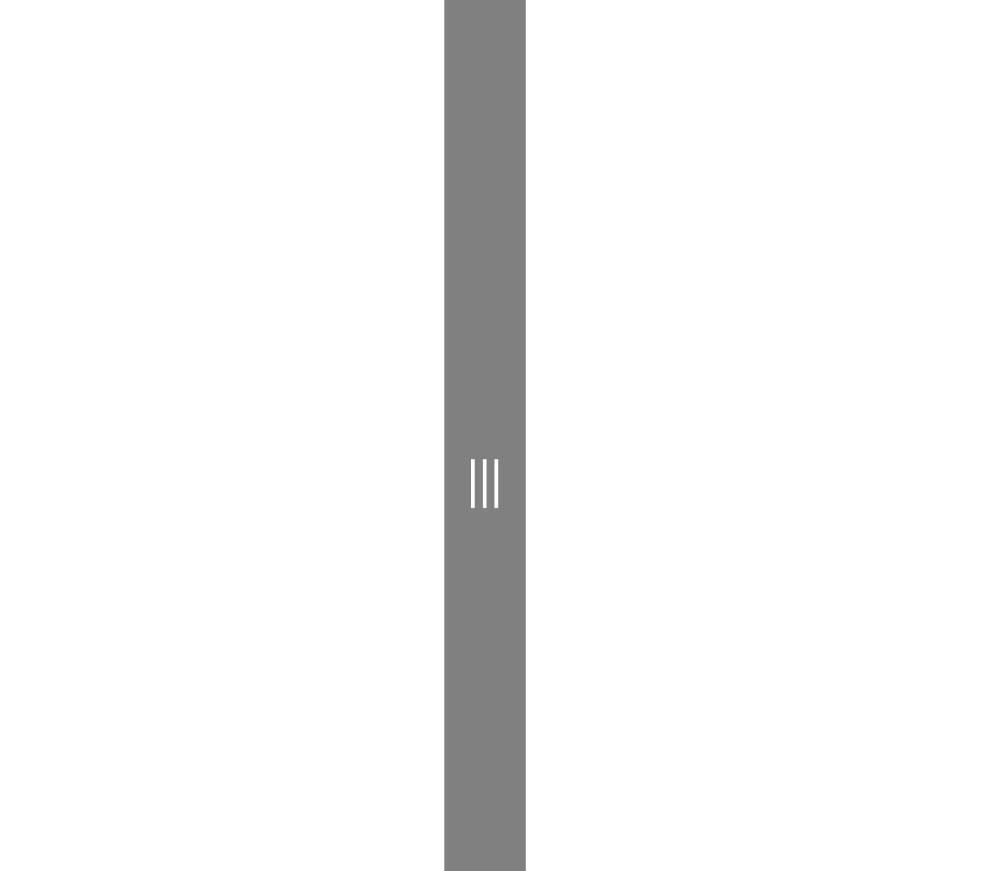

# GridSplitter XAML Control

The [GridSplitter Control](https://docs.microsoft.com/dotnet/api/microsoft.toolkit.uwp.ui.controls.gridsplitter) provides an easy-to-use Splitter that redistributes space between columns or rows of a Grid Control. By dragging the control, the control will resize the targeted columns or rows.

The control automatically detects the targeted columns/rows to resize, while dragging the control it starts to resize the columns/rows and redistributes space between columns/rows, you can manually specify the Resize Direction Auto, Column, Row and the Resize Behavior to select which columns/rows to resize.

> [!NOTE]
You can use the control to resize fixed and star (*) width/height columns/rows.

## Syntax

```xaml
<Page ...
     xmlns:controls="using:Microsoft.Toolkit.Uwp.UI.Controls"/>

<controls:GridSplitter Width="11" ResizeBehavior="BasedOnAlignment" ResizeDirection="Auto"
        Background="Gray" Foreground="White" FontSize="13">
    <controls:GridSplitter.Element>
        <Grid>
            <TextBlock HorizontalAlignment="Center"  IsHitTestVisible="False"
                    VerticalAlignment="Center" Text="&#xE784;"
                    Foreground="Black" FontFamily="Segoe MDL2 Assets"/>
        </Grid>
    </controls:GridSplitter.Element>
</controls:GridSplitter>
```

## Sample Output



## Properties

| Property | Type | Description |
| -- | -- | -- |
| CursorBehavior | [GridSplitter.SplitterCursorBehavior](https://docs.microsoft.com/dotnet/api/microsoft.toolkit.uwp.ui.controls.gridsplitter.splittercursorbehavior) | Gets or sets splitter cursor on hover behavior |
| Element | UIElement | Gets or sets the visual content of this Grid Splitter |
| GripperCursor | [GridSplitter.GripperCursorType](https://docs.microsoft.com/dotnet/api/microsoft.toolkit.uwp.ui.controls.gridsplitter.grippercursortype) | Gets or sets the gripper Cursor type |
| GripperCustomCursorResource | int | Gets or sets the gripper Custom Cursor resource number |
| GripperForeground | Brush | Gets or sets the foreground color of grid splitter grip |
| ParentLevel | int | Gets or sets the level of the parent grid to resize |
| ResizeBehavior | [GridSplitter.GridResizeBehavior](https://docs.microsoft.com/dotnet/api/microsoft.toolkit.uwp.ui.controls.gridsplitter.gridresizebehavior) | Gets or sets which Columns or Rows the Splitter resizes |
| ResizeDirection | [GridSplitter.GridResizeDirection](https://docs.microsoft.com/dotnet/api/microsoft.toolkit.uwp.ui.controls.gridsplitter.gridresizedirection) | Gets or sets whether the Splitter resizes the Columns, Rows, or Both |

## Examples

The following sample demonstrates how to add Grid Splitter Control

```xaml
<Page ....
    xmlns:controls="using:Microsoft.Toolkit.Uwp.UI.Controls">

    <Grid>
        <Grid.RowDefinitions>
            <RowDefinition MinHeight="100"></RowDefinition>
            <RowDefinition Height="11"></RowDefinition>
            <RowDefinition></RowDefinition>
        </Grid.RowDefinitions>
        <Grid.ColumnDefinitions>
            <ColumnDefinition MinWidth="200"></ColumnDefinition>
            <ColumnDefinition Width="11"></ColumnDefinition>
            <ColumnDefinition></ColumnDefinition>
        </Grid.ColumnDefinitions>

        <!--Column Grid Splitter-->
        <controls:GridSplitter Grid.Column="1" Width="11" ResizeBehavior="BasedOnAlignment"
            ResizeDirection="Auto" Background="Gray" Foreground="White" FontSize="13">
            <controls:GridSplitter.Element>
                <Grid>
                    <TextBlock HorizontalAlignment="Center" IsHitTestVisible="False" VerticalAlignment="Center"  
                               Text="&#xE784;" Foreground="Black" FontFamily="Segoe MDL2 Assets">
                    </TextBlock>
                </Grid>
            </controls:GridSplitter.Element>
        </controls:GridSplitter>

        <!--Row Grid Splitter-->
        <controls:GridSplitter Foreground="White" Grid.Row="1" ResizeBehavior="BasedOnAlignment"
            ResizeDirection="Auto" Background="Gray" Height="11" HorizontalAlignment="Stretch"  FontSize="13">
            <controls:GridSplitter.Element>
                <Grid>
                    <TextBlock HorizontalAlignment="Center" IsHitTestVisible="False" VerticalAlignment="Center"  
                               Text="&#xE76F;" Foreground="Black" FontFamily="Segoe MDL2 Assets">
                    </TextBlock>
                </Grid>
            </controls:GridSplitter.Element>
        </controls:GridSplitter>
    </Grid>
</Page>
```

## Sample Code

[GridSplitter Sample Page Source](https://github.com/Microsoft/WindowsCommunityToolkit//tree/master/Microsoft.Toolkit.Uwp.SampleApp/SamplePages/GridSplitter). You can see this in action in [Windows Community Toolkit Sample App](https://www.microsoft.com/store/apps/9NBLGGH4TLCQ).

## Default Template 

[GridSplitter XAML File](https://github.com/Microsoft/WindowsCommunityToolkit//blob/master/Microsoft.Toolkit.Uwp.UI.Controls/GridSplitter/GridSplitter.xaml) is the XAML template used in the toolkit for the default styling.

## Requirements

| Device family | Universal, 10.0.15063.0 or higher |
| -- | -- |
| Namespace | Microsoft.Toolkit.Uwp.UI.Controls |
| NuGet package | [Microsoft.Toolkit.Uwp.UI.Controls](https://www.nuget.org/packages/Microsoft.Toolkit.Uwp.UI.Controls/) |

## API

* [GridSplitter source code](https://github.com/Microsoft/WindowsCommunityToolkit//tree/master/Microsoft.Toolkit.Uwp.UI.Controls/GridSplitter)
