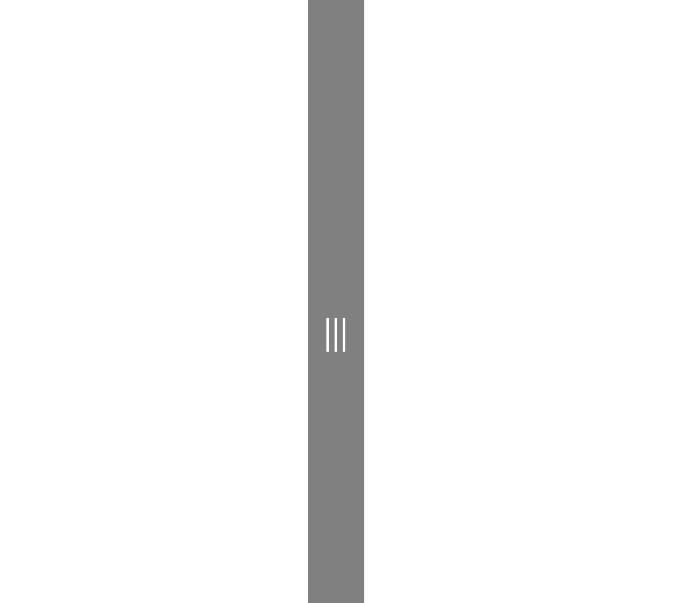

# GridSplitter XAML Control

The **GridSplitter Control** provides an easy-to-use Splitter that redistributes space between columns or rows of a Grid Control. By dragging the control, the control will resize the targeted columns or rows.

### How it works

The control automatically detects the targeted columns/rows to resize, while dragging the control it starts to resize the columns/rows and redistributes space between columns/rows, you can manually specify the Resize Direction Auto, Column, Row and the Resize Behavior to select which columns/rows to resize.

Developers can use the control to resize fixed and star (*) width/height columns/rows.

## Syntax

```xml

<controls:GridSplitter 
            Grid.Column="1"
                Width="11"
            ResizeBehavior="BasedOnAlignment"
            ResizeDirection="Auto"
                Background="Gray"
                Foreground="White" 
                FontSize="13">
            <controls:GridSplitter.Element>
                <Grid>
                    <TextBlock HorizontalAlignment="Center" 
                                   IsHitTestVisible="False"
                                   VerticalAlignment="Center"  
                                    Text="&#xE784;"
                                   Foreground="Black" 
                                   FontFamily="Segoe MDL2 Assets">
                    </TextBlock>
                </Grid>
            </controls:GridSplitter.Element>
        </controls:GridSplitter>

```


## Example Image



## Example Code

[GridSplitter Sample Page](https://github.com/Microsoft/UWPCommunityToolkit/tree/master/Microsoft.Toolkit.Uwp.SampleApp/SamplePages/GridSplitter)

The following sample demonstrates how to add Grid Splitter Control.

```xml

<Page
    x:Class="Microsoft.Toolkit.Uwp.SampleApp.SamplePages.GridSplitterPage"
    xmlns="http://schemas.microsoft.com/winfx/2006/xaml/presentation"
    xmlns:x="http://schemas.microsoft.com/winfx/2006/xaml"
    xmlns:d="http://schemas.microsoft.com/expression/blend/2008"
    xmlns:mc="http://schemas.openxmlformats.org/markup-compatibility/2006"
    xmlns:controls="using:Microsoft.Toolkit.Uwp.UI.Controls"
    mc:Ignorable="d">


    <Grid Background="{ThemeResource ApplicationPageBackgroundThemeBrush}">
        <Grid.RowDefinitions>
            <RowDefinition MinHeight="100"></RowDefinition>
            <RowDefinition Height="11"></RowDefinition>
            <RowDefinition></RowDefinition>
        </Grid.RowDefinitions>
        <Grid.ColumnDefinitions>
            <ColumnDefinition MinWidth="200"></ColumnDefinition>
            <ColumnDefinition Width="11"></ColumnDefinition>
            <ColumnDefinition></ColumnDefinition>
        </Grid.ColumnDefinitions>

        <!--Column Grid Splitter-->
        <controls:GridSplitter 
            Grid.Column="1"
                Width="11"
            ResizeBehavior="BasedOnAlignment"
            ResizeDirection="Auto"
                Background="Gray"
                Foreground="White" 
                FontSize="13">
            <controls:GridSplitter.Element>
                <Grid>
                    <TextBlock HorizontalAlignment="Center" 
                                   IsHitTestVisible="False"
                                   VerticalAlignment="Center"  
                                    Text="&#xE784;"
                                   Foreground="Black" 
                                   FontFamily="Segoe MDL2 Assets">
                    </TextBlock>
                </Grid>
            </controls:GridSplitter.Element>
        </controls:GridSplitter>

        <!--Row Grid Splitter-->
        <controls:GridSplitter 
            Foreground="White"
            Grid.Row="1"
            ResizeBehavior="BasedOnAlignment"
            ResizeDirection="Auto"
            Background="Gray" Height="11"
            HorizontalAlignment="Stretch" 
            FontSize="13">
            <controls:GridSplitter.Element>
                <Grid>
                    <TextBlock HorizontalAlignment="Center"     
                                   IsHitTestVisible="False"
                                   VerticalAlignment="Center"  
                                    Text="&#xE76F;"
                                   Foreground="Black" 
                                   FontFamily="Segoe MDL2 Assets">
                    </TextBlock>
                </Grid>
            </controls:GridSplitter.Element>
        </controls:GridSplitter>

    </Grid>
</Page>

```


## Default Template 

[GridSplitter XAML File](https://github.com/Microsoft/UWPCommunityToolkit/blob/master/Microsoft.Toolkit.Uwp.UI.Controls/GridSplitter/GridSplitter.xaml) is the XAML template used in the toolkit for the default styling.

## Requirements (Windows 10 Device Family)

| [Device family](http://go.microsoft.com/fwlink/p/?LinkID=526370) | Universal, 10.0.14393.0 or higher |
| --- | --- |
| Namespace | Microsoft.Toolkit.Uwp.UI.Controls |

## API

* [GridSplitter source code](https://github.com/Microsoft/UWPCommunityToolkit/tree/master/Microsoft.Toolkit.Uwp.UI.Controls/GridSplitter)
