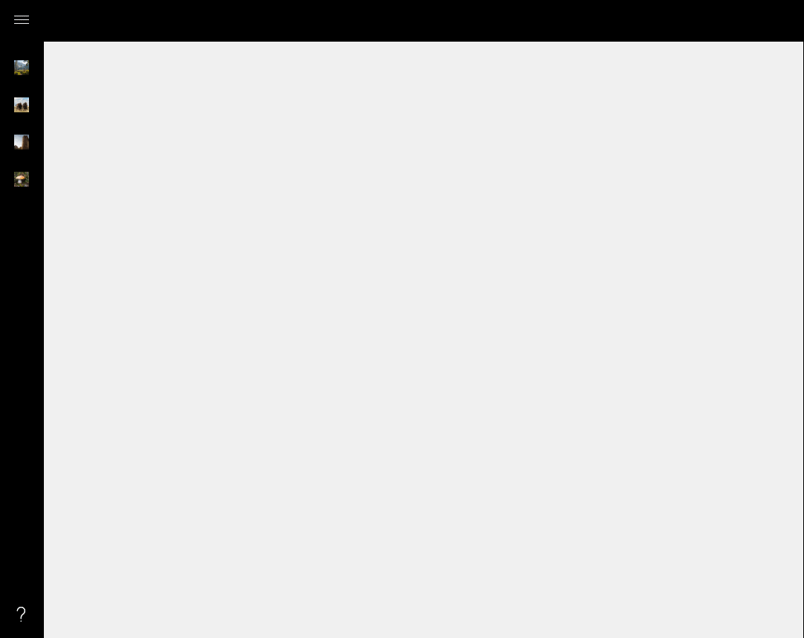

# HamburgerMenu XAML Control

> [!WARNING]
The HamburgerMenu is deprecated and will be removed in a future major release. Please use the [NavigationView](https://docs.microsoft.com/windows/uwp/controls-and-patterns/navigationview) available in the Fall Creators Update. Read the [Moving to NavigationView](#navview) section for more info.

The [HamburgerMenu Control](https://docs.microsoft.com/dotnet/api/microsoft.toolkit.uwp.ui.controls.hamburgermenu) provides an easy-to-use, side-bar menu which users can show or hide by using a Hamburger button. By  tapping the icon, it opens up a side menu with a selection of options or additional pages.

The 3-line menu icon, which resembles a Hamburger, allows developers to pack more features into their apps or navigation. The tiny icon takes up a minimal amount of screen real estate and creates a clean, minimalist look.

Developers can place menu specific content, navigation, images, text or custom controls. An example of the HamburgerMenu is the *MSN Money App* included in Windows 10. When tapped, it displays additional feature pages, and user settings.

## Syntax

```xaml

<controls:HamburgerMenu PaneBackground="Black" x:Name="HamburgerMenuControl"
	Foreground="White" ItemTemplate="{StaticResource ButtonTemplate}"
	OptionsItemTemplate="{StaticResource OptionTemplate}" ItemClick="HamburgerMenu_OnItemClick"
	OptionsItemClick="HamburgerMenu_OnOptionsItemClick" OpenPaneLength="240"
	DisplayMode="CompactInline" CompactPaneLength="48"
	HamburgerHeight="48" IsPaneOpen="False">
</controls:HamburgerMenu>
```

## Sample Output



## Properties

| Property | Type | Description |
| -- | -- | -- |
| CompactPaneLength | double | Gets or sets the width of the pane in its compact display mode |
| DisplayMode | [SplitViewDisplayMode](https://docs.microsoft.com/uwp/api/Windows.UI.Xaml.Controls.SplitViewDisplayMode) | Gets or sets a value that specifies how the pane and content areas are shown |
| HamburgerHeight | double | Gets or sets main button's height |
| HamburgerMargin | Thickness | Gets or sets main button's margin |
| HamburgerMenuTemplate | DataTemplate | Gets or sets a template for the hamburger icon |
| HamburgerVisibility | Visibility | Gets or sets main button's visibility |
| HamburgerWidth | double | Gets or sets main button's width |
| IsPaneOpen | bool | Gets or sets a value indicating whether gets or sets a value that specifies whether the pane is expanded to its full width |
| Items | ItemCollection | Gets the collection used to generate the content of the items list |
| ItemsSource | object | Gets or sets an object source used to generate the content of the menu |
| ItemTemplate | DataTemplate | Gets or sets the DataTemplate used to display each item |
| ItemTemplateSelector | DataTemplateSelector | Gets or sets the DataTemplateSelector used to display each item |
| OpenPaneLength | double | Gets or sets the width of the pane when it's fully expanded |
| OptionsItems | ItemCollection | Gets the collection used to generate the content of the option list |
| OptionsItemsSource | object | Gets or sets an object source used to generate the content of the options |
| OptionsItemTemplate | DataTemplate | Gets or sets the DataTemplate used to display each item in the options |
| OptionsItemTemplateSelector | DataTemplateSelector | Gets or sets the DataTemplateSelector used to display each item in the options |
| OptionsVisibility | Visibility | Gets or sets the visibility of the options menu |
| PaneBackground | Brush | Gets or sets the Brush to apply to the background of the Pane area of the control |
| PaneForeground | Brush | Gets or sets the Brush to apply to the foreground of the Pane area of the control (specifically, the hamburger button foreground) |
| PanePlacement | [SplitViewPanePlacement](https://docs.microsoft.com/uwp/api/windows.ui.xaml.controls.splitviewpaneplacement) | Gets or sets a value that specifies whether the pane is shown on the right or left side of the control |
| SelectedIndex | int | Gets or sets the selected menu index |
| SelectedItem | object | Gets or sets the selected menu item |
| SelectedOptionsIndex | int | Gets or sets the selected options menu index |
| SelectedOptionsItem | object | Gets or sets the selected options menu item |
| UseNavigationViewWhenPossible | bool | Set `true` to use a template based on the [NavigationView](https://docs.microsoft.com/en-us/windows/uwp/controls-and-patterns/navigationview) when running on the Fall Creators Update and above, and the regular template otherwise |

## Events

| Events | Description |
| -- | -- |
| ItemClick | Event raised when an item is clicked |
| OptionsItemClick | Event raised when an options' item is clicked |

## Example Code

This sample demonstrates how to add custom menu items to the HamburgerMenu control.

```xaml
<Page ...
    xmlns:controls="using:Microsoft.Toolkit.Uwp.UI.Controls">

    <Page.Resources>
        <DataTemplate x:Key="DefaultTemplate" x:DataType="local:MenuItem">
            <Grid Width="240" Height="48">
                <Grid.ColumnDefinitions>
                    <ColumnDefinition Width="48" />
                    <ColumnDefinition />
                </Grid.ColumnDefinitions>
                <SymbolIcon Grid.Column="0" Symbol="{x:Bind Icon, Mode=OneWay}" Foreground="White" />
                <TextBlock Grid.Column="1" Text="{x:Bind Name, Mode=OneWay}" FontSize="16" VerticalAlignment="Center" Foreground="White" />
            </Grid>
        </DataTemplate>
    </Page.Resources>

    <Grid Background="{ThemeResource ApplicationPageBackgroundThemeBrush}">
        <controls:HamburgerMenu x:Name="hamburgerMenuControl" PaneBackground="Black" Foreground="White" 
                                ItemTemplate="{StaticResource DefaultTemplate}" ItemClick="OnMenuItemClick"
                                OptionsItemTemplate="{StaticResource DefaultTemplate}" OptionsItemClick="OnMenuItemClick">
            <Frame x:Name="contentFrame" Foreground="Black"/>
        </controls:HamburgerMenu>
    </Grid>
</Page>
```

As you can see below, we declared a Frame inside the HamburgerMenu control. Using this Frame object, you can navigate to your pages by using the following code.

```csharp
using System;
using System.Collections.Generic;
using Windows.UI.Xaml.Controls;

namespace HamburgerSample
{
    public sealed partial class MainPage : Page
    {
        public MainPage()
        {
            this.InitializeComponent();

            hamburgerMenuControl.ItemsSource = MenuItem.GetMainItems();
            hamburgerMenuControl.OptionsItemsSource = MenuItem.GetOptionsItems();
        }

        private void OnMenuItemClick(object sender, ItemClickEventArgs e)
        {
            var menuItem = e.ClickedItem as MenuItem;
            contentFrame.Navigate(menuItem.PageType);
        }
    }

    public class MenuItem
    {
        public Symbol Icon { get; set; }
        public string Name { get; set; }
        public Type PageType { get; set; }

        public static List<MenuItem> GetMainItems()
        {
            var items = new List<MenuItem>();
            items.Add(new MenuItem() { Icon = Symbol.Accept, Name = "MenuItem1", PageType = typeof(Views.BlankPage1) });
            items.Add(new MenuItem() { Icon = Symbol.Send, Name = "MenuItem2", PageType = typeof(Views.BlankPage1) });
            items.Add(new MenuItem() { Icon = Symbol.Shop, Name = "MenuItem3", PageType = typeof(Views.BlankPage1) });
            return items; 
        }

        public static List<MenuItem> GetOptionsItems()
        {
            var items = new List<MenuItem>();
            items.Add(new MenuItem() { Icon = Symbol.Setting, Name = "OptionItem1", PageType = typeof(Views.BlankPage1) });
            return items;
        }
    }
}
```
```vb
Public NotInheritable Class MainPage
    Inherits Page

    Sub New()
        InitializeComponent()

        hamburgerMenuControl.ItemsSource = MenuItem.GetMainItems()
        hamburgerMenuControl.OptionsItemsSource = MenuItem.GetOptionsItems()
    End Sub

    Private Sub OnMenuItemClick(sender As Object, e As ItemClickEventArgs)
        Dim menuItem = TryCast(e.ClickedItem, MenuItem)
        contentFrame.Navigate(menuItem.PageType)
    End Sub
End Class

Public Class MenuItem

    Public Property Icon As Symbol

    Public Property Name As String

    Public Property PageType As Type

    Public Shared Function GetMainItems() As List(Of MenuItem)
        Dim items = New List(Of MenuItem)()
        items.Add(New MenuItem() With {.Icon = Symbol.Accept, .Name = "MenuItem1", .PageType = GetType(Views.BlankPage1)})
        items.Add(New MenuItem() With {.Icon = Symbol.Send, .Name = "MenuItem2", .PageType = GetType(Views.BlankPage1)})
        items.Add(New MenuItem() With {.Icon = Symbol.Shop, .Name = "MenuItem3", .PageType = GetType(Views.BlankPage1)})
        Return items
    End Function

    Public Shared Function GetOptionsItems() As List(Of MenuItem)
        Dim items = New List(Of MenuItem)()
        items.Add(New MenuItem() With {.Icon = Symbol.Setting, .Name = "OptionItem1", .PageType = GetType(Views.BlankPage1)})
        Return items
    End Function
End Class

```

## <a name="navview"></a> Moving to NavigationView
The Windows 10 Fall Creators Update SDK now includes the [NavigationView](https://docs.microsoft.com/windows/uwp/controls-and-patterns/navigationview) control among other new controls and APIs. This is great news for the Windows Community Toolkit as it means that one of its most popular controls, the HamburgerMenu, has a comparable counterpart in the Windows SDK and it is very easy to transition to the NavigationView if you are already using the HamburgerMenu. 

The HamburgerMenu and NavigationView share the same concepts and provide the same functionality with one major exception being the NavigationView takes advantage of the new fluent design system. In fact, the NavigationView does everything the HamburgerMenu does and even more.

### What developers need to know to move to NavigationView?

- **Pane:** Both the NavigationView and HamburgerMenu are based on the SplitView, so the same properties exist in both controls. However, the NavigationView uses the new AcrylicBrush for the background which creates the semi-transparent material out of the box. Additionally, the navigation view automatically changes its display mode based on the amount of screen size available to it, so you are no longer required to write all that code.
- **NavigationViewItems and Item Templates:** The NavigationView uses a similar pattern to define the Menu Items, with some naming changes. Here is the mapping from some properties in the HamburgerMenu to the comparable properties in the NavigationView:

    | HamburgerMenu | NavigationView |
    | --- | --- |
    | ItemsSource | MenuItemsSource |
    | ItemTemplate | MenuItemTemplate |
    | ItemClick | ItemInvoked |

    The *OptionsItemsSource* and *OptionItemsTemplate* is not available in the NavigationView. Instead, the NavigationView has two additional new properties that provide a much more flexible way of handling settings and optional items:
    - An optional property for app settings. Simply set the property *IsSettingsVisible* to true and the NavigationView will display the settings button at the bottom. You can even customize the settings item 

        ```csharp
        var settingsItem = HamburgerMenu.SettingsItem as NavigationViewItem;
        settingsItem.Content = "About";
        settingsItem.Icon = new FontIcon() { Glyph = "?" };
        ```
        ```vb
        Dim settingsItem = TryCast(HamburgerMenu.SettingsItem, NavigationViewItem)
        settingsItem.Content = "About"
        settingsItem.Icon = New FontIcon() With {.Glyph = "?"}
        ```

    - Free-form content in the pane's footer, by adding any content in the new *PaneFooter* property 

    In addition, the NavigationView introduces new classes for quickly adding navigation items and grouping items. You can use the new NavigationViewItem, NavigationViewItemSeparator and NavigationViewItemHeader to directly populate the MenuItems and get the look you want

* **Additional features in the NavigationView:** The navigation view also introduces several new features that are not available in the HamburgerMenu:

    * There is a new optional header area that is vertically aligned with the navigation button and has a fixed height. Its purpose is to hold the page title of the selected nav category. The header is docked to the top of the page and acts as a scroll clipping point for the content area.
    * AutoSuggestBox property allows you to add a search box that integrates directly with the NavigationView. Some developers accomplished the same with the HamburgerMenu by re-templating it and writing a lot of custom code. That is not needed with the NavigationView

### Making the transition even easier
Starting with v2.1 of the Windows Community Toolkit, the HamburgerMenu provides a new property called `UseNavigationViewWhenPossible`. Setting the value to true will force the HamburgerMenu to use a template based on the NavigationView when running on the Fall Creators Update and above, and the regular template otherwise.

Using this property will enable you to take advantage of the NavigationView on devices that supported the NavigationView, while providing an experience based on HamburgerMenu on devices that have not yet updated to the Fall Creators Update. Make sure to test the experience on multiple OS releases and plan to fully transition to the NavigationView as the HamburgerMenu will be removed from the Windows Community Toolkit in a future major release.

Version 3.0 of the Windows Community Toolkit adds another related property called **UseNavigationViewSettingsWhenPossible**. When this and UseNavigationViewWhenPossible are both set to true, the control will attempt to detect any of the OptionsItems that represent settings and map this to the built in Settings item in the NavigationView. If the control fails to detect the correct item, you can tell it which item to use by setting the Tag property of the OPtionsItem to the value "setting".

> [!NOTE]
The `ItemClick` and `OptionsItemClick` events will continue to work but the EventArgs will be null when `UseNavigationViewWhenPossible` is set to true. There is a new event called `ItemInvoked` that should be used instead. This new event will include information about the clicked item and whether it is an item or options item. This event also works if UseNavigationViewWhenPossible is set to false. 

> [!NOTE]
The PaneBackground will not have any effect when `UseNavigationViewWhenPossible` is set to null. To change the pane background of the NavigationView, modify the two theme resources by overwriting them in your App.xaml. See the [NavigationVew documentation](https://docs.microsoft.com/en-us/windows/uwp/design/controls-and-patterns/navigationview#customizing-backgrounds) for more details.

There are several HamburgerMenu properties that have no effect when the HamburgerMenu is using the NavigationView:

* DisplayMode
* PanePlacement
* PaneBackground
* PaneForeground
* HamburgerWidth
* HamburgerHeight
* HamburgerMargin
* HamburgerMenuTemplate

## Sample Code

[HamburgerMenu Sample Page Source](https://github.com/Microsoft/WindowsCommunityToolkit//tree/master/Microsoft.Toolkit.Uwp.SampleApp/SamplePages/HamburgerMenu)
. You can see this in action in [Windows Community Toolkit Sample App](https://www.microsoft.com/store/apps/9NBLGGH4TLCQ).

## Default Template 

[HamburgerMenu XAML File](https://github.com/Microsoft/WindowsCommunityToolkit//blob/master/Microsoft.Toolkit.Uwp.UI.Controls/HamburgerMenu/HamburgerMenu.xaml) is the XAML template used in the toolkit for the default styling.

## Requirements

| Device family | Universal, 10.0.15063.0 or higher |
| -- | -- |
| Namespace | Microsoft.Toolkit.Uwp.UI.Controls |
| NuGet package | [Microsoft.Toolkit.Uwp.UI.Controls](https://www.nuget.org/packages/Microsoft.Toolkit.Uwp.UI.Controls/) |

## API

* [HamburgerMenu source code](https://github.com/Microsoft/WindowsCommunityToolkit//tree/master/Microsoft.Toolkit.Uwp.UI.Controls/HamburgerMenu)
