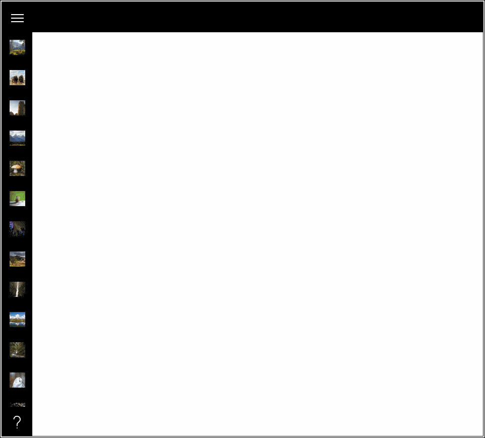

# HamburgerMenu XAML Control

The **Hamburger Menu Control** provides an easy-to-use, side-bar menu which users can show or hide by using a Hamburger button. By  tapping the icon, it opens up a side menu with a selection of options or additional pages.

### How it works

The 3-line menu icon, which resembles a Hamburger, allows developers to pack more features into their apps or navigation. The tiny icon takes up a minimal amount of screen real estate and creates a clean, minimalist look.

Developers can place menu specific content, navigation, images, text or custom controls. An example of the HamburgerMenu is the *MSN Money App* included in Windows 10. When tapped, it displays additional feature pages, and user settings.

## Syntax

```xml

<controls:HamburgerMenu PaneBackground="@[PaneBackground:Brush:Black]" x:Name="HamburgerMenuControl"
	Foreground="White"
	ItemTemplate="{StaticResource ButtonTemplate}"
	OptionsItemTemplate="{StaticResource OptionTemplate}"
	ItemClick="HamburgerMenu_OnItemClick"
	OptionsItemClick="HamburgerMenu_OnOptionsItemClick"
	OpenPaneLength="240"
	DisplayMode="CompactInline"
	CompactPaneLength="48"
	HamburgerHeight="48"
	IsPaneOpen="False">
</controls:HamburgerMenu>

```


## Example Image



## Example Code

The following example shows you how to simply setup a HamburgerMemu using HamburgerMenuGlyphItem directly in your XAML code:

[HamburgerMenu Sample Page](https://github.com/Microsoft/UWPCommunityToolkit/tree/master/Microsoft.Toolkit.Uwp.SampleApp/SamplePages/HamburgerMenu)

You can also create HamburgerMenuGlyphItem (or HamburgerMenuImageItem) directly from your code.

The next sample demonstrates how to add custom menu items to the HamburgerMenu control.

```xml

<Page
    x:Class="HamburgerSample.MainPage"
    xmlns="http://schemas.microsoft.com/winfx/2006/xaml/presentation"
    xmlns:x="http://schemas.microsoft.com/winfx/2006/xaml"
    xmlns:local="using:HamburgerSample"
    xmlns:d="http://schemas.microsoft.com/expression/blend/2008"
    xmlns:mc="http://schemas.openxmlformats.org/markup-compatibility/2006"
    xmlns:controls="using:Microsoft.Toolkit.Uwp.UI.Controls"
    mc:Ignorable="d">

    <Page.Resources>
        <DataTemplate x:Key="DefaultTemplate" x:DataType="local:MenuItem">
            <Grid Width="240" Height="48">
                <Grid.ColumnDefinitions>
                    <ColumnDefinition Width="48" />
                    <ColumnDefinition />
                </Grid.ColumnDefinitions>
                <SymbolIcon Grid.Column="0" Symbol="{x:Bind Icon, Mode=OneWay}" Foreground="White" />
                <TextBlock Grid.Column="1" Text="{x:Bind Name, Mode=OneWay}" FontSize="16" VerticalAlignment="Center" Foreground="White" />
            </Grid>
        </DataTemplate>
    </Page.Resources>

    <Grid Background="{ThemeResource ApplicationPageBackgroundThemeBrush}">
        <controls:HamburgerMenu x:Name="hamburgerMenuControl"
                                PaneBackground="Black"
                                Foreground="White"
                                ItemTemplate="{StaticResource DefaultTemplate}"
                                ItemClick="OnMenuItemClick"
                                OptionsItemTemplate="{StaticResource DefaultTemplate}"
                                OptionsItemClick="OnMenuItemClick">
            <Frame x:Name="contentFrame" Foreground="Black"/>
        </controls:HamburgerMenu>
    </Grid>
</Page>

```

As you can see below, we declared a Frame inside the HamburgerMenu control. Using this Frame object, you can navigate to your pages by using the following code.

```csharp

using System;
using System.Collections.Generic;
using Windows.UI.Xaml.Controls;

namespace HamburgerSample
{
    public sealed partial class MainPage : Page
    {
        public MainPage()
        {
            this.InitializeComponent();

            hamburgerMenuControl.ItemsSource = MenuItem.GetMainItems();
            hamburgerMenuControl.OptionsItemsSource = MenuItem.GetOptionsItems();
        }

        private void OnMenuItemClick(object sender, ItemClickEventArgs e)
        {
            var menuItem = e.ClickedItem as MenuItem;
            contentFrame.Navigate(menuItem.PageType);
        }
    }

    public class MenuItem
    {
        public Symbol Icon { get; set; }
        public string Name { get; set; }
        public Type PageType { get; set; }

        public static List<MenuItem> GetMainItems()
        {
            var items = new List<MenuItem>();
            items.Add(new MenuItem() { Icon = Symbol.Accept, Name = "MenuItem1", PageType = typeof(Views.BlankPage1) });
            items.Add(new MenuItem() { Icon = Symbol.Send, Name = "MenuItem2", PageType = typeof(Views.BlankPage1) });
            items.Add(new MenuItem() { Icon = Symbol.Shop, Name = "MenuItem3", PageType = typeof(Views.BlankPage1) });
            return items; 
        }

        public static List<MenuItem> GetOptionsItems()
        {
            var items = new List<MenuItem>();
            items.Add(new MenuItem() { Icon = Symbol.Setting, Name = "OptionItem1", PageType = typeof(Views.BlankPage1) });
            return items;
        }
    }
}

```

## Default Template 

[HamburgerMenu XAML File](https://github.com/Microsoft/UWPCommunityToolkit/blob/master/Microsoft.Toolkit.Uwp.UI.Controls/HamburgerMenu/HamburgerMenu.xaml) is the XAML template used in the toolkit for the default styling.

## Requirements (Windows 10 Device Family)

| [Device family](http://go.microsoft.com/fwlink/p/?LinkID=526370) | Universal, 10.0.14393.0 or higher |
| --- | --- |
| Namespace | Microsoft.Toolkit.Uwp.UI.Controls |

## API

* [HamburgerMenu source code](https://github.com/Microsoft/UWPCommunityToolkit/tree/master/Microsoft.Toolkit.Uwp.UI.Controls/HamburgerMenu)


