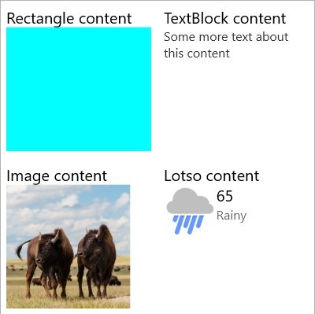

# HeaderedContentControl XAML Control

The **HeaderedContentControl** is a UI control that allows content to be displayed with a specified header. The `Header` property can be any object and you can use the `HeaderTemplate` to specify a custom look to the header. Content for the HeaderedContentControl will align to the top left. This is to maintain the same functionality as the ContentControl.


## Properties
### Header
Gets or sets the data used for the header of each control.

The `Header` property can be set to a string, or any xaml elements. If binding the `Header` to an object that is not a string, use the `HeaderTemplate` to control how the content is rendered.

```xaml
<controls:HeaderedContentControl Header="This is the header!"/>
```

```xaml
<controls:HeaderedContentControl>
    <controls:HeaderedContentControl.Header>
        <Border Background="Gray">
            <TextBlock Text="This is the header!" FontSize="16">
        </Border>
    </controls:HeaderedContentControl.Header>
</<controls:HeaderedContentControl>
```

### HeaderTemplate
Gets or sets the template used to display the content of the control's header.

Used to control the look of the header. The default value for the `HeaderTemplate` will display the string representation of the `Header`. Set this property if you need to bind the `Header` to an object.

```xaml
<controls:HeaderedContentControl Header="{Binding CustomObject}">
    <controls:HeaderedContentControl.HeaderTemplate>
        <DataTemplate>
            <TextBlock Text="{Binding Title}">
        </DataTemplate>
    </controls:HeaderedContentControl.HeaderTemplate>
</<controls:HeaderedContentControl>
```

> [!NOTE]
Setting the `Background`, `BorderBrush` and `BorderThickness` properties will not have any effect on the HeaderedContentControl. This is to maintain the same functionality as the ContentControl.

## Example Image



## Example Code

[HeaderedContentControl Sample Page](https://github.com/Microsoft/UWPCommunityToolkit/tree/master/Microsoft.Toolkit.Uwp.SampleApp/SamplePages/HeaderedContentControl)

## Default Template

[HeaderedContentControl XAML File](https://github.com/Microsoft/UWPCommunityToolkit/blob/master/Microsoft.Toolkit.Uwp.UI.Controls/HeaderedContentControl/HeaderedContentControl.xaml) is the XAML template used in the toolkit for the default styling.

## Requirements (Windows 10 Device Family)

| [Device family](http://go.microsoft.com/fwlink/p/?LinkID=526370) | Universal, 10.0.14393.0 or higher |
| --- | --- |
| Namespace | Microsoft.Toolkit.Uwp.UI.Controls |

## API

* [HeaderedContentControl source code](https://github.com/Microsoft/UWPCommunityToolkit/tree/master/Microsoft.Toolkit.Uwp.UI.Controls/HeaderedContentControl)

