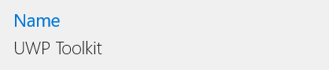

# HeaderedTextBlock XAML Control

The **HeaderedTextBlock Control** provides a header for read-only text. This control is useful for displaying read-only forms, content, or a collection of items depending on the type. 

## Syntax

```xml

<controls:HeaderedTextBlock Header="HeaderedTextBlockControl" 
           Text="UWP Community Toolkit" 
           Orientation="Vertical"
		   Margin="20,10,0,0" />  

```

## Example Image



## Example Code

[HeaderedTextBlock Sample Page](https://github.com/Microsoft/UWPCommunityToolkit/tree/master/Microsoft.Toolkit.Uwp.SampleApp/SamplePages/HeaderedTextBlock)

## Default Template

[HeaderedTextBlock XAML File](https://github.com/Microsoft/UWPCommunityToolkit/blob/master/Microsoft.Toolkit.Uwp.UI.Controls/HeaderedTextBlock/HeaderedTextBlock.xaml) is the XAML template used in the toolkit for the default styling.

## Requirements (Windows 10 Device Family)

| [Device family](http://go.microsoft.com/fwlink/p/?LinkID=526370) | Universal, 10.0.14393.0 or higher |
| --- | --- |
| Namespace | Microsoft.Toolkit.Uwp.UI.Controls |

## API

* [HeaderedTextBlock source code](https://github.com/Microsoft/UWPCommunityToolkit/tree/master/Microsoft.Toolkit.Uwp.UI.Controls/HeaderedTextBlock)

