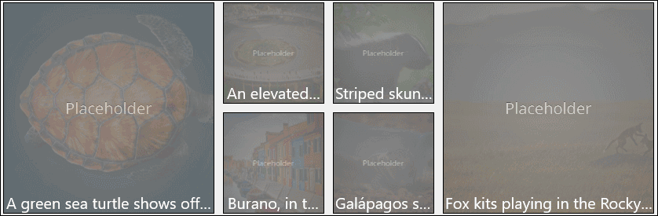

# ImageEx XAML Control

The [ImageEx Control](https://docs.microsoft.com/dotnet/api/microsoft.toolkit.uwp.ui.controls.imageex) and [RoundImageEx Control](https://docs.microsoft.com/dotnet/api/microsoft.toolkit.uwp.ui.controls.roundimageex) downloads images asynchronously, while showing a loading indicator. Source images are then stored in the application's local cache to preserve resources and load time. ImageEx also extends the default *Image* and *ImageBrush* Platform controls respectively to improve performance through caching. You can also use a placeholder image that will be displayed while loading the main image.
 
## Syntax

```xaml
<controls:ImageEx Name="ImageExControl" IsCacheEnabled="True"
	PlaceholderSource="/assets/thumbnails/thumbnails.png"
	Source="/assets/bigPicture.png"/> 

<controls:RoundImageEx Name="RoundImageExControl" IsCacheEnabled="True"
	PlaceholderSource="/assets/thumbnails/thumbnails.png"
	Source="/assets/bigPicture.png" CornerRadius="999"/> 
```

> [!NOTE]
On Windows 10.0.16299.0 or higher, `CornerRadius` is supported on ImageEx.  Use of this property will not cause an exception on downlevel platforms; however, the desired effect will not render.

## Sample Output



## ImageEx Properties

| Property | Type | Description |
| -- | -- | -- |
| NineGrid | Thickness | Gets or sets the nine-grid used by the image |

## RoundImageEx Properties

| Property | Type | Description |
| -- | -- | -- |
| CornerRadius | double | Get or set the radius of round image corner |

## Sample Code

[ImageExControl Sample Page Source](https://github.com/Microsoft/WindowsCommunityToolkit//tree/master/Microsoft.Toolkit.Uwp.SampleApp/SamplePages/ImageEx). You can see this in action in [Windows Community Toolkit Sample App](https://www.microsoft.com/store/apps/9NBLGGH4TLCQ).

## Default Template

ImageEx control supports use of Progress Indicator. This can be enabled by adding ImageEx template from previous release of the control.

- [ImageEx Control with Progress Indicator XAML File](https://github.com/Microsoft/WindowsCommunityToolkit/blob/rel/2.2.0/Microsoft.Toolkit.Uwp.UI.Controls/ImageEx/ImageEx.xaml) is the XAML template used in v2.2.0.0 of toolkit.

- [ImageEx Control XAML File](https://github.com/Microsoft/WindowsCommunityToolkit//blob/master/Microsoft.Toolkit.Uwp.UI.Controls/ImageEx/ImageEx.xaml) is the XAML template used in the toolkit for the default styling.

- [RoundImageEx Control XAML File](https://github.com/Microsoft/WindowsCommunityToolkit//blob/master/Microsoft.Toolkit.Uwp.UI.Controls/ImageEx/RoundImageEx.xaml) is the XAML template used in the toolkit for the default styling of the Control that has Corner Rounding.

## Requirements

| Device family | Universal, 10.0.15063.0 or higher |
| -- | -- |
| Namespace | Microsoft.Toolkit.Uwp.UI.Controls |
| NuGet package | [Microsoft.Toolkit.Uwp.UI.Controls](https://www.nuget.org/packages/Microsoft.Toolkit.Uwp.UI.Controls/) |

## API

* [ImageEx source code](https://github.com/Microsoft/WindowsCommunityToolkit//tree/master/Microsoft.Toolkit.Uwp.UI.Controls/ImageEx)

