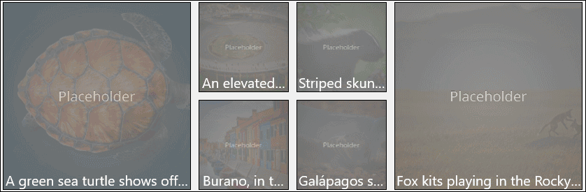

# ImageEx XAML Control

The **ImageEx Control** and **RoundImageEx Control** downloads images asynchronously, while showing a loading indicator. Source images are then stored in the application's local cache to preserve resources and load time. ImageEx also extends the default *Image* and *ImageBrush* Platform controls respectively to improve performance through caching. 
You can also use a placeholder image that will be displayed will loading the main image.
 
## Syntax

```xml

<controls:ImageEx Name="ImageExControl"
	IsCacheEnabled="True"
	PlaceholderSource="/assets/thumbnails/thumbnails.png"
	Source="/assets/bigPicture.png"
/> 

<controls:RoundImageEx Name="RoundImageExControl"
	IsCacheEnabled="True"
	PlaceholderSource="/assets/thumbnails/thumbnails.png"
	Source="/assets/bigPicture.png"
	CornerRadius="999"
/> 

```

## Example Image



## Example Code

[ImageExControl Sample Page](https://github.com/Microsoft/UWPCommunityToolkit/tree/master/Microsoft.Toolkit.Uwp.SampleApp/SamplePages/ImageEx)

## Default Template 

[ImageEx Control XAML File](https://github.com/Microsoft/UWPCommunityToolkit/blob/master/Microsoft.Toolkit.Uwp.UI.Controls/ImageEx/ImageEx.xaml) is the XAML template used in the toolkit for the default styling.
[RoundImageEx Control XAML File](https://github.com/Microsoft/UWPCommunityToolkit/blob/master/Microsoft.Toolkit.Uwp.UI.Controls/ImageEx/RoundImageEx.xaml) is the XAML template used in the toolkit for the default styling of the Control that has Corner Rounding.

## Requirements (Windows 10 Device Family)

| [Device family](http://go.microsoft.com/fwlink/p/?LinkID=526370) | Universal, 10.0.14393.0 or higher |
| --- | --- |
| Namespace | Microsoft.Toolkit.Uwp.UI.Controls |

## API

* [ImageEx source code](https://github.com/Microsoft/UWPCommunityToolkit/tree/master/Microsoft.Toolkit.Uwp.UI.Controls/ImageEx)

