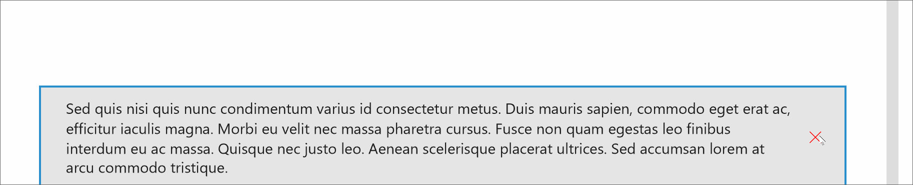

# InAppNotification 

The [InAppNotification](https://docs.microsoft.com/dotnet/api/microsoft.toolkit.uwp.ui.controls.inappnotification) control offers the ability to show local notifications in your application.

The control should be placed where you want your notification to be displayed in the page, generally in the root grid.

> [!NOTE]
Since the control is part of the page visual tree, it will render in the order it was added in the parent control, and might be hidden by other elements. For the control to render on top of other elements, add it as the last child of the parent control or set the Canvas.ZIndex to a high number.

## Syntax

```xaml
<controls:InAppNotification>
    <!-- InAppNotification content -->
</controls:InAppNotification>
```

## Sample Output



## Properties

| Property | Type | Description |
| -- | -- | -- |
| AnimationDuration | TimeSpan | Gets or sets a value indicating the duration of the popup animation (in milliseconds) |
| HorizontalOffset | double | Gets or sets a value indicating the horizontal offset of the popup animation |
| ShowDismissButton | bool | Gets or sets a value indicating whether to show the Dismiss button of the control |
| StackMode | StackMode | Gets or sets a value indicating the stack mode of the notifications |
| VerticalOffset | double | Gets or sets a value indicating the vertical offset of the popup animation |

### StackMode

By default, each time you display an in-app notification using the same control, each notification will replace the previous one.
You can change this behavior with one of these values:

| StackMode properties | Description |
| -- | -- |
| Replace | Default mode, replace previous notification |
| QueueBehind | Store every notifications to show, when you dismiss a notification the remaining ones will be displayed successively |
| StackInFront | Store every notifications to show, when you show a notification it will be displayed in priority (in the reverse order of `QueueBehind` mode) |

## Methods

| Methods | Return Type | Description |
| -- | -- | -- |
| Dismiss() | void | Dismiss the notification |
| Show(int) | void | Show notification using the current template |
| Show(String, int) | void | Show notification using text as the content of the notification with a display duration |
| Show(DataTemplate, int) | void | Show notification using DataTemplate as the content of the notification with a display duration |
| Show(UIElement, int) | void | Show notification using UIElement as the content of the notification with a display duration |

## Events

| Events | Description |
| -- | -- |
| Closed | Event raised when the notification is closed |
| Closing | Event raised when the notification is closing |
| Opened | Event raised when the notification is opened |
| Opening | Event raised when the notification is opening |

### Examples

- You have multiple options to show an in-app notification.

    - By simply displaying the notification using the current template

        ```csharp
        ExampleInAppNotification.Show();
        ```
        ```vb
        ExampleInAppNotification.Show()
        ```

    - By using a simple text content.

        ```csharp
        ExampleInAppNotification.Show("Some text.");
        ```
        ```vb
        ExampleInAppNotification.Show("Some text.")
        ```

    - By using a UIElement (with a container as parent, ex: Grid)

        ```csharp
        var grid = new Grid();

        // TODO : Construct the Grid in C#
        ExampleInAppNotification.Show(grid);
        ```
        ```vb
        Dim grid = New Grid()

        ' TODO : Construct the Grid in code
        ExampleInAppNotification.Show(grid)
        ```

    - By using a DataTemplate

        ```csharp
        object inAppNotificationWithButtonsTemplate;
        bool isTemplatePresent = Resources.TryGetValue("InAppNotificationWithButtonsTemplate", out inAppNotificationWithButtonsTemplate);

        if (isTemplatePresent && inAppNotificationWithButtonsTemplate is DataTemplate)
        {
            ExampleInAppNotification.Show(inAppNotificationWithButtonsTemplate as DataTemplate);
        }
        ```
        ```vb
        Dim inAppNotificationWithButtonsTemplate As Object
        Dim isTemplatePresent As Boolean = Resources.TryGetValue("InAppNotificationWithButtonsTemplate", inAppNotificationWithButtonsTemplate)

        If isTemplatePresent AndAlso TypeOf inAppNotificationWithButtonsTemplate Is DataTemplate Then
            ExampleInAppNotification.Show(TryCast(inAppNotificationWithButtonsTemplate, DataTemplate))
        End If
        ```

- By passing a second argument to the `Show()` method, you can set the duration of the notification (in milliseconds).

    ```csharp
    ExampleInAppNotification.Show("Some text.", 2000); // the notification will appear for 2 seconds
    ```
    ```vb
    ExampleInAppNotification.Show("Some text.", 2000)  ' The notification will appear for 2 seconds
    ```

- Call Dismiss to dismiss the notification

    ```csharp
    ExampleInAppNotification.Dismiss();
    ```
    ```vb
    ExampleInAppNotification.Dismiss()
    ```

- Use EventArgs to find the dismiss kind of the InAppNotification in and Closed

    ```csharp
    private void InAppNotification_OnClosing(object sender, InAppNotificationDismissingEventArgs e)
    {
        if (e.DismissKind == InAppNotificationDismissKind.User)
        {
            // When the user asked to dismiss the notification
        }
        if (e.DismissKind == InAppNotificationDismissKind.Timeout)
        {
            // When the notification is dismissed after timeout
        }
    }
    ```
    ```vb
    Private Sub InAppNotification_OnClosing(ByVal sender As Object, ByVal e As InAppNotificationDismissingEventArgs)
        If e.DismissKind = InAppNotificationDismissKind.User Then
            ' When the user asked to dismiss the notification
        End If

        If e.DismissKind = InAppNotificationDismissKind.Timeout Then
            ' When the notification is dismissed after timeout
        End If
    End Sub
    ```

- The in-app notification control is designed to support multiple styles. The default style applied is the Microsoft Edge-like notification. Other styles have been added to the Toolkit so you can easily switch to another of your favorite In App Notification styles.

    Here is the list of existing styles :

    - [Microsoft Edge notification style](https://github.com/Microsoft/UWPCommunityToolkit/blob/master/Microsoft.Toolkit.Uwp.UI.Controls/InAppNotification/Styles/MSEdgeNotificationStyle.xaml)

        

    - [Visual Studio Code notification style](https://github.com/Microsoft/UWPCommunityToolkit/blob/master/Microsoft.Toolkit.Uwp.UI.Controls/InAppNotification/Styles/VSCodeNotificationStyle.xaml)

        

    If you want to use another style than the default one, please follow the example below :

    - Import external styles in your resources

    ```xaml
    <Page.Resources>
        <ResourceDictionary>
            <ResourceDictionary.MergedDictionaries>
                <ResourceDictionary Source="ms-appx:///Microsoft.Toolkit.Uwp.UI.Controls/InAppNotification/Styles/VSCodeNotificationStyle.xaml" />
            </ResourceDictionary.MergedDictionaries>
        </ResourceDictionary>
    </Page.Resources>
    ```

    - Apply the `Style`

    ```xaml
    <controls:InAppNotification 
        x:Name="ExampleVSCodeInAppNotification"
        Style="{StaticResource VSCodeNotificationStyle}" />
    ```

## Adding styles to Toolkit

If you want to add styles to the Toolkit, please follow these steps :

1. Create a `ResourceDictionary` file in [Microsoft.Toolkit.Uwp.UI.Controls/InAppNotification/Styles/](https://github.com/Microsoft/UWPCommunityToolkit/tree/master/Microsoft.Toolkit.Uwp.UI.Controls/InAppNotification/Styles) folder
2. Create a new `Style` with `TargetType="local:InAppNotification"`
3. Create a new `ControlTemplate` with `TargetType="local:InAppNotification"` and add a `ContentPresenter` inside the Template
4. Do not forget to set the `Template` property inside your `Style` resource

## Sample Code

[InAppNotification Sample Page Source](https://github.com/Microsoft/UWPCommunityToolkit/tree/master/Microsoft.Toolkit.Uwp.SampleApp/SamplePages/InAppNotification). You can see this in action in [Windows Community Toolkit Sample App](https://www.microsoft.com/store/apps/9NBLGGH4TLCQ).

## Default Template 

[InAppNotification XAML File](https://github.com/Microsoft/UWPCommunityToolkit/blob/master/Microsoft.Toolkit.Uwp.UI.Controls/InAppNotification/InAppNotification.xaml) is the XAML template used in the toolkit for the default styling.

## Requirements

| Device family | Universal, 10.0.14393.0 or higher |
| -- | -- |
| Namespace | Microsoft.Toolkit.Uwp.UI.Controls |
| NuGet package | [Microsoft.Toolkit.Uwp.UI.Controls](https://www.nuget.org/packages/Microsoft.Toolkit.Uwp.UI.Controls/) |

## API

* [InAppNotification source code](https://github.com/Microsoft/UWPCommunityToolkit/tree/master/Microsoft.Toolkit.Uwp.UI.Controls/InAppNotification)
