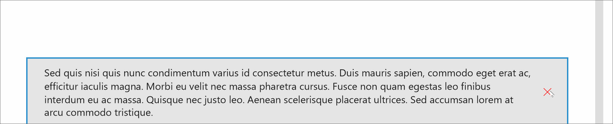

# InAppNotification 

The *InAppNotification* control offers the ability to show local notifications in your application.

## Syntax

The control should be placed where you want your notification to be displayed in the page, generally in the root grid.

```xaml
<controls:InAppNotification
    x:Name="ExampleInAppNotification" />
```

> [!NOTE]
Since the control is part of the page visual tree, it will render in the order it was added in the parent control, and might be hidden by other elements. For the control to render on top of other elements, add it as the last child of the parent control or set the Canvas.ZIndex to a high number.

### Show notification

You have multiple options to show an in-app notification.

1. By simply displaying the notification using the current template

    ```csharp
    ExampleInAppNotification.Show();
    ```

2. By using a simple text content.

    ```csharp
    ExampleInAppNotification.Show("Some text.");
    ```

3. By using a UIElement (with a container as parent, ex: Grid)

    ```csharp
    var grid = new Grid();

    // TODO : Construct the Grid in C#

    ExampleInAppNotification.Show(grid);
    ```

4. By using a DataTemplate

    ```csharp
    object inAppNotificationWithButtonsTemplate;
    bool isTemplatePresent = Resources.TryGetValue("InAppNotificationWithButtonsTemplate", out inAppNotificationWithButtonsTemplate);

    if (isTemplatePresent && inAppNotificationWithButtonsTemplate is DataTemplate)
    {
        ExampleInAppNotification.Show(inAppNotificationWithButtonsTemplate as DataTemplate);
    }
    ```

### Notification duration

By passing a second argument to the `Show()` method, you can set the duration of the notification (in milliseconds).

```csharp
ExampleInAppNotification.Show("Some text.", 2000); // the notification will appear for 2 seconds
```

### Dismiss notification

```csharp
ExampleInAppNotification.Dismiss();
```

## Example Image



## Properties

### ShowDismissButton

If you want to fully customize the in-app notification, you will see that the Dismiss button is still visible.
To hide it, simply set the property to `ShowDismissButton="False"`.

### StackMode

By default, each time you display an in-app notification using the same control, each notification will replace the previous one.
You can change this behavior with one of these values:

| StackMode properties | Description |
| -- | -- |
| `Replace` | Default mode, replace previous notification |
| `QueueBehind` | Store every notifications to show, when you dismiss a notification the remaining ones will be displayed successively |
| `StackInFront` | Store every notifications to show, when you show a notification it will be displayed in priority (in the reverse order of `QueueBehind` mode) |

## Events

### Opening

This event is raised just before the notification starts to open.

```csharp
private void InAppNotification_OnOpening(object sender, InAppNotificationOpeningEventArgs e)
{
    // TODO
}
```

### Opened

This event is raised when the notification is fully opened (after open animation).

```csharp
private void InAppNotification_OnOpened(object sender, EventArgs e)
{
    // TODO
}
```

### Closing

This event is raised when the system or your user started to close the notification.

```csharp
private void InAppNotification_OnClosing(object sender, InAppNotificationDismissingEventArgs e)
{
    // TODO
    if (e.DismissKind == InAppNotificationDismissKind.User)
    {
        // When the user asked to dismiss the notification
    }
    if (e.DismissKind == InAppNotificationDismissKind.Timeout)
    {
        // When the notification is dismissed after timeout
    }
}
```

### Closed

This event is raised when the notification is fully closed (after close animation).

```csharp
private void InAppNotification_OnClosed(object sender, EventArgs e)
{
    // TODO
}
```

## Animation

The default animation are set on each Notification Style. 
You can update the animation using three distinct properties :

| Animation properties | Type | Description |
| -- | -- | -- |
| `AnimationDuration` | TimeSpan | Duration of the popup animation in milliseconds |
| `VerticalOffset` | double | Vertical offset of the popup animation |
| `HorizontalOffset` | double | Horizontal offset of the popup animation |

## Styling

### Using styles

The in-app notification control is designed to support multiple styles. 
The default style applied is the Microsoft Edge-like notification.
Other styles have been added to the Toolkit so you can easily switch to another of your favorite In App Notification styles.

Here is the list of existing styles : 
* [Microsoft Edge notification style](https://github.com/Microsoft/UWPCommunityToolkit/blob/master/Microsoft.Toolkit.Uwp.UI.Controls/InAppNotification/Styles/MSEdgeNotificationStyle.xaml)
* [Visual Studio Code notification style](https://github.com/Microsoft/UWPCommunityToolkit/blob/master/Microsoft.Toolkit.Uwp.UI.Controls/InAppNotification/Styles/VSCodeNotificationStyle.xaml)

If you want to use another style than the default one, please follow the example below :

1. Import external styles in your resources

    ```xaml
    <Page.Resources>
        <ResourceDictionary>
            <ResourceDictionary.MergedDictionaries>
                <ResourceDictionary Source="ms-appx:///Microsoft.Toolkit.Uwp.UI.Controls/InAppNotification/Styles/VSCodeNotificationStyle.xaml" />
            </ResourceDictionary.MergedDictionaries>
        </ResourceDictionary>
    </Page.Resources>
    ```

2. Apply the `Style`

    ```xaml
    <controls:InAppNotification 
        x:Name="ExampleVSCodeInAppNotification"
        Style="{StaticResource VSCodeNotificationStyle}" />
    ```

### Adding styles

If you want to add styles to the Toolkit, please follow these steps :

1. Create a `ResourceDictionary` file under `InAppNotification/Styles/` folder of `Microsoft.Toolkit.Uwp.UI.Controls` project
2. Create a new `Style` with `TargetType="local:InAppNotification"`
3. Create a new `ControlTemplate` with `TargetType="local:InAppNotification"` and add a `ContentPresenter` inside the Template
4. Do not forget to set the `Template` property inside your `Style` resource

## Example Code

[InAppNotification Sample Page](https://github.com/Microsoft/UWPCommunityToolkit/tree/master/Microsoft.Toolkit.Uwp.SampleApp/SamplePages/InAppNotification)

## Default Template 

[InAppNotification XAML File](https://github.com/Microsoft/UWPCommunityToolkit/blob/master/Microsoft.Toolkit.Uwp.UI.Controls/InAppNotification/InAppNotification.xaml) is the XAML template used in the toolkit for the default styling.

## Requirements (Windows 10 Device Family)

| [Device family](http://go.microsoft.com/fwlink/p/?LinkID=526370) | Universal, 10.0.14393.0 or higher |
| --- | --- |
| Namespace | Microsoft.Toolkit.Uwp.UI.Controls |

## API

* [InAppNotification source code](https://github.com/Microsoft/UWPCommunityToolkit/tree/master/Microsoft.Toolkit.Uwp.UI.Controls/InAppNotification)

