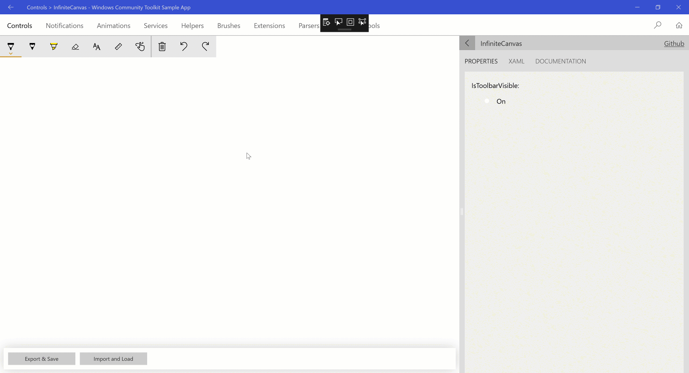

# InfiniteCanvas XAML Control

The [InfiniteCanvas Control](https://docs.microsoft.com/dotnet/api/microsoft.toolkit.uwp.ui.controls.infinitecanvas) is a canvas that supports Infinite Scrolling, Ink, Text, Format Text, Zoom in/out, Redo, Undo, Export canvas data, Import canvas data.

## Syntax

```xaml
<Page ...
     xmlns:controls="using:Microsoft.Toolkit.Uwp.UI.Controls"/>

<controls:InfiniteCanvas Name="canvas"/>
```

## Sample Output



## Properties

| Property | Type | Description |
| -- | -- | -- |
| CanvasWidth | double | Gets or sets the width of the drawing area, default value is 2097152. This is different from the `Width` property which specifies the Width of the control |
| CanvasHeight | double | Gets or sets the height of the drawing area, default value is 2097152. This is different from the `Height` property which specifies the Height of the control |
| IsToolbarVisible | bool | Gets or sets a value indicating whether the toolbar is visible or not. |
| MaxZoomFactor | double | Gets or sets the MaxZoomFactor for the canvas, range between 1 to 10 and the default value is 4. |
| MinZoomFactor | double | Gets or sets the MinZoomFactor for the canvas, range between .1 to 1 the default value is .25. |

## Methods

| Method | Return Type | Description |
| -- | -- | -- |
| Redo() | void | Redo the last action. |
| Undo() | void | Undo the last action. |
| ExportAsJson() | string | Export the InfinitCanvas as json string. |
| ImportFromJson(string json) | void | Import InfiniteCanvas from json string and render the new canvas, this function will empty the Redo/Undo queue. |

## Events

### ReRenderCompleted

This event triggered after each render happended because of any change in the canvas elements.
This event could be used to do the Auto Save functionality.

## Examples

The following sample demonstrates how to add InfiniteCanvas Control

```xaml
<Page ....
    xmlns:controls="using:Microsoft.Toolkit.Uwp.UI.Controls">

    <Grid>
    <controls:InfiniteCanvas Name="canvas"/>
  </Grid>
</Page>
```

## Sample Code

[InfiniteCanvas Sample Page Source](https://github.com/Microsoft/WindowsCommunityToolkit//tree/master/Microsoft.Toolkit.Uwp.SampleApp/SamplePages/InfiniteCanvas). You can see this in action in [Windows Community Toolkit Sample App](https://www.microsoft.com/store/apps/9NBLGGH4TLCQ).

## Default Template

[InfiniteCanvas XAML File](https://github.com/Microsoft/WindowsCommunityToolkit//blob/master/Microsoft.Toolkit.Uwp.UI.Controls/InfiniteCanvas/InfiniteCanvas.xaml) is the XAML template used in the toolkit for the default styling.

## Requirements

| Device family | Universal, 10.0.16299.0 or higher |
| -- | -- |
| Namespace | Microsoft.Toolkit.Uwp.UI.Controls |
| NuGet package | [Microsoft.Toolkit.Uwp.UI.Controls](https://www.nuget.org/packages/Microsoft.Toolkit.Uwp.UI.Controls/) |

## API

* [InfiniteCanvas source code](https://github.com/Microsoft/WindowsCommunityToolkit//tree/master/Microsoft.Toolkit.Uwp.UI.Controls/InfiniteCanvas)
