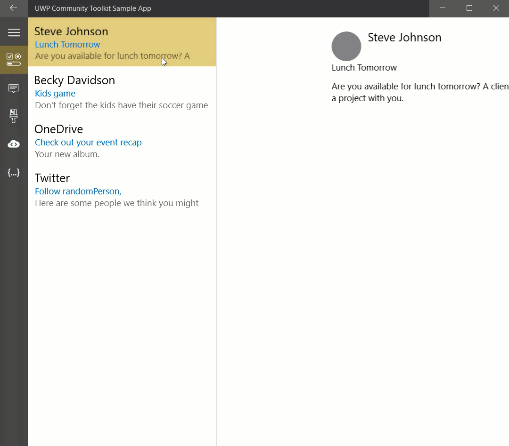

# MasterDetailsView XAML Control 

The [MasterDetailsView Control](https://docs.microsoft.com/dotnet/api/microsoft.toolkit.uwp.ui.controls.masterdetailsview) presents items in a master/details pattern. It shows a collection of items within the "master panel" and the details for that item within the "details panel". The MasterDetailsView reacts to the width it is given to determine if it should show both the master and details or just one of the two. There is a dependency property `ViewState` or an event `ViewStateChanged` that can be used to track which state the control is in.

## Syntax

```xaml
<controls:MasterDetailsView
          ItemsSource="{Binding Items}"
          ItemTemplate="{StaticResource ListTemplate}"
		  DetailsTemplate="{StaticResource DetailsTemplate}"
          NoSelectionContentTemplate="{StaticResource NoSelectionContentTemplate}">
</controls:MasterDetailsView>
```

## Sample Output



## Properties

| Property | Type | Description |
| -- | -- | -- |
| DetailsCommandBar | CommandBar | Gets or sets the Windows.UI.Xaml.Controls.CommandBar for the details section |
| DetailsTemplate | DataTemplate | Gets or sets the DataTemplate used to display the details |
| MapDetails | Func<object,object> | Gets or sets a function for mapping the selected item to a different model. This new model will be the DataContext of the Details area |
| MasterCommandBar | CommandBar | Gets or sets the Windows.UI.Xaml.Controls.CommandBar for the master section |
| MasterHeader | object | Gets or sets the content for the master pane's header |
| MasterHeaderTemplate | DataTemplate | Gets or sets the DataTemplate used to display the content of the master pane's header |
| MasterPaneBackground | Brush | Gets or sets the Brush to apply to the background of the list area of the control |
| MasterPaneWidth | double | Gets or sets the width of the master pane when the view is expanded |
| NoSelectionContent | object | Gets or sets the content to dsiplay when there is no item selected in the master list |
| NoSelectionContentTemplate | DataTemplate | Gets or sets the DataTemplate used to display the content when there is no selection |
| SelectedItem | object | Gets or sets the selected item |
| ViewState | [MasterDetailsViewState](https://docs.microsoft.com/dotnet/api/microsoft.toolkit.uwp.ui.controls.masterdetailsviewstate) | Gets the current visual state of the control |

## Events

| Events | Description |
| -- | -- |
| SelectionChanged | Occurs when the currently selected item changes |
| ViewStateChanged | Occurs when the view state changes |

## Sample Code

[MasterDetailsView Sample Page Source](https://github.com/Microsoft/UWPCommunityToolkit/tree/master/Microsoft.Toolkit.Uwp.SampleApp/SamplePages/MasterDetailsView). You can see this in action in [Windows Community Toolkit Sample App](https://www.microsoft.com/store/apps/9NBLGGH4TLCQ).

## Default Template 

[MasterDetailsView XAML File](https://github.com/Microsoft/UWPCommunityToolkit/blob/master/Microsoft.Toolkit.Uwp.UI.Controls/MasterDetailsView/MasterDetailsView.xaml) is the XAML template used in the toolkit for the default styling.

## Requirements

| Device family | Universal, 10.0.14393.0 or higher |
| -- | -- |
| Namespace | Microsoft.Toolkit.Uwp.UI.Controls |
| NuGet package | [Microsoft.Toolkit.Uwp.UI.Controls](https://www.nuget.org/packages/Microsoft.Toolkit.Uwp.UI.Controls/) |

## API

* [MasterDetailsView source code](https://github.com/Microsoft/UWPCommunityToolkit/tree/master/Microsoft.Toolkit.Uwp.UI.Controls/MasterDetailsView)
