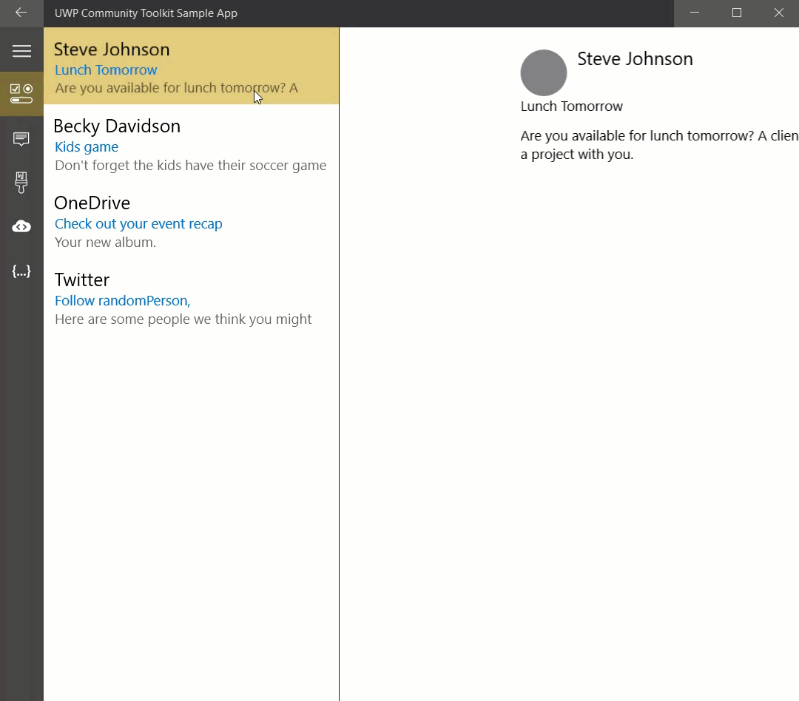

# MasterDetailsView XAML Control 

The **MasterDetailsView Control** presents items in a master/details pattern. It shows a collection of items within the "master panel" and the details for that item within the "details panel". The MasterDetailsView reacts to the width it is given to determine if it should show both the master and details or just one of the two. There is a dependency property `ViewState` or an event `ViewStateChanged` that can be used to track which state the control is in.

## Syntax

```xml

<controls:MasterDetailsView
          ItemsSource="{Binding Items}"
          ItemTemplate="{StaticResource ListTemplate}"
		  DetailsTemplate="{StaticResource DetailsTemplate}">
</controls:MasterDetailsView>

```

## Example Image



## Example Code

[MasterDetailsView Sample Page](https://github.com/Microsoft/UWPCommunityToolkit/tree/master/Microsoft.Toolkit.Uwp.SampleApp/SamplePages/MasterDetailsView)

## Default Template 

[MasterDetailsView XAML File](https://github.com/Microsoft/UWPCommunityToolkit/blob/master/Microsoft.Toolkit.Uwp.UI.Controls/MasterDetailsView/MasterDetailsView.xaml) is the XAML template used in the toolkit for the default styling.

## Requirements (Windows 10 Device Family)

| [Device family](http://go.microsoft.com/fwlink/p/?LinkID=526370) | Universal, 10.0.14393.0 or higher |
| --- | --- |
| Namespace | Microsoft.Toolkit.Uwp.UI.Controls |

## API

* [MasterDetailsView source code](https://github.com/Microsoft/UWPCommunityToolkit/tree/master/Microsoft.Toolkit.Uwp.UI.Controls/MasterDetailsView)

