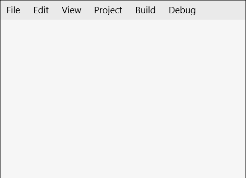

# Menu Control

The [Menu Control](https://docs.microsoft.com/dotnet/api/microsoft.toolkit.uwp.ui.controls.menu) defines a menu of choices for users to invoke, it is inheriting from `ItemsControl`. The default ItemsPanel for the menu control is `WrapPanel` and it only supports MenuItem as an item\children.

The [Menu Control](https://docs.microsoft.com/dotnet/api/microsoft.toolkit.uwp.ui.controls.menu) positions it's items the way the WrapPanel does based on the selected orientation Virtical\Horizontal (Developers can change the control ItemsPanel). The Menu items must be of type MenuItem, each MenuItem can be opened using keyboard or pointer.

[MenuItem](https://docs.microsoft.com/dotnet/api/microsoft.toolkit.uwp.ui.controls.menuitem) is inheriting from `ItemsControl` and the allowed controls must be derived from `MenuFlyoutItemBase` like `MenuFlyoutSubItem`, `MenuFlyoutItem`, etc...

To invoke any command on any Menu, MenuItem or MenuFlyoutItem you must use property `InputGestureText`

If the tooltip is allowed on the Menu control when clicking Alt a tooltip with the input gesture text will show\hide.  

## Syntax

```xaml
<controls:Menu>
    <controls:MenuItem Name="FileMenu"
        controls:Menu.InputGestureText="Alt+F"
        Header="File">

        <MenuFlyoutSubItem Text="New">
            <MenuFlyoutItem controls:Menu.InputGestureText="Ctrl+Shift+N"
                Command="{StaticResource NewProject}"
                Text="Project" />

            <MenuFlyoutItem controls:Menu.InputGestureText="Ctrl+N"
                Command="{StaticResource NewFile}"
                Text="File" />
        </MenuFlyoutSubItem>
    </controls:MenuItem>
</controls:Menu>
```

## Sample Output



## Properties

### Menu Properties

| Property | Type | Description |
| -- | -- | -- |
| FlyoutPlacement | [FlyoutPlacementMode](https://docs.microsoft.com/uwp/api/Windows.UI.Xaml.Controls.Primitives.FlyoutPlacementMode) | Gets or sets the placement of the flyoutMenu (Auto, Top, Bottom, Left, Right and Full) |
| IsOpened | bool | Gets a value indicating whether the menu is opened or not |
| MenuFlyoutStyle | Style | Gets or sets the menu style for MenuItem |
| Orientation | Orientation | Gets or sets the orientation of the Menu, Horizontal or vertical means that child controls will be added horizontally until the width of the panel can't fit more control then a new row is added to fit new horizontal added child controls, vertical means that child will be added vertically until the height of the panel is received then a new column is added |
| SelectedMenuItem | MenuItem | Gets the current selected menu header item |
| TooltipPlacement | [PlacementMode](https://docs.microsoft.com/uwp/api/Windows.UI.Xaml.Controls.Primitives.PlacementMode) | Gets or sets the tooltip placement on menu |
| TooltipStyle | Style | Gets or sets the tooltip styles for menu |

### External Properties

| Property | Type | Description |
| -- | -- | -- |
| AllowTooltip | bool | Specify whether to allow tooltip on Alt click or not |
| InputGestureText | string | Sets the text describing an input gesture that will call the command tied to the specified item or to open the MenuItem FlyoutMenu. ex (Alt+F) |

> [!NOTE]
InputGestureText supports Ctrl, Alt or Shift.

### MenuItem Properties

| Property | Type | Description |
| -- | -- | -- |
| Header | object | Gets or sets the header of the MenuItem. if you added '^' before any header character this character will be highlighted on pressing or holding Alt, this feature is used to visualize which character can be used beside Alt to open this MenuItem. |
| HeaderTemplate | DataTemplate | Gets or sets the data template that is used to display the content of the MenuItem |
| IsOpened | bool | Gets a value indicating whether the menu is opened or not |

## Methods

### Menu Methods

| Methods | Return Type | Description |
| -- | -- | -- |
| static GetAllowTooltip(Menu) | bool | Gets AllowTooltip attached property |
| static GetInputGestureText(FrameworkElement) | string | Gets InputGestureText attached property |
| static SetAllowTooltip(Menu, Boolean) | void | Sets AllowTooltip attached property |
| static SetInputGestureText(FrameworkElement, String) | void | Sets InputGestureText attached property |

### MenuItem Methods

| Methods | Return Type | Description |
| -- | -- | -- |
| HideMenu() | void | This method is used to hide the menu for current item |
| static ShowMenu() | void | This method is used to show the menu for current item |

## Example

The following sample demonstrates how to add Menu Control.

```xaml
<Page .... 
    xmlns:controls="using:Microsoft.Toolkit.Uwp.UI.Controls"">

    <Page.Resources>
        <ResourceDictionary>
            <commands:NewProjectCommand x:Key="NewProject" />
        </ResourceDictionary>
    </Page.Resources>

    <Grid>
        <controls:Menu>
            <controls:MenuItem Name="FileMenu" controls:Menu.InputGestureText="Alt+F" Header="File">
                <MenuFlyoutSubItem Text="New">
                    <MenuFlyoutItem controls:Menu.InputGestureText="Ctrl+Shift+N"
                                    Command="{StaticResource NewProject}" Text="Project" />
                </MenuFlyoutSubItem>
            </controls:MenuItem>
        </controls:Menu>
    </Grid>
</Page>
```

``` CSharp
internal class NewProjectCommand : ICommand
{
    public bool CanExecute(object parameter)
    {
        return true;
    }

    public async void Execute(object parameter)
    {
        var dialog = new MessageDialog("Create New Project");
        await dialog.ShowAsync();
    }

    public event EventHandler CanExecuteChanged;
}
```

## Sample Code

[Menu Sample Page Source](https://github.com/Microsoft/WindowsCommunityToolkit//tree/master/Microsoft.Toolkit.Uwp.SampleApp/SamplePages/Menu). You can see this in action in [Windows Community Toolkit Sample App](https://www.microsoft.com/store/apps/9NBLGGH4TLCQ).

## Default Template 

[Menu XAML File](https://github.com/Microsoft/WindowsCommunityToolkit//blob/master/Microsoft.Toolkit.Uwp.UI.Controls/Menu/Menu.xaml) is the XAML template used in the toolkit for the default styling.

## Requirements

| Device family | Universal, 10.0.15063.0 or higher |
| -- | -- |
| Namespace | Microsoft.Toolkit.Uwp.UI.Controls |
| NuGet package | [Microsoft.Toolkit.Uwp.UI.Controls](https://www.nuget.org/packages/Microsoft.Toolkit.Uwp.UI.Controls/) |

## API

* [Menu source code](https://github.com/Microsoft/WindowsCommunityToolkit//tree/master/Microsoft.Toolkit.Uwp.UI.Controls/Menu)
