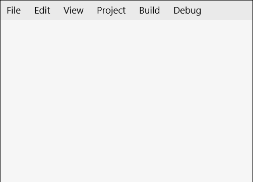

# Menu Control

The **Menu Control** defines a menu of choices for users to invoke, it is inheriting from `ItemsControl`. The default ItemsPanel for the menu control is `WrapPanel` and it only supports MenuItem as an item\children.

### How it works

The **Menu Control** positions it's items the way the WrapPanel does based on the selected orientation Virtical\Horizontal (Developers can change the control ItemsPanel). The Menu items must be of type MenuItem, each MenuItem can be opened using keyboard or pointer.

**MenuItem** is inheriting from `ItemsControl` and the allowed controls must be derived from `MenuFlyoutItemBase` like `MenuFlyoutSubItem`, `MenuFlyoutItem`, etc...

To invoke any command on any Menu, MenuItem or MenuFlyoutItem you must use property `InputGestureText`

If the tooltip is allowed on the Menu control when clicking Alt a tooltip with the input gesture text will show\hide.  

## Syntax

```xaml

<controls:Menu>
            <controls:MenuItem Name="FileMenu"
                               controls:Menu.InputGestureText="Alt+F"
                               Header="File">
                <MenuFlyoutSubItem Text="New">
                    <MenuFlyoutItem controls:Menu.InputGestureText="Ctrl+Shift+N"
                                    Command="{StaticResource NewProject}"
                                    Text="Project" />
                    <MenuFlyoutItem controls:Menu.InputGestureText="Ctrl+N"
                                    Command="{StaticResource NewFile}"
                                    Text="File" />
                </MenuFlyoutSubItem>
            </controls:MenuItem>
</controls:Menu>

```

## Example Image



## External Properties

### InputGestureText
Sets the text describing an input gesture that will call the command tied to the specified item or to open the MenuItem FlyoutMenu. ex (Alt+F)

`Note`: InputGestureText supports Ctrl, Alt or Shift.

### AllowTooltip
Specify whether to allow tooltip on Alt click or not.

## MenuItem Properties
### Header
Gets or sets the header of the MenuItem. if you added '^' before any header character this character will be highlighted on pressing or holding Alt, this feature is used to visualize which character can be used beside Alt to open this MenuItem.

## Menu Properties

### Orientation
Gets or sets the orientation of the Menu, Horizontal or vertical means that child controls will be added horizontally until the width of the panel can't fit more control then a new row is added to fit new horizontal added child controls, vertical means that child will be added vertically until the height of the panel is received then a new column is added.

### FlyoutPlacement
Gets or sets the placement of the flyoutMenu (Auto, Top, Bottom, Left, Right and Full).
If the MenuPlacement is Bottom the FlyoutMenu will be aligned with the bottom left corner of the MenuItem
If the MenuPlacement is Right the FlyoutMenu will be aligned with the top right corner of the MenuItem
If the MenuPlacement is Auto the calculation of the menu placement will be based on Menu Orientation properties, case orientation is Horizontal FLyoutMenu placement will be Bottom, case orientation is Vertical FlyoutMenu placement will be Right.
If the MenuPlacement is left or top the FlyoutMenu placement will be displayed left/top but without any alignment with the MenuItem.

### MenuFlyoutStyle
Gets or sets the FlyoutMenu style for MenuItem.

### TooltipStyle
Gets or sets the tooltip styles for MenuItem.

### TooltipPlacement
Gets or sets the tooltip PlacementMode on MenuItem. (Bottom, Right, Mouse, Left and Top).

### SelectedHeaderItem
Gets the current selected MenuItem.

### IsOpened
Gets a value indicating whether the menu is opened or not.

## Example Code

[Menu Sample Page](https://github.com/Microsoft/UWPCommunityToolkit/tree/master/Microsoft.Toolkit.Uwp.SampleApp/SamplePages/Menu)

The following sample demonstrates how to add Menu Control.

```xml

<Page x:Class="Microsoft.Toolkit.Uwp.SampleApp.SamplePages.MenuPage"
      xmlns="http://schemas.microsoft.com/winfx/2006/xaml/presentation"
      xmlns:x="http://schemas.microsoft.com/winfx/2006/xaml"
      xmlns:commands="using:Microsoft.Toolkit.Uwp.SampleApp.Menu.Commands"
      xmlns:controls="using:Microsoft.Toolkit.Uwp.UI.Controls"
      xmlns:d="http://schemas.microsoft.com/expression/blend/2008"
      xmlns:mc="http://schemas.openxmlformats.org/markup-compatibility/2006"
      mc:Ignorable="d">

    <Page.Resources>
        <ResourceDictionary>
            <commands:NewProjectCommand x:Key="NewProject" />
        </ResourceDictionary>
    </Page.Resources>

    <Grid>
        <controls:Menu>
            <controls:MenuItem Name="FileMenu"
                               controls:Menu.InputGestureText="Alt+F"
                               Header="File">
                <MenuFlyoutSubItem Text="New">
                    <MenuFlyoutItem controls:Menu.InputGestureText="Ctrl+Shift+N"
                                    Command="{StaticResource NewProject}"
                                    Text="Project" />
                </MenuFlyoutSubItem>
            </controls:MenuItem>
        </controls:Menu>
    </Grid>
</Page>

```

``` CSharp

internal class NewProjectCommand : ICommand
    {
        public bool CanExecute(object parameter)
        {
            return true;
        }

        public async void Execute(object parameter)
        {
            var dialog = new MessageDialog("Create New Project");
            await dialog.ShowAsync();
        }

        public event EventHandler CanExecuteChanged;
    }

```

## Default Template 

[Menu XAML File](https://github.com/Microsoft/UWPCommunityToolkit/blob/master/Microsoft.Toolkit.Uwp.UI.Controls/Menu/Menu.xaml) is the XAML template used in the toolkit for the default styling.

## Requirements (Windows 10 Device Family)

| [Device family](http://go.microsoft.com/fwlink/p/?LinkID=526370) | Universal, 10.0.14393.0 or higher |
| --- | --- |
| Namespace | Microsoft.Toolkit.Uwp.UI.Controls |

## API

* [Menu source code](https://github.com/Microsoft/UWPCommunityToolkit/tree/master/Microsoft.Toolkit.Uwp.UI.Controls/Menu)
