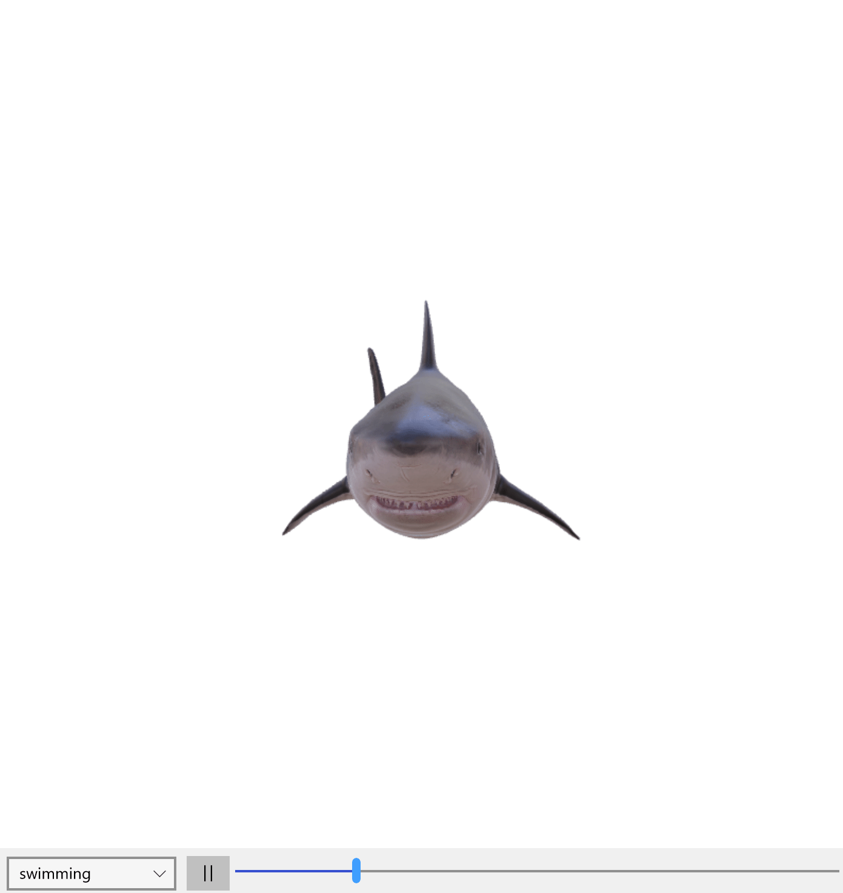

# Model3D XAML Control

The [Model3D control](https://docs.microsoft.com/dotnet/api/microsoft.toolkit.uwp.ui.controls.model3d) provides a control which embed a WebView used to render a 3D model through [Babylon.js](https://www.babylonjs.com)

It can load [glb files](https://www.khronos.org/gltf/).

By default, it will provide a command bar to control animations if the source glb file contains animation clips.

## Syntax

```xaml
<Page ...
     xmlns:controls="using:Microsoft.Toolkit.Uwp.UI.Controls"/>
     
    <controls:Model3D VerticalAlignment="Stretch"
                      HorizontalAlignment="Stretch"
                      Source="ms-appx:///Assets/3D/shark.glb"
                      CameraControl="True"
                      AlphaInDegrees="90"
                      BetaInDegrees="90"
                      RadiusPercentage="10">
    </controls:Model3D>
```

## Sample Output



## Properties

### Model3D Properties

| Property | Type | Description |
| -- | -- | -- |
| AlphaInDegrees | float | Gets or sets a float value indicating the alpha angle in degrees (which defines the rotation on horizontal plane)|
| BetaInDegrees | float | Gets or sets a float value indicating the beta angle in degrees (which defines the rotation on vertical plane) |
| CameraControl | bool | Gets or sets a value indicating whether the camera can be controlled with pointers (mouse, touch, pencil) or not |
| Environment | string | Gets or sets a string indicating the path for the environment texture (must be a DDS file) |
| RadiusPercentage | float | Gets or sets a float value between 0 and 100 indicating the distance from the center of the scene|
| Source | string | Gets or sets a string indicating the source path for the model |

## Events

### Model3D Events

| Events | Description |
| -- | -- |
| AssetLoading | Event raised when the assets are loading |
| AssetLoaded | Event raised when assets are loaded |

## Examples

The following sample demonstrates how to add a Model3D Control.

```xaml
<controls:Model3D VerticalAlignment="Stretch"
                    HorizontalAlignment="Stretch"
                    Source="ms-appx:///Assets/3D/shark.glb"
                    CameraControl="True"
                    AlphaInDegrees="90"
                    BetaInDegrees="90"
                    RadiusPercentage="10">
</controls:Model3D>
```

## Sample Code

[Model3D Sample Page Source](https://github.com/Microsoft/UWPCommunityToolkit/blob/master/Microsoft.Toolkit.Uwp.SampleApp/SamplePages/Model3D). You can see this in action in [Windows Community Toolkit Sample App](https://www.microsoft.com/store/apps/9NBLGGH4TLCQ).

## Default Template 

[Model3D XAML File](https://github.com/Microsoft/UWPCommunityToolkit/blob/master/Microsoft.Toolkit.Uwp.UI.Controls/Model3D/Model3D.xaml) is the XAML template used in the toolkit for the default styling.

## Requirements

| Device family | Universal, 10.0.14393.0 or higher |
| -- | -- |
| Namespace | Microsoft.Toolkit.Uwp.UI.Controls |
| NuGet package | [Microsoft.Toolkit.Uwp.UI.Controls](https://www.nuget.org/packages/Microsoft.Toolkit.Uwp.UI.Controls/) |

## API

* [Model3D source code](https://github.com/Microsoft/UWPCommunityToolkit/tree/master/Microsoft.Toolkit.Uwp.UI.Controls/Model3D)
