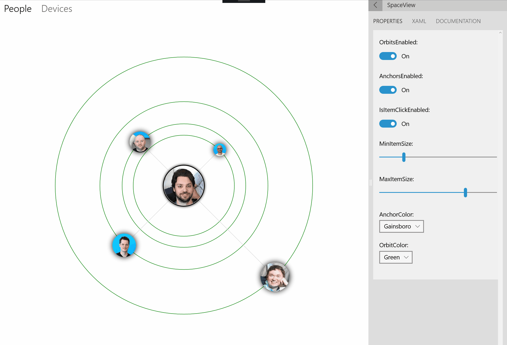

# OrbitView XAML Control

The `OrbitView` control provides a new control, inherited from the `ItemsControl`. All items are arranged in circle around a center element

  

## Syntax

```xaml

<controls:OrbitView OrbitsEnabled="True" 
                    AnchorsEnabled="False" 
                    IsItemClickEnabled="True" 
                    MinItemSize="20" 
                    MaxItemSize="60"
                    AnchorColor="Gray"
                    OrbitColor="Gray">
  <controls:OrbitView.ItemTemplate>
    <DataTemplate x:DataType="controls:OrbitViewDataItem">
      <controls:DropShadowPanel Color="Black" BlurRadius="20" VerticalContentAlignment="Stretch" HorizontalContentAlignment="Stretch">
        <Ellipse >
          <Ellipse.Fill>
            <ImageBrush ImageSource="{x:Bind Image}"></ImageBrush>
          </Ellipse.Fill>
        </Ellipse>
      </controls:DropShadowPanel>
    </DataTemplate>
  </controls:OrbitView.ItemTemplate>
  <controls:OrbitView.ItemsSource>
    <controls:OrbitViewDataItemCollection>
      <controls:OrbitViewDataItem Image="ms-appx:///Assets/People/shen.png" Distance="0.1" Label="Shen" Diameter="0.2"></controls:OrbitViewDataItem>
      <controls:OrbitViewDataItem Image="ms-appx:///Assets/People/david.png" Distance="0.2" Label="David" Diameter="0.5"></controls:OrbitViewDataItem>
      <controls:OrbitViewDataItem Image="ms-appx:///Assets/People/petri.png" Distance="0.4" Label="Petri" Diameter="0.6"></controls:OrbitViewDataItem>
      <controls:OrbitViewDataItem Image="ms-appx:///Assets/People/vlad.png" Distance="0.8" Label="Vlad" Diameter="0.8"></controls:OrbitViewDataItem>
    </controls:OrbitViewDataItemCollection>
  </controls:OrbitView.ItemsSource>
  <controls:OrbitView.CenterContent>
    <Grid>
      <controls:DropShadowPanel>
        <Ellipse Fill="White" Height="105" Width="105" Stroke="Black" StrokeThickness="2"></Ellipse>
      </controls:DropShadowPanel>
      <Ellipse Height="100" Width="100" VerticalAlignment="Center" HorizontalAlignment="Center">
        <Ellipse.Fill>
          <ImageBrush ImageSource="ms-appx:///Assets/People/nikola.png"></ImageBrush>
        </Ellipse.Fill>
      </Ellipse>
    </Grid>
  </controls:OrbitView.CenterContent>
</controls:OrbitView>

```

## OrbitView Properties

### IsItemClickEnabled
When set to true, the `ItemClicked` event is fired when an item is clicked. This property also enables input interactions including animations

### OrbitsEnabled
When set to true, each item will have an orbit drawn

### OrbitColor
When Orbits are enabled, this property specifies the orbit color

### OrbitThickness
When Orbits are enabled, this property specifies the orbit line thickness

### OrbitDashArray
When Orbits are enabled, this property specifies the orbit line dash array

### AnchorsEnabled
When set to true, each item will have an anchor line connecting it to the center element

### AnchorColor
When Anchors are enabled, this property specifies the anchor color

### AnchorThickness
When Anchors are enabled, this property specifies the anchor line thickness

### MinItemSize
MinItemSize specifies the minimum size for items

> Note: for this property to work, the data context of each item has to be a `OrbitViewDataItem` and Diameter property set between 0 and 1 

### MaxItemSize
MinItemSize specifies the maximum size for items

> Note: for this property to work, the data context of each item has to be a `OrbitViewDataItem` and Diameter property set between 0 and 1 

## OrbitView Events

### ItemInvoked
Event is raised when item is invoked with mouse or keyboard/controller

> Note: `IsItemClickedEnabled` should be true for this event to work

## OrbitViewDataItem
OrbitViewDataItem is a helper class used for specifying size and distance of each item of the `OrbitView`. To work properly, the `ItemSource` of the `OrbitView` should be set to en *IEnumerable< OrbitViewDataItem >*. Objects extending OrbitViewDataItem will also work. Alternatively, OrbitViewDataItem has the `Item` object property that can be used to store additional objects and properties.

### Diameter
A double value between 0 and 1, 0 indicating `MinItemSize` and 1 indicating `MaxItemSize`

### Distance
A double value between 0 and 1, 0 indicating closest to center and 1 indication farthest from center

### Label
A string value used for specifying AutomationProperties

### Image
ImageSource to be shown when no ItemTemplate is specified

### Item
Object property useful for adding additional properties

## Default Template 

[OrbitView XAML File](https://github.com/Microsoft/UWPCommunityToolkit/blob/master/Microsoft.Toolkit.Uwp.UI.Controls/OrbitView/OrbitView.xaml) is the XAML template used in the toolkit for the default styling.

## Requirements (Windows 10 Device Family)

| [Device family](http://go.microsoft.com/fwlink/p/?LinkID=526370) | Universal, 10.0.14393.0 or higher |
| --- | --- |
| Namespace | Microsoft.Toolkit.Uwp.UI.Controls |

## API

* [OrbitView source code](https://github.com/Microsoft/UWPCommunityToolkit/tree/master/Microsoft.Toolkit.Uwp.UI.Controls/OrbitView)

