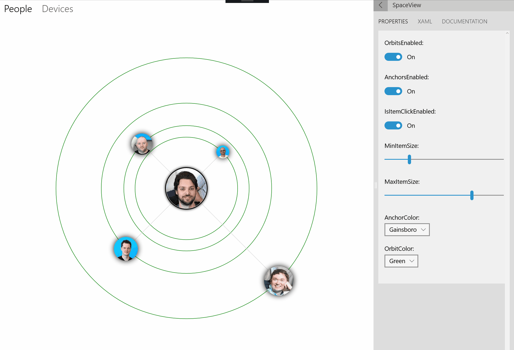

# OrbitView XAML Control

The [OrbitView control](https://docs.microsoft.com/dotnet/api/microsoft.toolkit.uwp.ui.controls.orbitview) provides a new control, inherited from the `ItemsControl`. All items are arranged in circle around a center element

[OrbitViewDataItem](https://docs.microsoft.com/dotnet/api/microsoft.toolkit.uwp.ui.controls.orbitviewdataitem) is a helper class used for specifying size and distance of each item of the `OrbitView`. To work properly, the `ItemSource` of the `OrbitView` should be set to en `IEnumerable<OrbitViewDataItem>`. Objects extending OrbitViewDataItem will also work. Alternatively, OrbitViewDataItem has the `Item` object property that can be used to store additional objects and properties.

## Syntax

```xaml
<Page ...
     xmlns:controls="using:Microsoft.Toolkit.Uwp.UI.Controls"/>
     
<controls:OrbitView OrbitsEnabled="True" AnchorsEnabled="False" 
                    IsItemClickEnabled="True" MinItemSize="20" 
                    MaxItemSize="60" AnchorColor="Gray" OrbitColor="Gray">
    <controls:OrbitView.ItemTemplate>
        <DataTemplate>
            <controls:DropShadowPanel/>
        </DataTemplate>
    </controls:OrbitView.ItemTemplate>
    <controls:OrbitView.ItemsSource>
        <controls:OrbitViewDataItemCollection>
            <controls:OrbitViewDataItem />
        </controls:OrbitViewDataItemCollection>
    </controls:OrbitView.ItemsSource>
    <controls:OrbitView.CenterContent>
        <Grid>
            <!-- OrbitView Center Content -->
        </Grid>
    </controls:OrbitView.CenterContent>
</controls:OrbitView>
```

## Sample Output



## Properties

### OrbitView Properties

| Property | Type | Description |
| -- | -- | -- |
| AnchorColor | Brush | Gets or sets a value indicating the color of anchors |
| AnchorsEnabled | bool | Gets or sets a value indicating whether anchors are enabled |
| AnchorThickness | double | Gets or sets a value indicating the thickness of the anchors |
| CenterContent | object | Gets or sets a value representing the center element |
| IsItemClickEnabled | bool | Gets or sets a value indicating whether elements are clickable |
| MaxItemSize | double | Gets or sets a value indicating the maximum size of items |
| MinItemSize | double | Gets or sets a value indicating the minimum size of items Note: for this property to work, Data Context must be derived from OrbitViewItems and Diameter must be between 0 and 1 |
| OrbitColor | Brush | Gets or sets a value indicating the color of orbits |
| OrbitDashArray | DoubleCollection | Gets or sets a value indicating the dash array for the orbit |
| OrbitsEnabled | bool | Gets or sets a value indicating whether orbits are enabled or not |
| OrbitThickness | double | Gets or sets a value indicating the thickness of the orbits |

> [!IMPORTANT]
For `MaxItemSize` and `MinItemSize` property to work, Data Context must be derived from OrbitViewItems and Diameter must be between 0 and 1

### OrbitViewDataItem Properties

| Property | Type | Description |
| -- | -- | -- |
| Diameter | double | Gets or sets a value indicating the diameter of the item. Expected value betweeen 0 and 1 |
| Distance | double | Gets or sets a value indicating the distance from the center. Expected value betweeen 0 and 1 |
| Image | ImageSource | Gets or sets a value indicating the image of the item |
| Item | object | Gets or sets a value of an object that can be used to store model data |
| Label | string | Gets or sets a value indicating the name of the item. Used for [AutomationProperties](https://docs.microsoft.com/uwp/api/Windows.UI.Xaml.Automation.AutomationProperties) |

## Events

### OrbitView Events

| Events | Description |
| -- | -- |
| ItemClick | Raised when an item has been clicked or activated with keyboard/controller |

> [!IMPORTANT]
`IsItemClickedEnabled` should be true for this event to work

## Examples

The following sample demonstrates how to add OrbitView Control.

```xaml
<controls:OrbitView OrbitsEnabled="True" AnchorsEnabled="False" 
                    IsItemClickEnabled="True" MinItemSize="20" 
                    MaxItemSize="60" AnchorColor="Gray" OrbitColor="Gray">
  <controls:OrbitView.ItemTemplate>
    <DataTemplate x:DataType="controls:OrbitViewDataItem">
      <controls:DropShadowPanel Color="Black" BlurRadius="20" VerticalContentAlignment="Stretch" HorizontalContentAlignment="Stretch">
        <Ellipse >
          <Ellipse.Fill>
            <ImageBrush ImageSource="{x:Bind Image}"></ImageBrush>
          </Ellipse.Fill>
        </Ellipse>
      </controls:DropShadowPanel>
    </DataTemplate>
  </controls:OrbitView.ItemTemplate>

  <controls:OrbitView.ItemsSource>
    <controls:OrbitViewDataItemCollection>
      <controls:OrbitViewDataItem Image="ms-appx:///Assets/People/shen.png" Distance="0.1" Label="Shen" Diameter="0.2"></controls:OrbitViewDataItem>
      <controls:OrbitViewDataItem Image="ms-appx:///Assets/People/david.png" Distance="0.2" Label="David" Diameter="0.5"></controls:OrbitViewDataItem>
      <controls:OrbitViewDataItem Image="ms-appx:///Assets/People/petri.png" Distance="0.4" Label="Petri" Diameter="0.6"></controls:OrbitViewDataItem>
      <controls:OrbitViewDataItem Image="ms-appx:///Assets/People/vlad.png" Distance="0.8" Label="Vlad" Diameter="0.8"></controls:OrbitViewDataItem>
    </controls:OrbitViewDataItemCollection>
  </controls:OrbitView.ItemsSource>
  
  <controls:OrbitView.CenterContent>
    <Grid>
      <controls:DropShadowPanel>
        <Ellipse Fill="White" Height="105" Width="105" Stroke="Black" StrokeThickness="2"></Ellipse>
      </controls:DropShadowPanel>
      <Ellipse Height="100" Width="100" VerticalAlignment="Center" HorizontalAlignment="Center">
        <Ellipse.Fill>
          <ImageBrush ImageSource="ms-appx:///Assets/People/nikola.png"></ImageBrush>
        </Ellipse.Fill>
      </Ellipse>
    </Grid>
  </controls:OrbitView.CenterContent>
</controls:OrbitView>
```

## Sample Code

[Carousel Sample Page Source](https://github.com/Microsoft/UWPCommunityToolkit/blob/master/Microsoft.Toolkit.Uwp.SampleApp/SamplePages/OrbitView). You can see this in action in [Windows Community Toolkit Sample App](https://www.microsoft.com/store/apps/9NBLGGH4TLCQ).

## Default Template 

[OrbitView XAML File](https://github.com/Microsoft/UWPCommunityToolkit/blob/master/Microsoft.Toolkit.Uwp.UI.Controls/OrbitView/OrbitView.xaml) is the XAML template used in the toolkit for the default styling.

## Requirements

| Device family | Universal, 10.0.14393.0 or higher |
| -- | -- |
| Namespace | Microsoft.Toolkit.Uwp.UI.Controls |
| NuGet package | [Microsoft.Toolkit.Uwp.UI.Controls](https://www.nuget.org/packages/Microsoft.Toolkit.Uwp.UI.Controls/) |

## API

* [OrbitView source code](https://github.com/Microsoft/UWPCommunityToolkit/tree/master/Microsoft.Toolkit.Uwp.UI.Controls/OrbitView)
