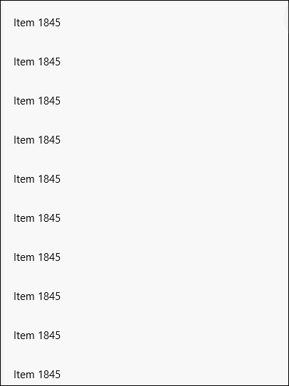

# PullToRefreshListView XAML Control

The **PullToRefreshListView Control**, is derived from the built-in List View in XAML. It lets the user pull down beyond the top limit on the listview to trigger a refresh of the content. This control can create rich, animations, and is easy to use. 

This control is very common on mobile devices, where the user can pull from the top to force a content refresh in applications like Twitter.

This control uses the *PullToRefreshLabel* and *ReleaseToRefreshLabel* properties to provide a visual indication to the user.

If you want more than a text to display, you can then use *PullToRefreshContent* and *ReleaseToRefreshContent*. In this case the *PullToRefreshLabel* and *ReleaseToRefreshLabel* properties will be ignored.

The *RefreshIndicatorContent* can be used with the *PullProgressChanged* event to provide a custom visual for the user.

To cancel a refresh request just slide back to a position prior to the *PullThreshold* position. Upon release the *RefreshIntentCanceled* event will
be raised and the *RefreshIntentCanceledCommand*, if any, will be executed.

## Syntax

```xml

<controls:PullToRefreshListView Name="PullToRefreshListViewControl"
    ItemsSource="{x:Bind _items}"	
    OverscrollLimit="0.4"
    PullThreshold="100"
    RefreshRequested="ListView_RefreshCommand"
    RefreshIntentCanceled="ListView_RefreshIntentCanceled"
    RefreshIntentCanceledCommand="{x:Bind RefreshIntentCanceled}"
    PullProgressChanged="ListView_PullProgressChanged">
    <controls:PullToRefreshListView.RefreshIndicatorContent>
        <Border HorizontalAlignment="Center" x:Name="refreshindicator" CornerRadius="30" Height="20" Width="20" ></Border>
    </controls:PullToRefreshListView.RefreshIndicatorContent>
</controls:PullToRefreshListView>

```

## Example Image



## Example Code

[PullToRefreshListView Sample Page](https://github.com/Microsoft/UWPCommunityToolkit/tree/master/Microsoft.Toolkit.Uwp.SampleApp/SamplePages/PullToRefreshListView)

## Default Template 

[PullToRefreshListView XAML File](https://github.com/Microsoft/UWPCommunityToolkit/blob/master/Microsoft.Toolkit.Uwp.UI.Controls/PullToRefreshListView/PullToRefreshListView.xaml) is the XAML template used in the toolkit for the default styling.

## Requirements (Windows 10 Device Family)

| [Device family](http://go.microsoft.com/fwlink/p/?LinkID=526370) | Universal, 10.0.14393.0 or higher |
| --- | --- |
| Namespace | Microsoft.Toolkit.Uwp.UI.Controls |

## API

* [PullToRefreshListView source code](https://github.com/Microsoft/UWPCommunityToolkit/tree/master/Microsoft.Toolkit.Uwp.UI.Controls/PullToRefreshListView)
