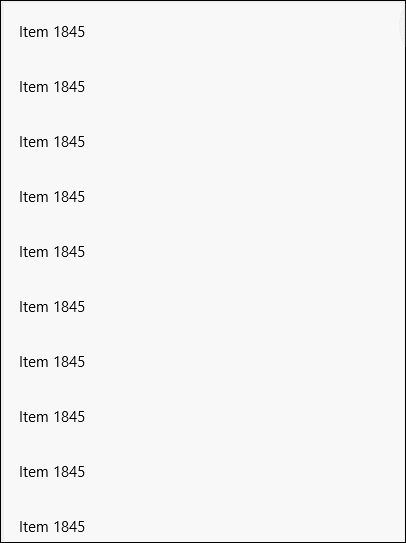

# PullToRefreshListView XAML Control

The [PullToRefreshListView Control](https://docs.microsoft.com/dotnet/api/microsoft.toolkit.uwp.ui.controls.pulltorefreshlistview), is derived from the built-in List View in XAML. It lets the user pull down beyond the top limit on the listview to trigger a refresh of the content. This control can create rich, animations, and is easy to use. 

This control is very common on mobile devices, where the user can pull from the top to force a content refresh in applications like Twitter.

This control uses the *PullToRefreshLabel* and *ReleaseToRefreshLabel* properties to provide a visual indication to the user.

If you want more than a text to display, you can then use *PullToRefreshContent* and *ReleaseToRefreshContent*. In this case the *PullToRefreshLabel* and *ReleaseToRefreshLabel* properties will be ignored.

The `RefreshIndicatorContent` can be used with the `PullProgressChanged` event to provide a custom visual for the user.

To cancel a refresh request just slide back to a position prior to the *PullThreshold* position. Upon release the *RefreshIntentCanceled* event will
be raised and the *RefreshIntentCanceledCommand*, if any, will be executed.

## Syntax

```xaml
<Page ...
     xmlns:controls="using:Microsoft.Toolkit.Uwp.UI.Controls"/>

<controls:PullToRefreshListView Name="PullToRefreshListViewControl"
    ItemsSource="{x:Bind _items}" OverscrollLimit="0.4" PullThreshold="100"
    RefreshRequested="ListView_RefreshCommand" RefreshIntentCanceled="ListView_RefreshIntentCanceled"
    RefreshIntentCanceledCommand="{x:Bind RefreshIntentCanceled}"  PullProgressChanged="ListView_PullProgressChanged">
    <controls:PullToRefreshListView.RefreshIndicatorContent>
        <!-- RefreshIndicator Content -->
    </controls:PullToRefreshListView.RefreshIndicatorContent>
</controls:PullToRefreshListView>
```

## Sample Output



## Properties

| Property | Type | Description |
| -- | -- | -- |
| IsPullToRefreshWithMouseEnabled | bool | Gets or sets a value indicating whether PullToRefresh is enabled with a mouse |
| OverscrollLimit | double | Gets or sets the Overscroll Limit. Value between 0 and 1 where 1 is the height of the control. Default is 0.3 |
| PullThreshold | double | Gets or sets the PullThreshold in pixels for when Refresh should be Requested. Default is 100 |
| PullToRefreshContent | object | Gets or sets the content that will be shown when the user pulls down to refresh |
| PullToRefreshLabel | string | Gets or sets the label that will be shown when the user pulls down to refresh. Note: This label will only show up if `RefreshIndicatorContent` is null |
| RefreshCommand | ICommand | Gets or sets the Command that will be invoked when Refresh is requested |
| RefreshIndicatorContent | object | Gets or sets the Content of the Refresh Indicator |
| RefreshIntentCanceledCommand | ICommand | Gets or sets the Command that will be invoked when a refresh intent is cancled |
| ReleaseToRefreshContent | object | Gets or sets the content that will be shown when the user needs to release to refresh |
| ReleaseToRefreshLabel | string | Gets or sets the label that will be shown when the user needs to release to refresh. Note: This label will only show up if `RefreshIndicatorContent` is null |

## Events

| Events | Description |
| -- | -- |
| PullProgressChanged | Occurs when listview overscroll distance is changed |
| RefreshIntentCanceled | Occurs when the user has cancels an intent for the content to be refreshed |
| RefreshRequested | Occurs when the user has requested content to be refreshed |

## Sample Code

[PullToRefreshListView Sample Page Source](https://github.com/Microsoft/UWPCommunityToolkit/tree/master/Microsoft.Toolkit.Uwp.SampleApp/SamplePages/PullToRefreshListView). You can see this in action in [Windows Community Toolkit Sample App](https://www.microsoft.com/store/apps/9NBLGGH4TLCQ).

## Default Template 

[PullToRefreshListView XAML File](https://github.com/Microsoft/UWPCommunityToolkit/blob/master/Microsoft.Toolkit.Uwp.UI.Controls/PullToRefreshListView/PullToRefreshListView.xaml) is the XAML template used in the toolkit for the default styling.

## Requirements

| Device family | Universal, 10.0.14393.0 or higher |
| -- | -- |
| Namespace | Microsoft.Toolkit.Uwp.UI.Controls |
| NuGet package | [Microsoft.Toolkit.Uwp.UI.Controls](https://www.nuget.org/packages/Microsoft.Toolkit.Uwp.UI.Controls/) |

## API

* [PullToRefreshListView source code](https://github.com/Microsoft/UWPCommunityToolkit/tree/master/Microsoft.Toolkit.Uwp.UI.Controls/PullToRefreshListView)
