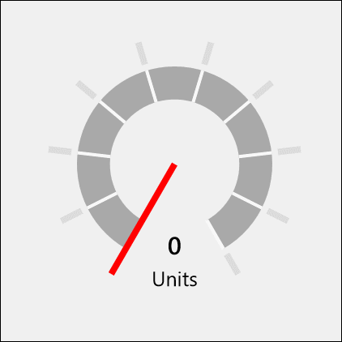

# RadialGauge XAML Control

The [Radial Gauge Control](https://docs.microsoft.com/dotnet/api/microsoft.toolkit.uwp.ui.controls.radialgauge) displays a value in a certain range using a needle on a circular face. This control will make data visualizations and dashboards more engaging with rich style and interactivity. 
The round gauges are powerful, easy to use, and highly configurable to present dashboards capable of displaying clocks, industrial panels, automotive dashboards, and even aircraft cockpits.

The Radial Gauge supports animated transitions between configuration states. The control gradually animates as it redraws changes to the needle, needle position, scale range, color range, and more. 

## Syntax

```xaml
<Page ...
     xmlns:controls="using:Microsoft.Toolkit.Uwp.UI.Controls"/>

<controls:RadialGauge x:Name="RadialGaugeControl" Column="1" Value="70" Minimum="0" 
	Maximum="180" TickSpacing="20" ScaleWidth="26" Unit="Units" TickBrush="Gainsboro"
	ScaleTickBrush="{ThemeResource ApplicationPageBackgroundThemeBrush}"
	UnitBrush="Black" ValueBrush="Black" NeedleWidth="5" TickLength="18">
</controls:RadialGauge>
```

## Sample Output



## Properties

| Property | Type | Description |
| -- | -- | -- |
| IsInteractive | bool | Gets or sets a value indicating whether the control accepts setting its value through interaction |
| MaxAngle | int | Gets or sets the end angle of the scale, which corresponds with the Maximum value, in degrees |
| Maximum | double | Gets or sets the maximum value of the scale |
| MinAngle | int | Gets or sets the start angle of the scale, which corresponds with the Minimum value, in degrees |
| Minimum | double | Gets or sets the minimum value of the scale |
| NeedleBrush | SolidColorBrush | Gets or sets the needle brush |
| NeedleLength | double | Gets or sets the needle length, in percentage of the gauge radius |
| NeedleWidth | double | Gets or sets the needle width, in percentage of the gauge radius |
| NormalizedMaxAngle | double | Gets the normalized maximum angle |
| NormalizedMinAngle | double | Gets the normalized minimum angle |
| ScaleBrush | Brush | Gets or sets the scale brush |
| ScalePadding | double | Gets or sets the distance of the scale from the outside of the control, in percentage of the gauge radius |
| ScaleTickBrush | SolidColorBrush | Gets or sets the scale tick brush |
| ScaleTickWidth | double | Gets or sets the width of the scale ticks, in percentage of the gauge radius |
| ScaleWidth | double | Gets or sets the width of the scale, in percentage of the gauge radius |
| StepSize | double | Gets or sets the rounding interval for the Value |
| TickBrush | SolidColorBrush | Gets or sets the outer tick brush |
| TickLength | double | Gets or sets the length of the ticks, in percentage of the gauge radius |
| TickSpacing | int | Gets or sets the tick spacing, in units |
| TickWidth | double | Gets or sets the width of the ticks, in percentage of the gauge radius |
| TrailBrush | Brush | Gets or sets the trail brush |
| Unit | string | Gets or sets the displayed unit measure |
| UnitBrush | Brush | Gets or sets the brush for the displayed unit measure |
| Value | double | Gets or sets the current value |
| ValueAngle | double | Gets or sets the current angle of the needle (between MinAngle and MaxAngle). Setting the angle will update the Value |
| ValueBrush | Brush | Gets or sets the brush for the displayed value |
| ValueStringFormat | string | Gets or sets the value string format |

## Control style and template

You can modify the default [Style](https://docs.microsoft.com/uwp/api/windows.ui.xaml.style) and [ControlTemplate](https://docs.microsoft.com/uwp/api/windows.ui.xaml.controls.controltemplate) to give the control a unique appearance. For information about modifying a control's style and template, see [Styling controls](https://msdn.microsoft.com/windows/uwp/controls-and-patterns/styling-controls). The default style, template, and resources that define the look of the control are included in the RadialGauge.xaml file. For design purposes, RadialGauge.xaml is available on [GitHub](https://github.com/Microsoft/UWPCommunityToolkit/blob/master/Microsoft.Toolkit.Uwp.UI.Controls/RadialGauge/RadialGauge.xaml). Styles and resources from different versions of the SDK might have different values.

Starting in Toolkit version 2.2, RadialGauge.xaml includes resources that you can use to modify the colors of a control in different visual states without modifying the control template. In apps that target this software development kit (SDK) or later, modifying these resources is preferred to setting properties such as Background and Foreground. For more info, see the Light-weight styling section of the Styling controls article.

This table shows the resources used by the [RadialGauge](https://docs.microsoft.com/dotnet/api/microsoft.toolkit.uwp.ui.controls.radialgauge) control.

| Resource key | Description |
| -- | -- | -- |
| RadialGaugeForegroundBrush | Label text color for the value of the gauge |
| RadialGaugeAccentBrush | Label text color for the units of the gauge |

## Sample Code

[RadialGauge Sample Page Source](https://github.com/Microsoft/UWPCommunityToolkit/tree/master/Microsoft.Toolkit.Uwp.SampleApp/SamplePages/RadialGauge). You can see this in action in [Windows Community Toolkit Sample App](https://www.microsoft.com/store/apps/9NBLGGH4TLCQ).

## Default Template 

[RadialGauge XAML File](https://github.com/Microsoft/UWPCommunityToolkit/blob/master/Microsoft.Toolkit.Uwp.UI.Controls/RadialGauge/RadialGauge.xaml) is the XAML template used in the toolkit for the default styling.

## Requirements

| Device family | Universal, 10.0.14393.0 or higher |
| -- | -- |
| Namespace | Microsoft.Toolkit.Uwp.UI.Controls |
| NuGet package | [Microsoft.Toolkit.Uwp.UI.Controls](https://www.nuget.org/packages/Microsoft.Toolkit.Uwp.UI.Controls/) |

## API

* [RadialGauge source code](https://github.com/Microsoft/UWPCommunityToolkit/tree/master/Microsoft.Toolkit.Uwp.UI.Controls/RadialGauge)

