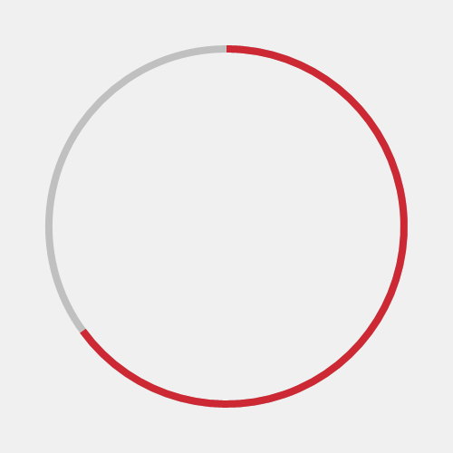

# RadialProgressBar XAML Control

The **Radial Progress Bar Control** displays a value in a certain range using a cicular sector that grows clockwise until it becomes a full ring.

## How it works

The control uses the same dependency properties as the standard Progress Bar, with the addition of:

- A Thickness parameter, which sets the thickness of the circular sector and the outline it's drawn on
- An Outline property, which sets the brush of the circular outline

## Syntax

```xml

<controls:RadialProgressBar x:Name="RadialProgressBarControl"
	Value="70"
	Minimum="0"
	Maximum="180"
	Thickness="4"
	Outline="Gray"
	Foreground="Red">
</controls:RadialProgressBar>

```

## Example Image



## Example Code

[RadialProgressBar Sample Page](https://github.com/Microsoft/UWPCommunityToolkit/tree/master/Microsoft.Toolkit.Uwp.SampleApp/SamplePages/RadialProgressBar)

## Default Template 

[RadialProgressBar XAML File](https://github.com/Microsoft/UWPCommunityToolkit/blob/master/Microsoft.Toolkit.Uwp.UI.Controls/RadialProgressBar/RadialProgressBar.xaml) is the XAML template used in the toolkit for the default styling.

## Requirements (Windows 10 Device Family)

| [Device family](http://go.microsoft.com/fwlink/p/?LinkID=526370) | Universal, 10.0.10586.0 or higher |
| --- | --- |
| Namespace | Microsoft.Toolkit.Uwp.UI.Controls |

## API

* [RadialProgressBar source code](https://github.com/Microsoft/UWPCommunityToolkit/tree/master/Microsoft.Toolkit.Uwp.UI.Controls/RadialProgressBar)

