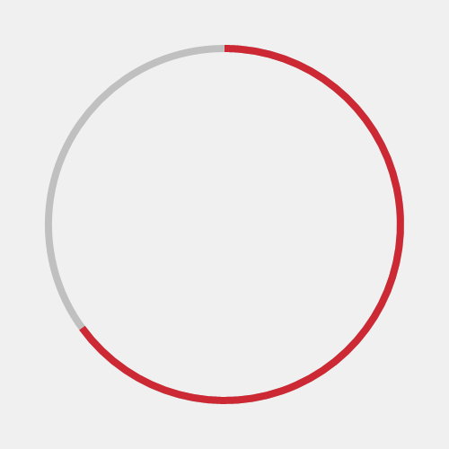

# RadialProgressBar XAML Control

The [Radial Progress Bar Control](https://docs.microsoft.com/dotnet/api/microsoft.toolkit.uwp.ui.controls.radialprogressbar) displays a value in a certain range using a cicular sector that grows clockwise until it becomes a full ring.

The control uses the same dependency properties as the standard Progress Bar, with the addition of:

- A Thickness parameter, which sets the thickness of the circular sector and the outline it's drawn on
- An Outline property, which sets the brush of the circular outline

## Syntax

```xaml
<Page ...
     xmlns:controls="using:Microsoft.Toolkit.Uwp.UI.Controls"/>

<controls:RadialProgressBar x:Name="RadialProgressBarControl"
	Value="70" Minimum="0" Maximum="180"
	Thickness="4" Outline="Gray" Foreground="Red">
</controls:RadialProgressBar>
```

## Sample Output



## Properties

| Property | Type | Description |
| -- | -- | -- |
| Outline | Brush | Gets or sets the color of the circular ouline on which the segment is drawn |
| Thickness | double | Gets or sets the thickness of the circular ouline and segment |

## Sample Code

[RadialProgressBar Sample Page Source](https://github.com/Microsoft/UWPCommunityToolkit/tree/master/Microsoft.Toolkit.Uwp.SampleApp/SamplePages/RadialProgressBar). You can see this in action in [Windows Community Toolkit Sample App](https://www.microsoft.com/store/apps/9NBLGGH4TLCQ).

## Default Template 

[RadialProgressBar XAML File](https://github.com/Microsoft/UWPCommunityToolkit/blob/master/Microsoft.Toolkit.Uwp.UI.Controls/RadialProgressBar/RadialProgressBar.xaml) is the XAML template used in the toolkit for the default styling.

## Requirements

| Device family | Universal, 10.0.14393.0 or higher |
| -- | -- |
| Namespace | Microsoft.Toolkit.Uwp.UI.Controls |
| NuGet package | [Microsoft.Toolkit.Uwp.UI.Controls](https://www.nuget.org/packages/Microsoft.Toolkit.Uwp.UI.Controls/) |

## API

* [RadialProgressBar source code](https://github.com/Microsoft/UWPCommunityToolkit/tree/master/Microsoft.Toolkit.Uwp.UI.Controls/RadialProgressBar)

