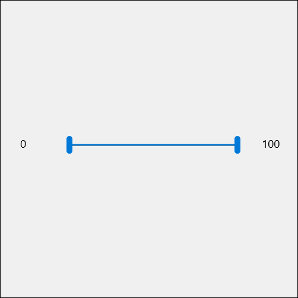

# RangeSelector XAML Control

The [RangeSelector Control](https://docs.microsoft.com/dotnet/api/microsoft.toolkit.uwp.ui.controls.rangeselector) is a Double Slider control that allows the user to select a sub-range of values from a larger range of possible values.  The user can slide from the left or right of the range.

## Syntax

```xaml
<Page ...
    xmlns:controls="using:Microsoft.Toolkit.Uwp.UI.Controls"/>

<controls:RangeSelector x:Name="RangeSelectorControl" 
	Minimum="10" 
	Maximum="100">
</controls:RangeSelector>       
```

## Sample Output



## Properties

| Property | Type | Description |
| -- | -- | -- |
| IsTouchOptimized | bool | Gets or sets a value indicating whether the control is optimized for touch use |
| Maximum | double | Gets or sets the maximum value of the range |
| Minimum | double | Gets or sets the minimum value of the range |
| RangeMax | double | Gets or sets the current upper limit value of the range |
| RangeMin | double | Gets or sets the current lower limit value of the range |

## Examples

> [!NOTE]
If you are using a RangeSelector within a ScrollViewer you'll need to add some codes. This is because by default, the ScrollViewer will block the thumbs of the RangeSelector to capture the pointer.

Here is an example of using RangeSelector within a ScrollViewer

```xaml
<controls:RangeSelector x:Name="Selector" ThumbDragStarted="Selector_OnDragStarted" ThumbDragCompleted="Selector_OnDragCompleted"/>
```

```csharp
private void Selector_OnDragStarted(object sender, DragStartedEventArgs e)
{
	ScrollViewer.HorizontalScrollMode = ScrollMode.Disabled;
	ScrollViewer.VerticalScrollMode = ScrollMode.Disabled;
}

private void Selector_OnDragCompleted(object sender, DragCompletedEventArgs e)
{
	ScrollViewer.HorizontalScrollMode = ScrollMode.Auto;
	ScrollViewer.VerticalScrollMode = ScrollMode.Auto;
}
```

## Sample Code

[RangeSelector Sample Page Source](https://github.com/Microsoft/UWPCommunityToolkit/tree/master/Microsoft.Toolkit.Uwp.SampleApp/SamplePages/RangeSelector). You can see this in action in [UWP Community Toolkit Sample App](https://www.microsoft.com/store/apps/9NBLGGH4TLCQ).

## Default Template 

[RangeSelector XAML File](https://github.com/Microsoft/UWPCommunityToolkit/blob/master/Microsoft.Toolkit.Uwp.UI.Controls/RangeSelector/RangeSelector.xaml) is the XAML template used in the toolkit for the default styling.

## Requirements

| Device family | Universal, 10.0.14393.0 or higher |
| -- | -- |
| Namespace | Microsoft.Toolkit.Uwp.UI.Controls |
| NuGet package | [Microsoft.Toolkit.Uwp.UI.Controls](https://www.nuget.org/packages/Microsoft.Toolkit.Uwp.UI.Controls/) |

## API

* [RangeSelector source code](https://github.com/Microsoft/UWPCommunityToolkit/tree/master/Microsoft.Toolkit.Uwp.UI.Controls/RangeSelector)
