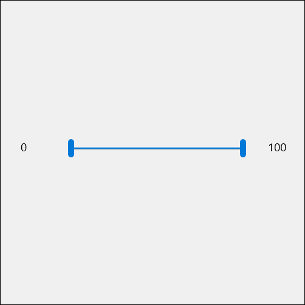

# RangeSelector XAML Control

The **RangeSelector Control** is a *Double Slider* control that allows the user to select a sub-range of values from a larger range of possible values.  The user can slide from the left or right of the range.

Please note that if you are using a RangeSelector within a ScrollViewer you'll need to add the following code:

```xml

<controls:RangeSelector x:Name="Selector" ThumbDragStarted="Selector_OnDragStarted" ThumbDragCompleted="Selector_OnDragCompleted"></controls:RangeSelector>

```

```csharp

private void Selector_OnDragStarted(object sender, DragStartedEventArgs e)
{
	ScrollViewer.HorizontalScrollMode = ScrollMode.Disabled;
	ScrollViewer.VerticalScrollMode = ScrollMode.Disabled;
}

private void Selector_OnDragCompleted(object sender, DragCompletedEventArgs e)
{
	ScrollViewer.HorizontalScrollMode = ScrollMode.Auto;
	ScrollViewer.VerticalScrollMode = ScrollMode.Auto;
}

```


This is because by default, the ScrollViewer will block the thumbs of the RangeSelector to capture the pointer.

## Syntax

```xml

<controls:RangeSelector x:Name="RangeSelectorControl" 
	Minimum="10" 
	Maximum="100">
</controls:RangeSelector>       

```

## Example Image



## Example Code

[RangeSelector Sample Page](https://github.com/Microsoft/UWPCommunityToolkit/tree/master/Microsoft.Toolkit.Uwp.SampleApp/SamplePages/RangeSelector)

## Default Template 

[RangeSelector XAML File](https://github.com/Microsoft/UWPCommunityToolkit/blob/master/Microsoft.Toolkit.Uwp.UI.Controls/RangeSelector/RangeSelector.xaml) is the XAML template used in the toolkit for the default styling.

## Requirements (Windows 10 Device Family)

| [Device family](http://go.microsoft.com/fwlink/p/?LinkID=526370) | Universal, 10.0.14393.0 or higher |
| --- | --- |
| Namespace | Microsoft.Toolkit.Uwp.UI.Controls |

## API

* [RangeSelector source code](https://github.com/Microsoft/UWPCommunityToolkit/tree/master/Microsoft.Toolkit.Uwp.UI.Controls/RangeSelector)
