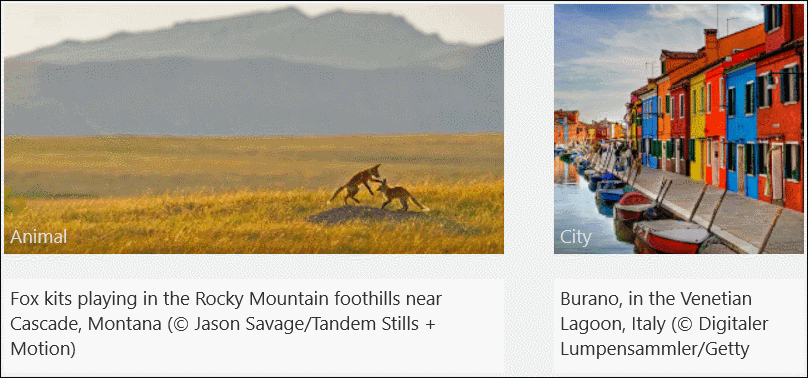

# RotatorTile XAML Control

The [Rotator Tile Control](https://docs.microsoft.com/dotnet/api/microsoft.toolkit.uwp.ui.controls.rotatortile) is an ItemsControl that rotates through a set of items one-by-one. It enables you to show multiple items of data in a live-tile like way.

## Syntax

```xaml
<Page ...
    xmlns:controls="using:Microsoft.Toolkit.Uwp.UI.Controls"/>

<controls:RotatorTile x:Name="Tile1"
	Background="LightGray"
	Direction="Up" 
	Width="400"
	Height="200"
	Margin="20"/>
```

## Example Image



## Properties

| Property | Type | Description |
| -- | -- | -- |
| CurrentItem | object | Gets or sets the currently selected visible item |
| Direction | [RotateDirection](https://docs.microsoft.com/dotnet/api/microsoft.toolkit.uwp.ui.controls.rotatortile.rotatedirection) | Gets or sets the direction the tile slides in |
| ExtraRandomDuration | TimeSpan | Gets or sets the extra randomized duration to be added to the `RotationDelay` property. A value between zero and this value in seconds will be added to the `RotationDelay` |
| ItemsSource | object | Gets or sets the ItemsSource |
| ItemTemplate | DataTemplate | Gets or sets the item template |
| RotationDelay | TimeSpan | Gets or sets the duration for tile rotation |

## Sample Code

[RotatorTile Sample Page Source](https://github.com/Microsoft/UWPCommunityToolkit/tree/master/Microsoft.Toolkit.Uwp.SampleApp/SamplePages/RotatorTile). You can see this in action in [Windows Community Toolkit Sample App](https://www.microsoft.com/store/apps/9NBLGGH4TLCQ).

## Default Template 

[RotatorTile XAML File](https://github.com/Microsoft/UWPCommunityToolkit/blob/master/Microsoft.Toolkit.Uwp.UI.Controls/RotatorTile/RotatorTile.xaml) is the XAML template used in the toolkit for the default styling.

## Requirements

| Device family | Universal, 10.0.14393.0 or higher |
| -- | -- |
| Namespace | Microsoft.Toolkit.Uwp.UI.Controls |
| NuGet package | [Microsoft.Toolkit.Uwp.UI.Controls](https://www.nuget.org/packages/Microsoft.Toolkit.Uwp.UI.Controls/) |

## API

* [RotatorTile source code](https://github.com/Microsoft/UWPCommunityToolkit/tree/master/Microsoft.Toolkit.Uwp.UI.Controls/RotatorTile)

