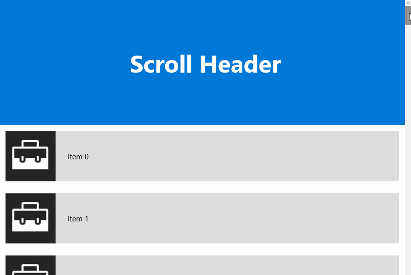

# ScrollHeader XAML Control

The **ScrollHeader Control** provides a header for ListViews or GridViews that adds the ability to keep its content visible or fade it out while scrolling down. It also has a quick return mode where the header hides when the ListView is scrolled down and reappears immediately as soon as the ListView is scrolled up again.

## Syntax

```xml

<ListView Name="listView" ItemsSource="{x:Bind _items, Mode=OneWay}">
	<ListView.Header>
		<controls:ScrollHeader Mode="Sticky" TargetListViewBase="{x:Bind listView}">
			<TextBlock Text="Scroll Header" />
		</controls:ScrollHeader>
	</ListView.Header>
</ListView>

```

## Example Image



## Example Code

[ScrollHeader Sample Page](https://github.com/Microsoft/UWPCommunityToolkit/tree/master/Microsoft.Toolkit.Uwp.SampleApp/SamplePages/ScrollHeader)

## Default Template

[ScrollHeader XAML File](https://github.com/Microsoft/UWPCommunityToolkit/blob/master/Microsoft.Toolkit.Uwp.UI.Controls/ScrollHeader/ScrollHeader.xaml) is the XAML template used in the toolkit for the default styling.

## Requirements (Windows 10 Device Family)

| [Device family](http://go.microsoft.com/fwlink/p/?LinkID=526370) | Universal, 10.0.14393.0 or higher |
| --- | --- |
| Namespace | Microsoft.Toolkit.Uwp.UI.Controls |

## API

* [ScrollHeader source code](https://github.com/Microsoft/UWPCommunityToolkit/tree/master/Microsoft.Toolkit.Uwp.UI.Controls/ScrollHeader)

