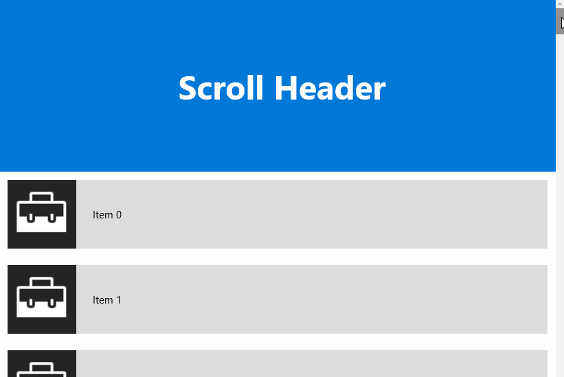

# ScrollHeader XAML Control

The [ScrollHeader Control](https://docs.microsoft.com/dotnet/api/microsoft.toolkit.uwp.ui.controls.scrollheader) provides a header for ListViews or GridViews that adds the ability to keep its content visible or fade it out while scrolling down. It also has a quick return mode where the header hides when the ListView is scrolled down and reappears immediately as soon as the ListView is scrolled up again.

## Syntax

```xaml
<Page ...
    xmlns:controls="using:Microsoft.Toolkit.Uwp.UI.Controls"/>

<ListView Name="listView" ItemsSource="{x:Bind _items, Mode=OneWay}">
	<ListView.Header>
		<controls:ScrollHeader Mode="Sticky" TargetListViewBase="{x:Bind listView}">
			<TextBlock Text="Scroll Header" />
		</controls:ScrollHeader>
	</ListView.Header>
</ListView>
```

## Sample Output



## Properties

| Property | Type | Description |
| -- | -- | -- |
| Mode | [ScrollHeaderMode](https://docs.microsoft.com/dotnet/api/microsoft.toolkit.uwp.ui.controls.scrollheadermode) | Gets or sets a value indicating whether the current mode. Default is none |
| TargetListViewBase | ListViewBase | Gets or sets the container this header belongs to |

## Sample Code

[ScrollHeader Sample Page Source](https://github.com/Microsoft/WindowsCommunityToolkit//tree/master/Microsoft.Toolkit.Uwp.SampleApp/SamplePages/ScrollHeader). You can see this in action in [Windows Community Toolkit Sample App](https://www.microsoft.com/store/apps/9NBLGGH4TLCQ).

## Default Template

[ScrollHeader XAML File](https://github.com/Microsoft/WindowsCommunityToolkit//blob/master/Microsoft.Toolkit.Uwp.UI.Controls/ScrollHeader/ScrollHeader.xaml) is the XAML template used in the toolkit for the default styling.

## Requirements

| Device family | Universal, 10.0.15063.0 or higher |
| -- | -- |
| Namespace | Microsoft.Toolkit.Uwp.UI.Controls |
| NuGet package | [Microsoft.Toolkit.Uwp.UI.Controls](https://www.nuget.org/packages/Microsoft.Toolkit.Uwp.UI.Controls/) |

## API

* [ScrollHeader source code](https://github.com/Microsoft/WindowsCommunityToolkit//tree/master/Microsoft.Toolkit.Uwp.UI.Controls/ScrollHeader)

